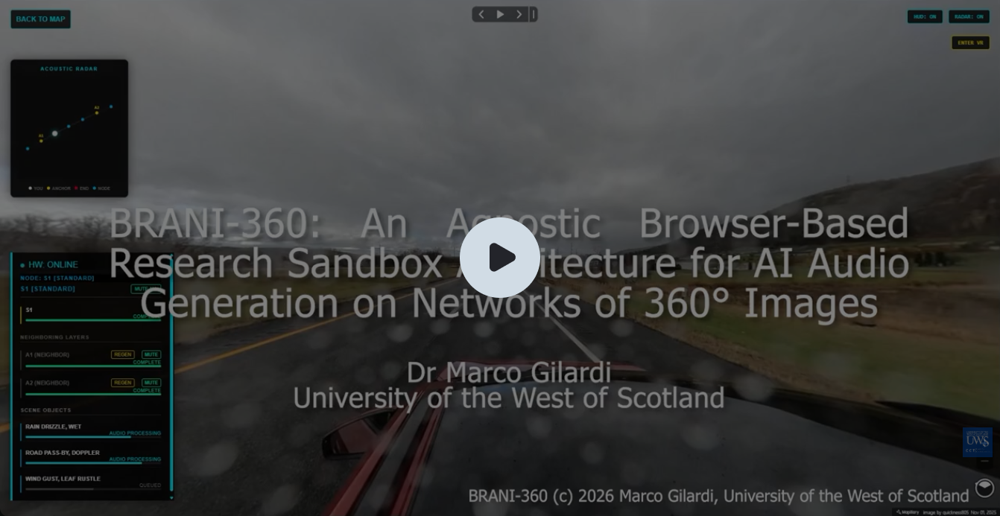

# BRANI-360: An Agnostic Browser-Based Research Sandbox Architecture for AI Audio-Generation on Networks of 360° Images  

[](https://orcid.org/0000-0001-8220-7432)
[](https://doi.org/10.5281/zenodo.XXXXXXX)
[](https://www.gnu.org/licenses/agpl-3.0)
[](https://github.com/DrMarcoGilardi/brani-360)
[](https://github.com/DrMarcoGilardi/brani-360)
[](https://github.com/DrMarcoGilardi/brani-360)
[](https://github.com/DrMarcoGilardi/brani-360/stargazers)

**Dr Marco Gilardi - University of the West of Scotland**  
  
**Cite as**: Please use the "Cite this Repository" widget on the right panel, under the "About" section, to get the correct citation of this repo.

[](https://youtu.be/NicJ22GHQ8A)

## Table of Contents

- [Abstract](#abstract)
- [Introduction](#introduction)
- [Project Structure](#project-structure)
- [Connection Configuration](#connection-configuration)
  - [Error Handling](#error-handling)
- [Local Installation & Testing with Out-Of-The-Box Implementation](#local-installation--testing-with-out-of-the-box-implementation)
  - [1. Local Backend Setup (Node.js)](#1-local-backend-setup-nodejs)
  - [2. Frontend Setup (Client)](#2-frontend-setup-client)
- [`.env` Variables Editor Guide](#env-variables-editor-guide)
  - [What is the `.env` Editor Dashboard?](#what-is-the-env-editor-dashboard)
  - [Key Features](#key-features)
  - [Accessing the Editor Dashboard](#accessing-the-editor-dashboard)
- [How to Configure Strategies (`.env`)](#how-to-configure-strategies-env)
- [Implementation Guide: Building Custom Strategies](#implementation-guide-building-custom-strategies)
  - [1. The Strict Contract System](#1-the-strict-contract-system)
  - [2. Step-by-Step: Implementing a Custom Strategy](#2-step-by-step-implementing-a-custom-strategy)
- [Provided Concrete Examples (Out-of-the-Box Examples)](#provided-concrete-examples-out-of-the-box-examples)
  - [1. Mapillary & MapLibre GL (Visuals & Topology)](#1-mapillary--maplibre-gl-visuals--topology)
  - [2. Geoapify (Context Grounding)](#2-geoapify-context-grounding)
  - [3. Marzipano (Local 360 tours)](#3-marzipano-local-360-tours)
  - [3. LM Studio (Vision-Language Analysis)](#3-lm-studio-vision-language-analysis)
  - [4. Stable Audio / Gradio / Pinokio (Audio Synthesis)](#4-stable-audio--gradio--pinokio-audio-synthesis)
  - [5. Python Adapters (Custom AI Fallbacks)](#5-python-adapters-custom-ai-fallbacks)
- [Core Payload Contracts](#core-payload-contracts)
  - [1. The Vision Payload (`VisionProvider.analyse()`)](#1-the-vision-payload-visionprovideranalyse)
  - [2. The Audio Task Payload (`AudioProvider.generate()`)](#2-the-audio-task-payload-audioprovidergenerate)
  - [3. The Client-to-Server Payload (`spatial_sync`)](#3-the-client-to-server-payload-spatial_sync)
  - [4. The Server-to-Client Completion Payload (`instance_ready` / `node_ready`)](#4-the-server-to-client-completion-payload-instance_ready--node_ready)
  - [5. The Topology Graph Payload (`BaseTopologyProvider.getNode()`)](#5-the-topology-graph-payload-basetopologyprovidergetnode)
- [Server-Side Strategies (The AI Engine)](#server-side-strategies-the-ai-engine)
  - [1. `ImageSourceProvider`](#1-imagesourceprovider)
  - [2. `ContextProvider`](#2-contextprovider)
  - [3. `VisionProvider`](#3-visionprovider)
  - [4. `AudioProvider`](#4-audioprovider)
- [Client-Side Strategies (UI & Map Abstractions)](#client-side-strategies-ui--map-abstractions)
  - [1. `BaseViewerProvider`](#1-baseviewerprovider)
  - [2. `BaseTopologyProvider`](#2-basetopologyprovider)
  - [3. `NodeSelectionStrategy`](#3-nodeselectionstrategy)
  - [4. `BaseSemanticProvider`](#4-basesemanticprovider)
  - [5. `BaseVRLoader`](#5-basevrloader)

## Abstract

The integration of Vision-Language Models (VLMs) and latent diffusion models offers novel pathways for generating dynamic spatial audio. However, investigating these multimodal intersections across complex spatial networks requires a highly controlled, adaptable environment. We introduce BRANI-360, an open-source, agnostic orchestration engine and research sandbox designed to generate and map AI-driven spatial audio across interconnected 360° image graphs. By decoupling the core computational engine from semantic meaning via externalised, data-driven manifests, BRANI-360 enables researchers to define and complex acoustic soundscape without altering backend architecture. The system facilitates the translation of raw visual data into distinct semantic layers (local sooundscape, neighboring soundscape, and specific objects sounds) to explore four key research pillars: semantic interpretation and AI optimization, acoustically informed topology and biome mapping, strategic node-selection modeling, and user agency.  

The sandbox provides a versatile framework for benchmarking purely mathematical graph traversal against context-aware algorithms, optimizing linguistic constraints to minimize AI hallucination, and evaluating perceptual authenticity in user immersion. Furthermore, BRANI-360 supports diverse interdisciplinary applications, ranging from the reconstruction of historical acoustic ecologies and visual-based biodiversity prediction to human-centric studies on spatial memory, dynamic exposure therapy for anxiety disorders, and enhanced navigational accessibility for visually impaired users. Ultimately, BRANI-360 serves as a foundational tool for exploring the perceptual, technical, and psychological dimensions of AI-generated spatial soundscapes.

## Introduction 

*BRANI: noun pl. [ masculine ] /'brani/ Italian for tracks or songs.*

Welcome to the BRANI-360 research sandbox.  

This software is released under AGPLv3 and commercial licencing. Please read the CONTRIBUTING.md file to know how to contribute to this project.

This system is designed as a **strictly agnostic orchestration engine** for AI generation of spatial audio from interconnected 360° images.  
The system is setup to run from GitHub Pages using zrok to connect to the server, or run locally.  

The purpose of the system is to provide a controlled research sandbox to study AI audio generation across graph-based spatial networks (e.g., interconnected 360° panoramas).  
The sandbox is designed to explore four key research pillars:  

**I. Semantic Interpretation & AI Optimization** 
* **Agnostic Mapping:** Exploring how effectively Vision-Language Models (VLMs) can translate raw visual data into abstract semantic layers (e.g., `local` environments vs. `neighboring` topologies).  
* **Prompt Engineering:** Experimenting with linguistic constraints and schema validation to minimize AI hallucination during VLM analysis and latent diffusion audio generation.  

**II. Acoustically Informed Topologies & Biome Mapping** 
* **Contextual Sound Propagation:** Moving beyond purely mathematical distance to dictate sound behavior based on the physical reality of the space (e.g., how sound travels differently in a dense forest vs. a concrete urban canyon).  
* **Multimodal Data Integration:** Exploring the use of geographic or satellite data (e.g., NASA Landsat, ESA Sentinel) to automatically classify biomes across a 360° image network and dynamically adjust the graph's acoustic properties.

**III. Strategic Node Selection Modeling** 
* **Algorithmic Benchmarking:** Comparing purely structural node-selection strategies (e.g., selecting acoustic anchors strictly by graph distance or hop count) against context-aware, acoustically informed strategies.  
* **Perceptual Authenticity:** Evaluating which method of distributing persistent audio anchor nodes across a spatial graph yields the most realistic and immersive user experience.

**IV. User Agency & Accessibility** 
* **Dynamic Routing:** Allowing users to dynamically swap the semantic manifest (e.g., switching from an "environmental" focus to a "weather" focus) to study personalized immersion.  
* **Sensory Translation:** Automating targeted visual-to-audio sonification to provide accessible spatial awareness for visually impaired users.  

Because the architecture strictly separates the **engine** from the **meaning**, the sandbox can be used to explore broad research questions, such as:  

**What approach to prompting VLMs and latent diffusion models yields the highest perceptual accuracy?** By forcing models to adhere to strict schema constraints (e.g., routing intents to `local`, `neighbor`, or `object` behaviors) and utilizing real-time feedback loops, BRANI-360 provides a controlled environment to study which linguistic architectures best bridge the gap between visual interpretation and 3D sound generation.  

**How do we construct semantic manifests that maximize perceptual realism?** Because the engine’s behavior is externalized into data-driven dictionaries, researchers can define entirely new semantic realities in a single file. Researchers can test how different base weights, layer definitions, and persistence rules affect the user's perception of authenticity—without touching a single line of backend code.  

**Mathematical vs. Acoustically Informed Graph Traversal: Which node-selection strategy provides the most authentic spatial immersion?** By utilizing pluggable node-selection strategies, researchers can benchmark purely structural algorithms against acoustically informed models. For instance, a strategy could ingest external satellite data to map the biomes covered by the 360° image network, anchoring background sounds specifically where acoustic propagation rules physically change (e.g., stepping from an open field into a dense forest), rather than at arbitrary mathematical hop distances.

**Can Vision-Language Models accurately reconstruct period-specific acoustic ecologies from visual architectural cues?** Researchers could create a `"historical"` semantic manifest and test the AI's ability to generate period-accurate soundscapes (e.g., a bustling 18th-century market vs. a modern street) by tweaking the linguistic constraints in the VLM prompts and measuring the historical authenticity of the generated audio against archival data.

**To what extent do AI-generated acoustic horizons improve spatial memory and navigation efficiency in visually restricted or highly repetitive virtual topologies?** Researchers can set up a maze-like graph of 360° nodes. By turning the `MASTER_NEIGHBOR_GAIN` (the acoustic horizon) on for one test group and off for another, researchers can quantitatively measure if users navigate the graph faster and build better mental maps when they can "hear" the adjacent nodes before seeing them.

**How effectively can dynamic, AI-generated spatial audio be utilized to create escalatory exposure scenarios for anxiety disorders without altering the visual stimulus?** The visual 360° image remains a static, safe environment (like a park). However, a researcher dynamically updates the semantic manifest via the `DefaultSemanticProvider` to slowly introduce and increase the base weight of a `"crowd"` or `"dogs"` layer. The VLM generates the audio dynamically, providing infinite, non-repeating variations of the stimuli to prevent habituation.

**How can dynamic spatial audio engines be utilized to foreshadow non-linear narrative branches in graph-based interactive storytelling?** As a user stands in narrative Node A, the `AcousticTreadmill` calculates the inverse-distance of narrative Nodes B and C (the choices). The audio engine bleeds the thematic soundscapes of those future story beats into the current environment as `neighbor` layers, allowing the user to "hear" the consequences of their narrative choices before making them.

**Can latent diffusion audio models accurately predict and simulate the acoustic biodiversity of an environment based purely on its visual vegetation index?** By navigating a graph of natural environments, researchers can analyze if the AI successfully identifies the biome and generates the correct species' calls (e.g., generating specific bird calls for a pine forest vs. a tropical rainforest). The agnostic manifest allows researchers to isolate a `"biophony"` layer and compare the AI's output against actual field recordings from that specific Lat/Lng coordinate.

**What semantic audio prioritization models best facilitate obstacle avoidance and point-of-interest discovery for visually impaired users in unfamiliar topologies?** Researchers can tweak the VLM prompts to act as a "hazard detector" (e.g., identifying crosswalks, stairs, or crowds) and map them to the `object` semantic layer. They can then test how quickly users can locate these hazards using the `SpatialAudioPlayer`'s 3D positional tracking.

## Project Structure

```text
brani-360_v0/
├── client/                     # ** Frontend Environment **
│   ├── index.html
|   ├── css/
|   |   └── styles.css
│   └── js/
│       ├── client.js           # Bootstrapper & Dependency Injection
│       ├── NavigationManager.js# Core Orchestrator
│       ├── NetworkService.js   # WebSocket client
│       ├── SpatialAudioPlayer.js
│       ├── UIManager.js
│       ├── TopologyRadar.js
│       ├── AcousticTreadmill.js
│       ├── vr/                 # WebXR & A-Frame lifecycle
|       |   ├── assets/
|       |   |   └── svg/        # Icons for VR interface
|       |   ├── InteractiveMap.js
|       |   ├── VRManager.js
|       |   ├── VRRPGAudioManager.js
|       |   ├── VRSceneController.js
│       |   └── WristUI.js
│       ├── utilities/
│       |   ├── SpatialUtils.js
│       |   └── Physics2D.js
│       └── strategies/         # <-- IMPLEMENT CLIENT STRATEGIES HERE
│           ├── nodeselectionstrategies/
│           ├── semanticproviders/
│           ├── topologyproviders/
│           ├── viewproviders/
│           └── vrproviders/
├── server/                     # ** Backend Environment **
│   ├── server.js               # Bootstrapper
│   ├── PipelineService.js      # Core Orchestrator
│   ├── .env                    # <-- IMPLEMENT CONFIG
│   ├── admin/                  # Administrator .env editor dashboard
│   |   ├── css/
│   |   |   └── style.css
│   |   ├── js/
│   |   |   └── admin.js
│   |   └── admin.html
│   ├── AIEngine/
│   |   ├── AIEngine.js         # Strategy Delegator
│   |   ├── pythonscripts/      # Python code go here
│   |   └── strategies/         # <-- IMPLEMENT SERVER STRATEGIES HERE
│   |       ├── audio/
│   |       |   └── BaseAudioProvider.js       # Base class for audio generation providers
│   |       ├── context/
│   |       |   └── BaseContextProvider.js     # Base class for reverse geolocation providers
│   |       ├── imagesource/
│   |       |   └── BaseImageSourceProvider.js # Base class for 360 image retrieval for analysis
│   |       └── vision/
│   |           └── BaseVisionProvider.js      # Base class for vision analysis provider
│   └── utilities
│       ├── CacheManager.js
│       ├── GPUResourceManager.js
│       ├── LogManager.js
│       ├── SocketController.js # WebSocket server
│       └── Utils.js
└── docs/                       # Auto-generated Documentation
```

**You do not need to edit the core orchestration files** (like `PipelineService`, `NavigationManager`, `NetworkService`, `SocketController` etc).  The entire system is built on the **Strategy Pattern**. You simply need to write new Strategy classes to connect your own image sources, node selection algorithms, models, APIs, or mapping SDKs, and then activate them in the `.env` file.  
You should only implement the concrete strategies for the strategy pattern, you should not need to change any other file other than the `.env` and the `TUNNEL` constant at the top of the `client.js` file. 

---
## Connection Configuration

The frontend dynamically resolves the backend connection URL. It prioritizes the connection in the following order:

1. **Localhost:** If accessed via `localhost` or `127.0.0.1`, it defaults to `http://localhost:3000`.

2. **Custom Tunnel:** If the `?tunnel=` parameter is present in the URL (e.g., `?tunnel=https://your-ngrok-url`), it uses the provided URL.

3. **Zrok Token:** If the `?token=` parameter is provided, or if a default `ZROK_UNIQUE_NAME_HERE` is configured in `client.js`, it defaults to `https://<token>.shares.zrok.io`.

### Error Handling

If none of the above criteria are met (no local host, no custom tunnel, no valid Zrok token configured), the application will throw an error to the browser console:

> **BRANI-360 Error:** No valid backend connection found. Please provide a `?tunnel=` URL parameter, use a `?token=` parameter, or set your `ZROK_UNIQUE_NAME_HERE` in `client.js`.
---
## Local Installation & Testing with Out-Of-The-Box Implementation
 
 BRANI-360 can be run entirely locally for testing, development, and peer review.
 However, BRANI-360 is designed to be hosted via GitHub Pages and connected to a backend via secure tunnels (like zrok or ngrok). 
 Zrok is the fallback tunnel service if none is provided via the `?tunnel` URL parameter. 
 To use zrok set the `?token=` URL parameter to pass the random zrok token, or, if you prefer a static token, set a unique name in zrok and replace `ZROK_UNIQUE_NAME_HERE` in `client.js`.   

### 1. Local Backend Setup (Node.js)

1. Clone the repository and navigate to the root directory.

2. Install the backend dependencies:

   ```bash
   npm install
   ```

3. Duplicate the `.env.example` file, rename it to `.env`, and configure it for local mode:

   ```env
   LOCAL_MODE=true
   PORT=3000       # or set to the port number you prefer to open
   ```    
   
   > **NOTE**: *If are running the out-of-the-box pipeline implementation, ensure you add your required API keys/tokens for Mapillary and Geoapify and install LM Studio and Pinokio with Stable Audio. Also ensure you launch the LM Studio Server and that the `LM_STUDIO_API` and `STABLE_AUDIO_API` variables are set to the correct ports in the `.env` file, they are pre-set in `.env.example` to `1234` for LM Studio and `7860` for Pinokio.*
  
4. Start the backend orchestration server:

   ```bash
   node server.js
   ```

   The server will now be listening for WebSocket connections and API requests on `http://localhost:3000` or the port you opened.

   > **NOTE**: *If you want to run the application from your own host (such as GitHub Pages) set* `LOCAL_MODE` *to* `false` *and set the* `ALLOWED_ORIGIN` *to the host page url in the* `.env` *file*  
   
   > **NOTE**: *If you intend to run your own generation pipeline implementation, remember add your own API keys/tokens for the services your are using and your configuration parameters in the `.env` file.*  

   > **NOTE**: *If are not using the out-of-the-box implementation and you are using your own python concrete implementation via the python adapters provided, please specify your python executable (e.g., 'python3' for Linux/macOS, 'python' for Windows) in the*  `PYTHON_EXEC` *variable*  

### 2. Frontend Setup (Client)

Because the frontend utilizes ES6 modules (`type="module"`), the `index.html` file cannot simply be double-clicked to open in a browser due to strict CORS policies. It must be served via a local web server.

1. Serve the `client` directory using any standard local web server. For example, using VS Code Live Server or Python's built-in server like below:

   ```bash
   cd client
   python -m http.server 8080
   ```

2. Open your browser and navigate to `http://localhost:8080` or whatever port you set. The client will automatically handshake with your local Node.js backend.

---
## `.env` Variables Editor Guide

> **Note**: *It is strongly recommended to use the [admin editor](README-ADMIN.md) to safely edit the .env file and to avoid accidentally deleting environment variables required for the core workflow.*

### What is the `.env` Editor Dashboard?
The **BRANI-360 `.env` Variables Editor** is a secure, graphical web interface designed to help developers visually manage, organize, and document server environment variables. 

Directly editing raw `.env` files can often lead to syntax errors, accidental deletions, or disorganized configurations. This dashboard solves those issues by providing a structured layout where you can group variables, add live documentation, safely edit complex multi-line strings, and instantly sync changes back to the live server.

### Key Features
* **Visual Grouping:** Organize variables into logical, collapsible sections (e.g., Database configs, API keys, SMTP settings).
* **Safe Formatting:** Automatically sanitizes keys (forcing uppercase and restricting special characters) and safely escapes HTML characters to prevent layout breakage.
* **Smart UI Elements:** Text areas dynamically auto-expand to fit their content exactly, removing internal scrollbars for massive multi-line keys (like RSA certificates).
* **Drag-and-Drop Structure:** Move individual variables or entire clustered sections up and down your `.env` architecture effortlessly.

### Accessing the Editor Dashboard

To access the editor dashboard start the server then go to http://localhost:3000/admin where 3000 is the port used by your server.
If you changed the port change that value to your port.
The server console will give the correct address at start in a message coloured in cyan.  
Example: <span style="color: #3a96dd;"> [09:24:31] [Server] For the .env admin dashboard open http://localhost:3000/admin </span>

---

## How to Configure Strategies (`.env`)

> **Note**: *It is strongly recommended to use the [admin editor](README-ADMIN.md) application to safely edit the .env file and to avoid accidentally deleting environment variables required for the core workflow.*

The system uses dynamic dependency injection. It reads your `.env` file at boot and dynamically imports the exact JavaScript classes you request.  To use a custom strategy, place your file in the appropriate directory, **ensure the class name matches the filename exactly**, and update your `.env` using the admin editor application:

```env
# ==========================================
# SERVER STRATEGIES
# ==========================================
IMAGE_PROVIDER="MapillarySource"
CONTEXT_PROVIDER="GeoapifyContextProvider"
VISION_PROVIDER="LMStudioVisionProvider"
AUDIO_PROVIDER="StableAudioGradioProvider"

# ==========================================
# CLIENT STRATEGIES
# ==========================================
CLIENT_VIEWER_PROVIDER="MapillaryViewerProvider"
CLIENT_TOPOLOGY_PROVIDER="MapillaryTopologyProvider"
CLIENT_VR_LOADER_PROVIDER="MapillaryVRLoader"
CLIENT_NODE_SELECTION_STRATEGY="AcousticHorizonStrategy"
CLIENT_SEMANTIC_PROVIDER="DefaultSemanticProvider"
CLIENT_SEMANTIC_LAYERS="spatial, horizon"

# ==========================================
# PYTHON SCRIPTS [OPTIONAL]
# ==========================================
PYTHON_VISION_SCRIPT="vision_adapter.py"
PYTHON_AUDIO_SCRIPT="audio_adapter.py"
PYTHON_EXEC = "python3"
```

---
## Implementation Guide: Building Custom Strategies

BRANI-360 is built entirely on the **Strategy Pattern**. This means the core engine (which handles WebSocket syncing, AI queueing, and UI rendering) never directly touches a specific API, map SDK, or AI model. Instead, it talks to **Base Classes** (abstract interfaces). 

To add a new mapping SDK, a new AI Vision model, or a new acoustic logic system, you do **not** edit the core orchestrator. Instead, you create a "Concrete Class" that extends a Base Class.

### 1. The Strict Contract System
Because JavaScript does not have native `interface` keywords, BRANI-360 enforces architecture via strict runtime contracts. If you look inside any Base Class (e.g., `BaseViewerProvider.js` or `BaseSemanticProvider.js`), you will see methods that look like this:

```javascript
getCurrentNodeId() { 
    throw new Error("BaseViewerProvider: Method 'getCurrentNodeId()' must be implemented by subclass."); 
}
```

If your custom class fails to override these required methods, the system will instantly throw this error in the console at boot, preventing silent failures downstream.

### 2. Step-by-Step: Implementing a Custom Strategy
Here is an in-depth guide to building and injecting your own strategy. In this example, we will build a custom Semantic Provider that adds a `"weather"` layer.

#### **Step A: Locate the correct directory**
Find the directory for the type of strategy you want to build. 
* *Example:* Client-side semantic strategies belong in `client/js/strategies/semanticproviders/`.

#### **Step B: Create the File & Match the Class Name**
Create a new file.
> **CRITICAL:** The filename must exactly match the exported class name, or the dynamic `.env` injector will fail to load it.
* *Filename:* `WeatherSemanticProvider.js`

#### **Step C: Import and Extend the Base Class**
Open your new file, import the base interface, and extend it. Look at the base class file to see which methods throw an error—you **must** implement those. Methods that do not throw an error are optional capabilities.

```javascript
// 1. Import the Base Class
import { BaseSemanticProvider } from "./BaseSemanticProvider.js";

// 2. Class name MUST match filename
export class WeatherSemanticProvider extends BaseSemanticProvider {
    
    constructor(layers) {
        super();
        // Initialize your custom state
        this.layers = Array.isArray(layers) ? layers : (layers ? layers.split(',').map(s => s.trim()) : []);
        
        // Define your custom dictionary
        this.layerManifest = {
            "ambient": { behavior: "local", baseWeight: 0.5, persistent: true },
            "horizon": { behavior: "neighbor", baseWeight: 0.5, persistent: true },
            "spatial": { behavior: "object", baseWeight: 1.0, persistent: false },
            "weather": { behavior: "local", baseWeight: 0.8, persistent: true } // <-- New Custom Layer
        };
    }

    // 3. SATISFY THE STRICT CONTRACT
    // BaseSemanticProvider dictates that getLayerManifest() MUST be implemented.
    getLayerManifest() {
        return Object.keys(this.layerManifest)
            .filter(key => this.layers.includes(key))
            .reduce((obj, key) => {
                obj[key] = this.layerManifest[key];
                return obj;
            }, {});
    }

    // 4. OPTIONAL OVERRIDES
    // onChange() and notifyListeners() are empty no-ops in the base class.
    // You only need to override them if your strategy requires dynamic updates.
}
```

#### **Step D: Handling Asynchronous Init and Events (Viewer / AI Providers)**
Some base classes (like `BaseViewerProvider` or `BaseVisionProvider`) require asynchronous setup or event triggering. 

If extending a Viewer Provider, you must call the base class's `this.trigger()` method to alert the core engine when things happen in your custom map SDK:

```javascript
export class CustomViewerProvider extends BaseViewerProvider {
    async init() {
        // Initialize your custom 3D map SDK
        this.myMap = new CustomMapSDK(this.containerId);
        
        // Translate the SDK's native events into BRANI-360's agnostic events
        this.myMap.onMove(() => {
            const heading = this.myMap.getHeading();
            const pitch = this.myMap.getPitch();
            
            // Push the agnostic payload back up to the engine
            this.trigger('pov_changed', { heading, pitch });
        });
    }
    
    // ... implement remaining strict getters ...
}
```

#### **Step E: Activate via `.env`**
Once your class is written and saved, you simply tell the system to use it. You do not need to alter any HTML files or core `import` statements. 

Open your `.env` editor dashboard and update the relevant target variable to exactly match your new class name:

```env
# Before
CLIENT_SEMANTIC_PROVIDER="DefaultSemanticProvider"
CLIENT_SEMANTIC_LAYERS="spatial, horizon"

# After
CLIENT_SEMANTIC_PROVIDER="WeatherSemanticProvider"
CLIENT_SEMANTIC_LAYERS="spatial, horizon, weather"
```

When you refresh the browser, `client.js` will dynamically read the `.env` over the network, dynamically import `./strategies/semanticproviders/WeatherSemanticProvider.js`, instantiate it, and seamlessly inject it into the core `NavigationManager` and `SpatialAudioPlayer`.

---

## Provided Concrete Examples (Out-of-the-Box Examples)

To help you get started, the repository includes several fully functional, concrete implementations of the strategy interfaces.  These demonstrate how to wrap real-world APIs and local models. The system is configured to run with the client run locally or hosted on GitHub pages. Change the .env file using the **[admin editor](README-ADMIN.md)** to swap examples.

> **Place your API keys in the `.env` file**. The out-of-the-box code requires a Mapillary API token and a Geoapify API key, you can get them from `https://www.mapillary.com/dashboard/developers` and `https://www.geoapify.com/get-started-with-maps-api/`.  

Once the keys are in the `.env` file the system is setup to pass them to the client.

### 1. Mapillary & MapLibre GL (Visuals & Topology)
The system uses Mapillary as the default provider for 360-degree street-level imagery and graph navigation.
* **`MapillaryViewerProvider` (Client):** Wraps MapLibre GL JS to render the 2D map and WebGL viewer, translating user clicks into agnostic `pov_changed` and `node_changed` events.
* **`MapillaryTopologyProvider` (Client):** Queries the Mapillary API to extract the navigation graph (edges/links) so the Acoustic Treadmill can calculate distances to neighboring panoramas.
* **`MapillaryVRLoader` (Client):** Progressively downloads high-resolution equirectangular tiles to paint onto the WebXR A-Frame sphere.
* **`MapillarySource` (Server):** Fetches the raw image buffer for the current panorama ID and passes it to the AI Engine for VLM analysis. Image providers must match in client and server.

### 2. Geoapify (Context Grounding)
* **`GeoapifyContextProvider` (Server):** A reverse-geocoding adapter. It takes the raw Lat/Lng coordinates from the client and converts them into a human-readable location string (e.g., "Times Square, New York"). This string grounds the VLM prompt to ensure region-accurate sonic generation. It also passes the mapillary key to the system config.

### 3. Marzipano (Local 360 tours)
The system uses Marzipano and a physics based graph visualisation to read local 360 tours.
* **`MarzipanoViewerProvider` (Client):** Wraps Marzipano to render the tour graph and WebGL viewer, translating user clicks into agnostic `pov_changed` and `node_changed` events.
* **`MarzipanoTopologyProvider` (Client):** Queries the Marzipano data.js file to extract the navigation graph (edges/links) so the Acoustic Treadmill can calculate distances to neighboring panoramas.
* **`MarzipanoVRLoader` (Client):** Displays the high-resolution equirectangular tiles to paint onto the WebXR A-Frame sphere.
* **`MarzipanoSource` (Server):** Stitches the Marzipano tiles together to produce a raw image buffer for the current panorama ID and passes it to the AI Engine for VLM analysis. Image providers must match in client and server.
* **`MarzipanoContextProvider` (Server):** Returns "Unknown Location" this can be edited to give the exact location of the tour. It also passes the tour path to the system config.

### 3. LM Studio (Vision-Language Analysis)
* **`LMStudioVisionProvider` (Server):** An adapter for communicating with locally hosted Vision-Language Models (like LLaVA or Qwen-VL) via LM Studio's local server. It structures system prompts based on semantic layers (spatial, ambient, horizon) and parses the JSON output to locate sound sources in the 360 frame.

### 4. Stable Audio / Gradio / Pinokio (Audio Synthesis)
* **`StableAudioGradioProvider` (Server):** Connects via WebSockets to a local Gradio API endpoint (commonly managed via Pinokio). It passes the text prompts generated by the VLM to Stable Audio Open, streams the generation progress back to the UI, and captures the resulting `.wav` buffer.

### 5. Python Adapters (Custom AI Fallbacks)
If you prefer writing your AI inference logic in Python instead of Node.js, the system provides standard subprocess adapters:
* **`PythonVisionProvider` & `PythonAudioAdapter` (Server):** These strategies use `child_process.spawn` to execute standard Python scripts (`vision_adapter.py` and `audio_adapter.py`). They pipe the base64 image data and prompts via `stdin` and parse the JSON outputs from `stdout`. Mock python scripts are included in the `pythonscripts/` directory as templates.

---

## Core Payload Contracts

The architecture is strictly decoupled. These payloads act as the universal language between the Client, the Node.js Core, and your custom Strategies. Example payloads below. 

### 1. The Vision Payload (`VisionProvider.analyse()`)
Your Vision Provider must return an object with an `intents` array. Every intent must contain the strict routing keys (`eventName`, `identity`, `prompt`, `type`) to pass validation.

```json
{
  "intents": [
    {
      "layer": "spatial",                 
      "label": "Dog, Barking, Slapback",  
      "prompt": "Dog, Barking, Slapback, recorded at London, UK...",
      "type": "object_organic",           
      "eventName": "instance_ready",      
      "identity": "instance",             
      "persistent": false,                
      "positional": true,                 
      "envType": "organic",               
      "h": 270,                           
      "p": 0,                             
      "dist": 5                           
    },
    {
      "layer": "ambient",                 
      "label": "Ambient",                 
      "prompt": "Low rumble of distant traffic, dry acoustics...",
      "type": "ambient",                 
      "eventName": "node_ready",          
      "identity": "node",                 
      "persistent": true,                 
      "positional": false,                
      "envType": "city"                   
    }
  ]
}
```

### 2. The Audio Task Payload (`AudioProvider.generate()`)
The `AIEngine` takes the vision intents and appends internal caching and queueing identifiers before sending it to the `AudioProvider`.

```json
{
  "layer": "spatial",               
  "label": "Dog, Barking, Slapback",
  "prompt": "Dog, Barking, Slapback...",
  "type": "object_organic",         
  "eventName": "instance_ready",    
  "identity": "instance",           
  "persistent": false,              
  "positional": true,               
  "envType": "organic",             
  "h": 270,                         
  "p": 0,                           
  "dist": 5,                        
  
  "id": "london_uk_dog_barking_v1_34985734985_0", 
  "nodeId": "34985734985",                                 
  "audioContentId": "london_uk_dog_barking_v1",   
  "locationContext": "London, UK",                         
  "displayName": "Dog, Barking, Slapback",                 
  "visualMetadata": { /* raw copy of original intent */ }  
}
```

### 3. The Client-to-Server Payload (`spatial_sync`)
Emitted by `NetworkService` when navigating to a new panorama.

```json
{
  "nodeId": "34985734985",          
  "fromId": "12938471293",          
  "navEpoch": 14,                   
  "isAnchor": true,                 
  "location": { "lat": 40.7128, "lng": -74.0060 },
  "requestedLayers": ["ambient", "horizon", "spatial"],
  "nearbyAnchors": [                
    {
      "nodeId": "98237498237",
      "hops": 1,                    
      "requestedLayers": ["horizon"]
    }
  ],
  "dbPayload": { /* cached graph geometry */ }                 
}
```

### 4. The Server-to-Client Completion Payload (`instance_ready` / `node_ready`)
Emitted by `PipelineService` when audio generation is finished.

```json
{
  "url": "/audio/stream.wav?id=london_uk_dog_barking_v1", 
  "nodeId": "34985734985",                   
  "navEpoch": 14,                            
  "taskData": {                              
    "id": "london_uk_dog_barking_v1_34985734985_0",
    "prompt": "Dog, Barking, Slapback...",
    "displayName": "Dog, Barking, Slapback",
    "persistent": false,
    "positional": true,
    "envType": "organic",
    "audioContentId": "london_uk_dog_barking_v1"
  }
}
```

### 5. The Topology Graph Payload (`BaseTopologyProvider.getNode()`)
The expected return shape for topology map spidering.

```json
{
  "id": "34985734985",
  "lat": 40.7128,
  "lng": -74.0060,
  "links": [
    { "id": "neighbor_1_id", "heading": 90 },
    { "id": "neighbor_2_id", "heading": 270 }
  ]
}
```

---

## Server-Side Strategies (The AI Engine)

Server strategies live in `server/AIEngine/strategies/`. They dictate how the backend fetches 360 images, evaluates them with VLMs, and generates audio.

### 1. `ImageSourceProvider`
**Location:** `server/AIEngine/strategies/imagesource/`  
**Purpose:** Fetches raw equirectangular image buffers from a mapping service.

```javascript
import { ImageSourceProvider } from './ImageSourceProvider.js';

export class MyCustomImageSource extends ImageSourceProvider {
    /**
     * @param {string} id - The agnostic node identifier.
     * @returns {Promise<Buffer>} - The raw binary image data.
     */
    async getImage(id) {
        // Fetch image bytes from your API
        return Buffer.from(arrayBuffer); 
    }
}
```

### 2. `ContextProvider`
**Location:** `server/AIEngine/strategies/context/`  
**Purpose:** Converts raw Lat/Lng coordinates into a human-readable location string.

```javascript
import { ContextProvider } from './ContextProvider.js';

export class MyContextProvider extends ContextProvider {
    /**
     * @param {number} lat 
     * @param {number} lng 
     * @returns {Promise<string>} - Human readable location (e.g., "Urban Street, London")
     */
    async resolve(lat, lng) {
        return "Custom Location String";
    }

    /**
     * @returns {Object} - Safe config pushed to the client on boot
     */
    getPublicConfig() {
        return { customApiKey: process.env.MY_API_KEY };
    }
}
```

### 3. `VisionProvider`
**Location:** `server/AIEngine/strategies/vision/`  
**Purpose:** Evaluates visual buffers to extract sonic intents.

```javascript
import { VisionProvider } from './VisionProvider.js';

export class MyVisionProvider extends VisionProvider {
    async init() {}

    /**
     * @param {Buffer} buffer - The 360 image buffer
     * @param {string} context - The resolved location string
     * @param {Object} options - Dictionary parameters (layers, max objects, etc.)
     * @returns {Promise<Object>} - Must return an object containing an 'intents' array.
     */
    async analyse(buffer, context, options) {
        // Evaluate buffer, generate intents based on the payload schema above
        return {
            intents: [
                {
                    layer: "spatial",
                    label: "Dog",
                    prompt: "A dog barking...",
                    type: "object_organic",
                    eventName: "instance_ready",
                    identity: "instance",
                    persistent: false,
                    positional: true,
                    envType: "organic",
                    h: 270, p: 0, dist: 5
                }
            ]
        };
    }
}
```

### 4. `AudioProvider`
**Location:** `server/AIEngine/strategies/audio/`  
**Purpose:** Synthesizes text prompts into `.wav` audio buffers.

```javascript
import { AudioProvider } from './AudioProvider.js';

export class MyAudioProvider extends AudioProvider {
    /**
     * @param {Object} task - The intent payload
     * @param {Object} context - Execution hooks: { signal, socket, progressCallback }
     * @returns {Promise<{buffer: Buffer, duration: string}>}
     */
    async generate(task, context) {
        // Return raw WAV buffer and duration (in seconds)
        return {
            buffer: generatedWavBuffer,
            duration: "10.0"
        };
    }
}
```

---

## Client-Side Strategies (UI & Map Abstractions)

Client strategies live in `client/js/strategies/`. They wrap proprietary SDKs so the core engine never touches external code.

### 1. `BaseViewerProvider`
**Location:** `client/js/strategies/viewproviders/`  
**Purpose:** Wraps 2D Panoramas (StreetView, MapillaryJS). Must emit standard events.

```javascript
import { BaseViewerProvider } from './BaseViewerProvider.js';

export class MyViewerProvider extends BaseViewerProvider {
    async init() {
        // Boot your 2D Viewer SDK (e.g., attach to this.containerId)
        
        // CONTRACT: You MUST emit these 3 events when the SDK interacts:
        // this.trigger('visible_changed', boolean);
        // this.trigger('node_changed', { id: "newNodeId", location: { lat, lng } });
        // this.trigger('pov_changed', { heading: 180, pitch: 0 });
    }

    getCurrentNodeId() { return "current_id"; }
    getLocation() { return { lat: 0, lng: 0 }; }
    isVisible() { return true; }
    getNativeViewer() { return this.myNativeMapObject; }
}
```

### 2. `BaseTopologyProvider`
**Location:** `client/js/strategies/topologyproviders/`  
**Purpose:** Retrieves the graph mapping data for neighbors.

```javascript
import { BaseTopologyProvider } from './BaseTopologyProvider.js';

export class MyTopologyProvider extends BaseTopologyProvider {
    /**
     * @param {string} nodeId
     * @returns {Promise<Object>}
     */
    async getNode(nodeId) {
        return {
            id: nodeId,
            lat: 40.7128,
            lng: -74.0060,
            links: [
                { id: "neighbor_id_1", heading: 90 }
            ]
        };
    }
}
```

### 3. `NodeSelectionStrategy`
**Location:** `client/js/strategies/nodeselectionstrategies/`  
**Purpose:** Math logic to determine if a node acts as a background acoustic anchor.

```javascript
import { NodeSelectionStrategy } from './NodeSelectionStrategy.js';

export class MySelectionStrategy extends NodeSelectionStrategy {
    /**
     * @param {string} nodeId 
     * @param {TopologyRadar} radar 
     * @returns {Promise<boolean>}
     */
    async isAnchor(nodeId, radar) {
        return true; 
    }
    reset() {}
}
```

### 4. `BaseSemanticProvider`
**Location:** `client/js/strategies/semanticproviders/`  
**Purpose:** Defines the agnostic ruleset for what semantic layers exist and how the engine should behave towards them mathematically.

```javascript
import { BaseSemanticProvider } from './BaseSemanticProvider.js';

export class MySemanticProvider extends BaseSemanticProvider {
    /**
     * @returns {Object} Manifest dictating layer behavior, persistence, and mix weights.
     */
    getLayerManifest() { 
        return {
            "ambient": { behavior: "local", baseWeight: 0.5, persistent: true },
            "horizon": { behavior: "neighbor", baseWeight: 0.5, persistent: true },
            "spatial": { behavior: "object", baseWeight: 1.0, persistent: false }
        }; 
    }
}
```

### 5. `BaseVRLoader`
**Location:** `client/js/strategies/vrproviders/`  
**Purpose:** Fetches and paints image tiles to a canvas for WebXR environments.

```javascript
import { BaseVRLoader } from './BaseVRLoader.js';

export class MyVRLoader extends BaseVRLoader {
    async getLowResBase(nodeId, ctx, width, height) {
        // Draw low-res placeholder to ctx
    }

    async stitchProgressively(nodeId, zoom, ctx, width, height, onTileDrawn) {
        // Draw HD tiles
        onTileDrawn();
        return true; 
    }
}
```
