## Classes

<dl>
<dt><a href="#AcousticTreadmill">AcousticTreadmill</a></dt>
<dd><p>Manages the mathematical mixing of backgrounds and aggregate progress tracking.<br>Agnostically adjusts volume levels of adjacent nodes to simulate distance.</p>
<ul>
<li><h3 id="architecture">Architecture</h3>
</li>
</ul>


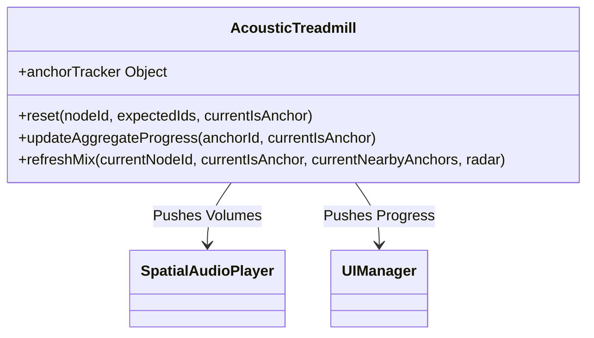


</dd>
<dt><a href="#NavigationManager">NavigationManager</a></dt>
<dd><p>Orchestrates movement using injected Strategy Providers (Viewer, Topology, UI, etc.) agnostically.<br>Coordinates the fetch state and topology mapping when navigating between panoramas.</p>
<ul>
<li><h3 id="architecture">Architecture</h3>
</li>
</ul>


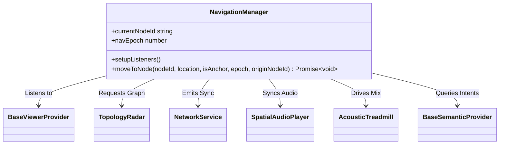


</dd>
<dt><a href="#NetworkService">NetworkService</a></dt>
<dd><p>Encapsulates WebSocket orchestration and High-Speed Navigation Guards.</p>
<ul>
<li><h3 id="architecture">Architecture</h3>
</li>
</ul>


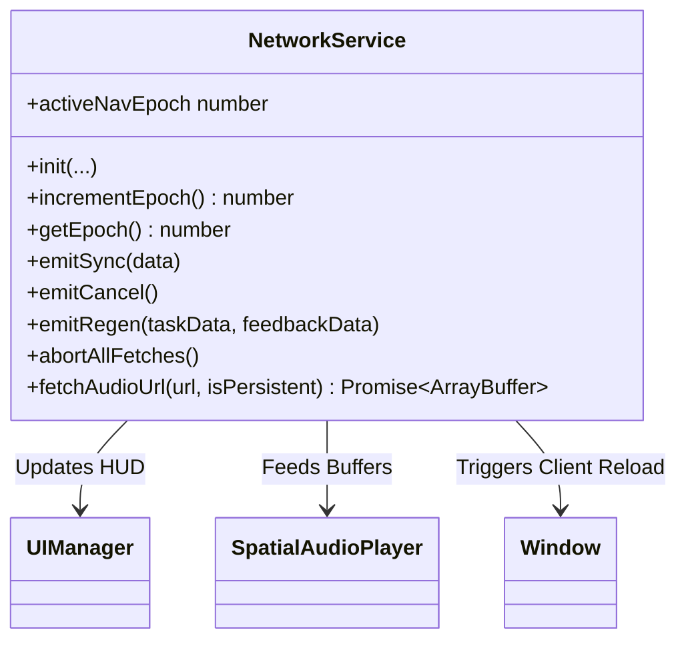


</dd>
<dt><a href="#SpatialAudioPlayer">SpatialAudioPlayer</a></dt>
<dd><p>Manages the A-Frame/Three.js audio lifecycle for the 3D viewer.<br>Explicitly manages 3D positional instances, local foreground washes, and neighbor background mixes.</p>
<ul>
<li><h3 id="architecture">Architecture</h3>
</li>
</ul>


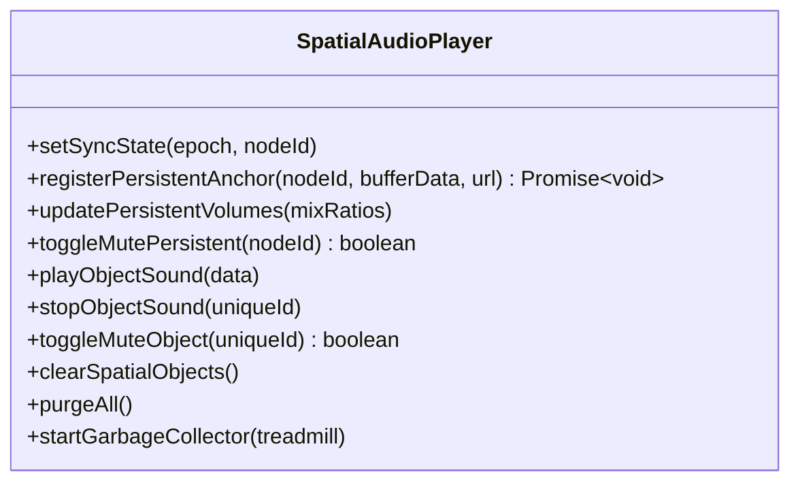


</dd>
<dt><a href="#AcousticHorizonStrategy">AcousticHorizonStrategy</a></dt>
<dd><p>EXAMPLE STRATEGY IMPLEMENTATION<br>Enforces strict Min 3 / Max 6 spacing across topological graphs.</p>
<ul>
<li><h3 id="architecture">Architecture</h3>
</li>
</ul>


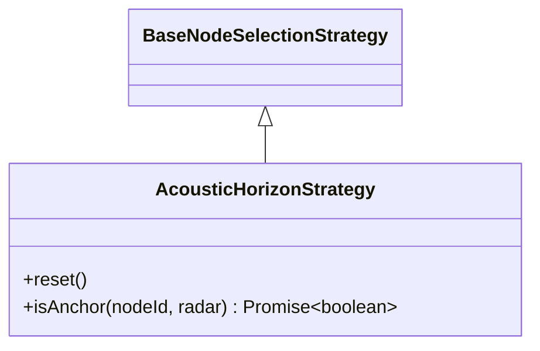


</dd>
<dt><a href="#BaseNodeSelectionStrategy">BaseNodeSelectionStrategy</a></dt>
<dd><p>Strategy Pattern Interface for Node Selection.<br>Determines the logical importance of a node within the topological graph.</p>
<ul>
<li><h3 id="architecture">Architecture</h3>
</li>
</ul>


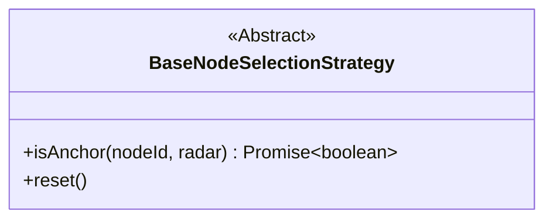


</dd>
<dt><a href="#BaseSemanticProvider">BaseSemanticProvider</a></dt>
<dd><p>Strategy Pattern Interface for semantic definitions.<br>Defines what a node &quot;means&quot; and how the engine should behave towards those meanings.<br>Extracts layer definitions away from the core orchestration.</p>
<ul>
<li><h3 id="architecture">Architecture</h3>
</li>
</ul>


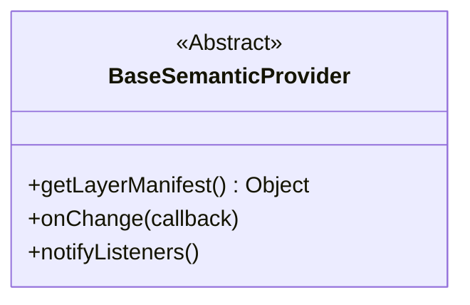


</dd>
<dt><a href="#DefaultSemanticProvider">DefaultSemanticProvider</a></dt>
<dd><p>EXAMPLE STRATEGY IMPLEMENTATION<br>Default Semantic Strategy.<br>Implements the standard base layers: ambient, spatial, and horizon.</p>
<ul>
<li><h3 id="architecture">Architecture</h3>
</li>
</ul>


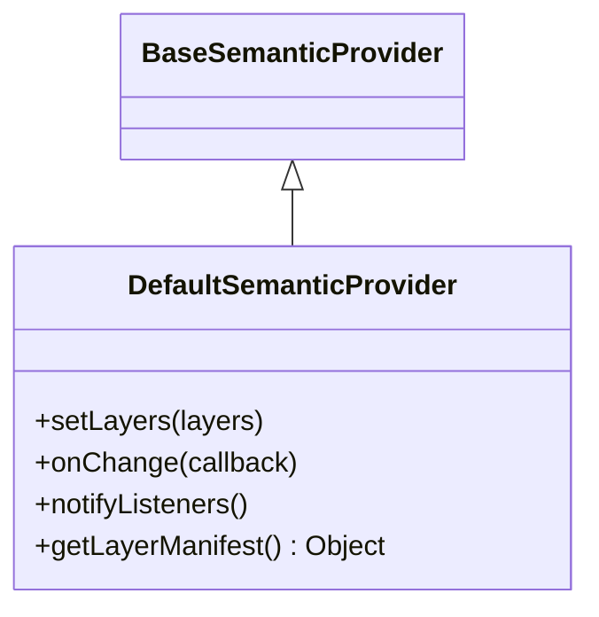


</dd>
<dt><a href="#BaseTopologyProvider">BaseTopologyProvider</a></dt>
<dd><p>Strategy Pattern Interface for Node Topology sources.<br>Agnostic interface for fetching graph connectivity from a mapping provider.</p>
<ul>
<li><h3 id="architecture">Architecture</h3>
</li>
</ul>


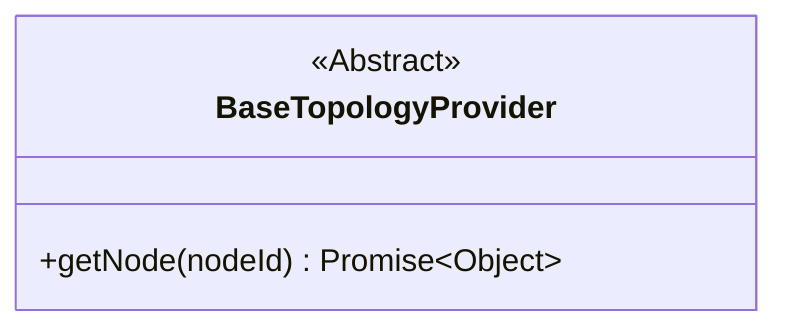


</dd>
<dt><a href="#MapillaryTopologyProvider">MapillaryTopologyProvider</a></dt>
<dd><p>EXAMPLE STRATEGY IMPLEMENTATION<br>Resolves node geometry and constructs topological links using Mapillary sequences.<br>Optimized with Memory-Capped LRU Caching and rate-limit throttling.</p>
<ul>
<li><h3 id="architecture">Architecture</h3>
</li>
</ul>


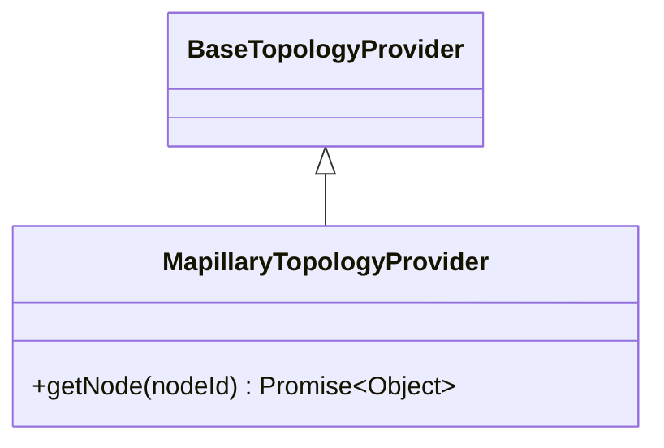


</dd>
<dt><a href="#MarzipanoTopologyProvider">MarzipanoTopologyProvider</a></dt>
<dd><p>EXAMPLE STRATEGY IMPLEMENTATION<br>Provides network topology parsing for Marzipano local tours, generating spatial routing and node relationships.</p>
<ul>
<li><h3 id="architecture">Architecture</h3>
</li>
</ul>


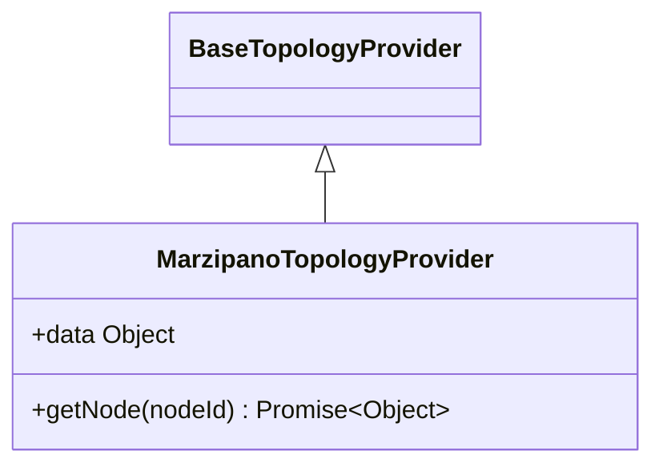


</dd>
<dt><a href="#BaseViewerProvider">BaseViewerProvider</a></dt>
<dd><p>Abstract Strategy Pattern for 2D/360 Viewer SDKs (Google Maps, Mapillary, etc.).<br>Standardizes event emissions and location tracking APIs.</p>
<ul>
<li><h3 id="architecture">Architecture</h3>
</li>
</ul>


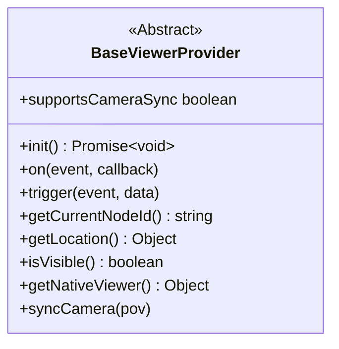


</dd>
<dt><a href="#MapillaryViewerProvider">MapillaryViewerProvider</a></dt>
<dd><p>EXAMPLE STRATEGY IMPLEMENTATION<br>Strategy implementing the map and 360° viewer interface utilizing MapillaryJS and MapLibre GL.</p>
<ul>
<li><h3 id="architecture">Architecture</h3>
</li>
</ul>


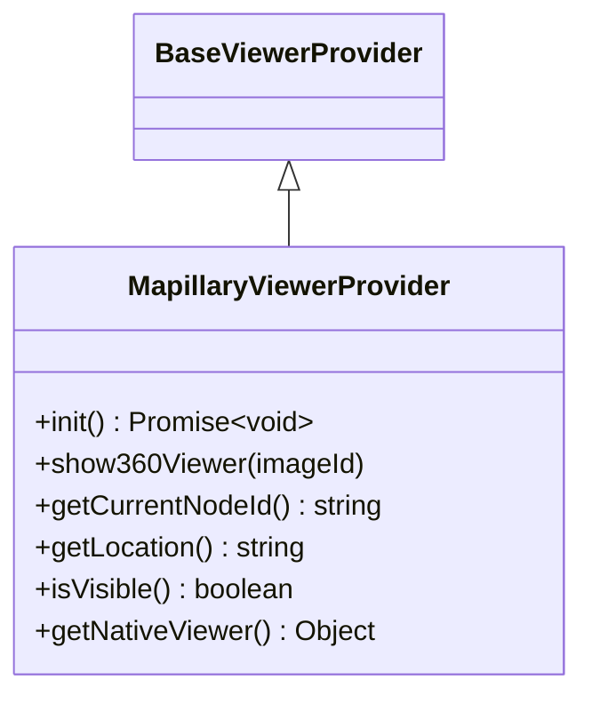


</dd>
<dt><a href="#MarzipanoViewerProvider">MarzipanoViewerProvider</a></dt>
<dd><p>EXAMPLE STRATEGY IMPLEMENTATION<br>Provider managing the Marzipano 360 viewer, its dynamic force-directed graph UI overlay, and event orchestration.</p>
<ul>
<li><h3 id="architecture">Architecture</h3>
</li>
</ul>


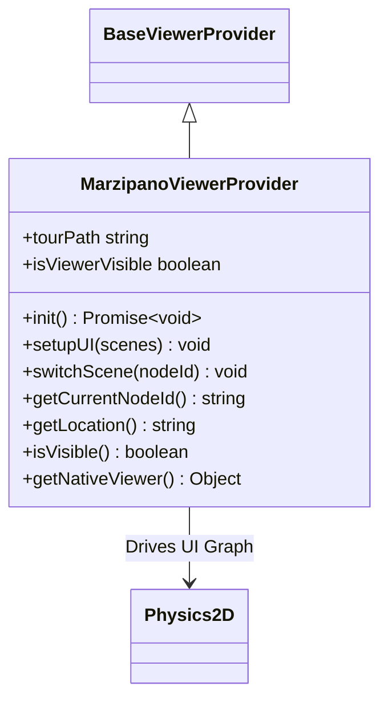


</dd>
<dt><a href="#BaseVRLoader">BaseVRLoader</a></dt>
<dd><p>Strategy Pattern Interface for VR 360 Image Fetching.<br>Standardizes the progressive loading of high-resolution panoramas for WebXR.</p>
<ul>
<li><h3 id="architecture">Architecture</h3>
</li>
</ul>


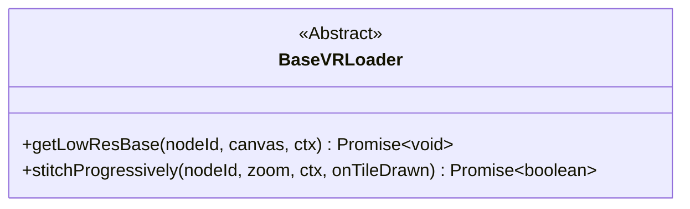


</dd>
<dt><a href="#MapillaryVRLoader">MapillaryVRLoader</a></dt>
<dd><p>EXAMPLE STRATEGY IMPLEMENTATION<br>Strategy implementation for loading panoramic images from Mapillary&#39;s Graph API into the VR buffer.</p>
<ul>
<li><h3 id="architecture">Architecture</h3>
</li>
</ul>


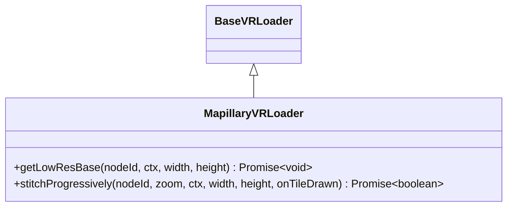


</dd>
<dt><a href="#MarzipanoVRLoader">MarzipanoVRLoader</a></dt>
<dd><p>EXAMPLE STRATEGY IMPLEMENTATION<br>Manages texture loading and image processing specific to Marzipano environments for WebXR injection.</p>
<ul>
<li><h3 id="architecture">Architecture</h3>
</li>
</ul>


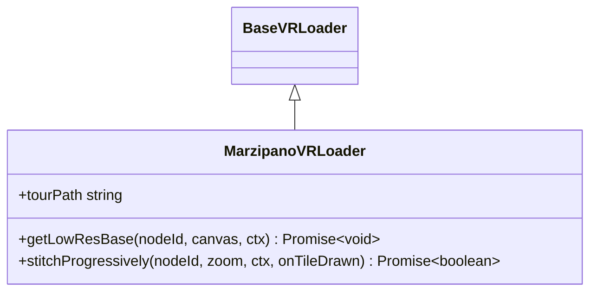


</dd>
<dt><a href="#TopologyRadar">TopologyRadar</a></dt>
<dd><p>Handles map-agnostic topological mapping and BFS spidering of ANY node-based graph.</p>
<ul>
<li><h3 id="architecture">Architecture</h3>
</li>
</ul>


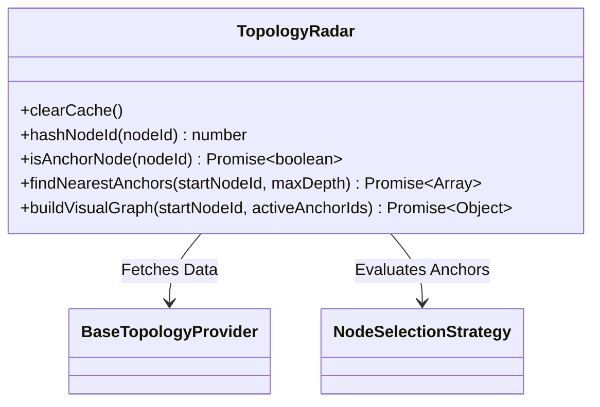


</dd>
<dt><a href="#UIManager">UIManager</a></dt>
<dd><p>Handles all 2D overlays, HUD elements, and the Radar graph visualization.<br>Completely Provider Agnostic.<br>Styles are driven by topological context.</p>
<ul>
<li><h3 id="architecture">Architecture</h3>
</li>
</ul>


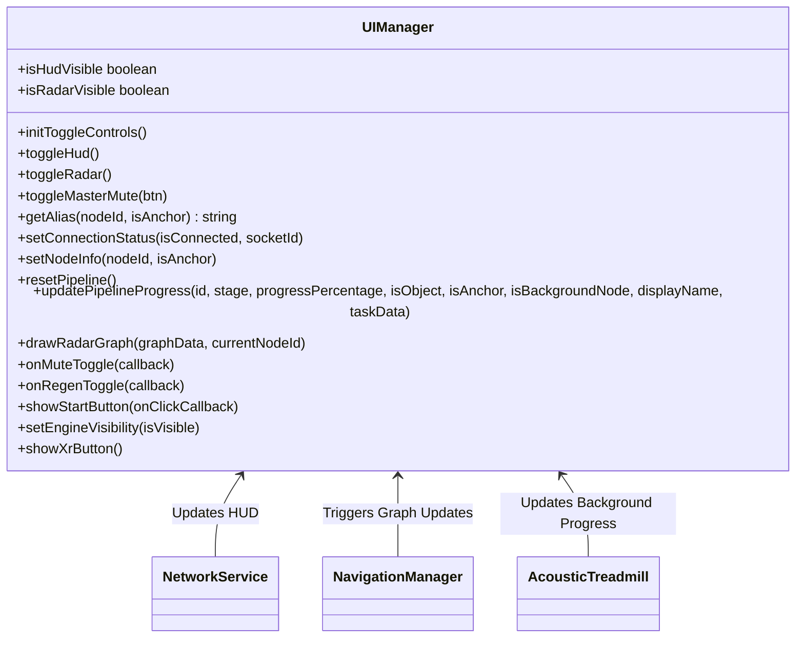


</dd>
<dt><a href="#Physics2D">Physics2D</a></dt>
<dd><p>A standalone 2D physics engine using force-directed graph algorithms to dynamically layout and arrange nodes and their text labels.</p>
<ul>
<li><h3 id="architecture">Architecture</h3>
</li>
</ul>


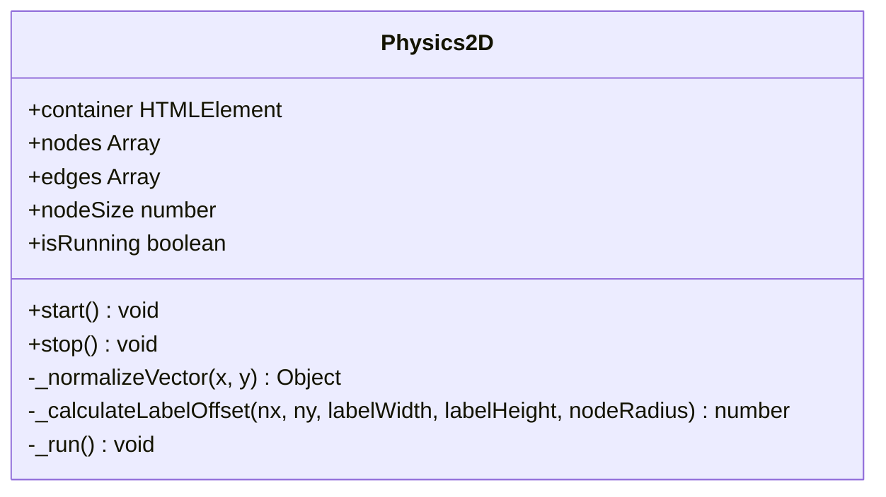


</dd>
<dt><a href="#SpatialUtils">SpatialUtils</a></dt>
<dd><p>Agnostic mathematical utilities for geographic and topological operations.<br>Explicitly decoupled from proprietary libraries.</p>
<ul>
<li><h3 id="architecture">Architecture</h3>
</li>
</ul>


```mermaid
classDiagram
class SpatialUtils{
+getDistance(lat1, lon1, lat2, lon2) number
+getBearing(lat1, lon1, lat2, lon2) number
+getRelativePosition(originLat, originLng, targetLat, targetLng) Object
+normalizeHeading(heading) number
+sphericalToCartesian(h, p, dist) Object
}
```


</dd>
<dt><a href="#InteractiveMap">InteractiveMap</a></dt>
<dd><p>Bridges 3D WebXR raycast events to a 2D HTML5 Canvas.<br>Registers the &#39;interactive-map&#39; A-Frame component to allow users to interact with UI elements like the topology radar from within VR.</p>
<h3 id="architecture">Architecture</h3>


```mermaid
classDiagram
class InteractiveMap{
+register() void
}
```


</dd>
<dt><a href="#VRManager">VRManager</a></dt>
<dd><p>Main coordinator for the VR experience.<br>Orchestrates HD visual projection and Camera sync.</p>
<ul>
<li><h3 id="architecture">Architecture</h3>
</li>
</ul>


```mermaid
classDiagram
VRManager --> BaseVRLoader : Uses to fetch images/tiles
class VRManager{
+updateSkybox(nodeId) Promise~void~
+createNavArrows(links, onNavigate)
+syncPOV(panorama)
}
```


</dd>
<dt><a href="#VRRPGAudioManager">VRRPGAudioManager</a></dt>
<dd><p>Manages A-Frame sound entities.<br>Places sounds in the 3D space.</p>
<ul>
<li><h3 id="architecture">Architecture</h3>
</li>
</ul>


```mermaid
classDiagram
class VRRPGAudioManager{
+treadmill HTMLElement
+ambientPool HTMLElement
+addSpatialSource(id, label, audioUrl, spatialData) void
+setAmbientWash(audioUrl) void
+clearSpatialSources() void
}
```


</dd>
<dt><a href="#VRSceneController">VRSceneController</a></dt>
<dd><p>Manages the A-Frame Lifecycle and WebXR spatial audio syncing.<br>Acts as the bridge between agnostic 2D logic and 3D WebXR representation.</p>
<ul>
<li><h3 id="architecture">Architecture</h3>
</li>
</ul>


```mermaid
classDiagram
VRSceneController --> VRManager : Updates Visuals
VRSceneController --> VRRPGAudioManager : Syncs Audio
class VRSceneController{
+setEpoch(epoch)
+setupListeners()
+ensureAudioContext()
+sync2DRotation(pov)
+syncVRHeadtracking(nativeViewer)
+updateSkybox(nodeId)
+updateVRNavigation(links, nativeViewer)
+addSpatialSource(data, tunnelUrl)
+setAmbientWash(url)
+clearSpatialSources()
+enterVR(nodeId, links, nativeViewer)
}
```


</dd>
<dt><a href="#WristUI">WristUI</a></dt>
<dd><p>Manages a wrist-mounted 3D UI panel for WebXR.<br>Registers the &#39;wrist-ui&#39; A-Frame component, rendering an interactive raycastable menu for exiting VR and toggling floating maps.</p>
<h3 id="architecture">Architecture</h3>


```mermaid
classDiagram
class WristUI{
+register() void
}
```


</dd>
</dl>

## Functions

<dl>
<dt><a href="#bootstrap">bootstrap()</a> ⇒ <code>Promise.&lt;void&gt;</code></dt>
<dd><p>Main application bootstrap (Dependency Injection Root). Fully Agnostic Injection handler. Fetches configuration from the server and imports requested strategy patterns dynamically over the network.</p>
</dd>
</dl>

<a name="AcousticTreadmill"></a>

## AcousticTreadmill
Manages the mathematical mixing of backgrounds and aggregate progress tracking.  
Agnostically adjusts volume levels of adjacent nodes to simulate distance.

* ### Architecture
```mermaid
classDiagram
AcousticTreadmill --> SpatialAudioPlayer : Pushes Volumes
AcousticTreadmill --> UIManager : Pushes Progress
class AcousticTreadmill{
+anchorTracker Object
+reset(nodeId, expectedIds, currentIsAnchor)
+updateAggregateProgress(anchorId, currentIsAnchor)
+refreshMix(currentNodeId, currentIsAnchor, currentNearbyAnchors, radar)
}
```

**Kind**: global class  

* [AcousticTreadmill](#AcousticTreadmill)
    * [new AcousticTreadmill(player, ui, clientConfig)](#new_AcousticTreadmill_new)
    * [.reset(nodeId, expectedIds, currentIsAnchor)](#AcousticTreadmill.reset)
    * [.updateAggregateProgress(anchorId, currentIsAnchor)](#AcousticTreadmill.updateAggregateProgress)
    * [.refreshMix(currentNodeId, currentIsAnchor, currentNearbyAnchors, radar)](#AcousticTreadmill.refreshMix)

<a name="new_AcousticTreadmill_new"></a>

### new AcousticTreadmill(player, ui, clientConfig)

| Param | Type | Description |
| --- | --- | --- |
| player | [<code>SpatialAudioPlayer</code>](#SpatialAudioPlayer) | The active audio player. |
| ui | [<code>UIManager</code>](#UIManager) | The UI HUD. |
| clientConfig | <code>Object</code> | Configuration options for the client. |

<a name="AcousticTreadmill.reset"></a>

### AcousticTreadmill.reset(nodeId, expectedIds, currentIsAnchor)
Resets the treadmill state for a new navigation origin.

**Kind**: static method of [<code>AcousticTreadmill</code>](#AcousticTreadmill)  

| Param | Type | Description |
| --- | --- | --- |
| nodeId | <code>string</code> | The central node identifier. |
| expectedIds | <code>Array.&lt;string&gt;</code> | List of neighboring nodes to track. |
| currentIsAnchor | <code>boolean</code> | True if the central node is an anchor. |

<a name="AcousticTreadmill.updateAggregateProgress"></a>

### AcousticTreadmill.updateAggregateProgress(anchorId, currentIsAnchor)
Increments background generation progress and updates the HUD.

**Kind**: static method of [<code>AcousticTreadmill</code>](#AcousticTreadmill)  

| Param | Type | Description |
| --- | --- | --- |
| anchorId | <code>string</code> | The newly completed neighbor node. |
| currentIsAnchor | <code>boolean</code> | True if the central node is an anchor. |

<a name="AcousticTreadmill.refreshMix"></a>

### AcousticTreadmill.refreshMix(currentNodeId, currentIsAnchor, currentNearbyAnchors, radar)
Calculates distance-based volume weights and pushes them to the audio player.

**Kind**: static method of [<code>AcousticTreadmill</code>](#AcousticTreadmill)  

| Param | Type | Description |
| --- | --- | --- |
| currentNodeId | <code>string</code> | Active central node. |
| currentIsAnchor | <code>boolean</code> | Active anchor status. |
| currentNearbyAnchors | <code>Array.&lt;Object&gt;</code> | List of topological neighbors. |
| radar | [<code>TopologyRadar</code>](#TopologyRadar) | Radar topology reference. |

<a name="NavigationManager"></a>

## NavigationManager
Orchestrates movement using injected Strategy Providers (Viewer, Topology, UI, etc.) agnostically.  
Coordinates the fetch state and topology mapping when navigating between panoramas.

* ### Architecture
```mermaid
classDiagram
NavigationManager --> BaseViewerProvider : Listens to
NavigationManager --> TopologyRadar : Requests Graph
NavigationManager --> NetworkService : Emits Sync
NavigationManager --> SpatialAudioPlayer : Syncs Audio
NavigationManager --> AcousticTreadmill : Drives Mix
NavigationManager --> BaseSemanticProvider : Queries Intents
class NavigationManager{
+currentNodeId string
+navEpoch number
+setupListeners()
+moveToNode(nodeId, location, isAnchor, epoch, originNodeId) Promise~void~
}
```

**Kind**: global class  

* [NavigationManager](#NavigationManager)
    * [new NavigationManager(viewer, radar, networkService, ui, player, treadmill, vrSceneController, semanticProvider)](#new_NavigationManager_new)
    * [.moveToNode(nodeId, [location], [isAnchor], [epoch], [originNodeId])](#NavigationManager.moveToNode) ⇒ <code>Promise.&lt;void&gt;</code>

<a name="new_NavigationManager_new"></a>

### new NavigationManager(viewer, radar, networkService, ui, player, treadmill, vrSceneController, semanticProvider)

| Param | Type | Description |
| --- | --- | --- |
| viewer | [<code>BaseViewerProvider</code>](#BaseViewerProvider) | Agnostic viewer strategy. |
| radar | [<code>TopologyRadar</code>](#TopologyRadar) | Agnostic topology evaluation strategy. |
| networkService | [<code>NetworkService</code>](#NetworkService) | WebSocket orchestrator. |
| ui | [<code>UIManager</code>](#UIManager) | HUD interface. |
| player | [<code>SpatialAudioPlayer</code>](#SpatialAudioPlayer) | Web Audio lifecycle manager. |
| treadmill | [<code>AcousticTreadmill</code>](#AcousticTreadmill) | Background audio mixer. |
| vrSceneController | [<code>VRSceneController</code>](#VRSceneController) | 3D/VR Environment manager. |
| semanticProvider | [<code>BaseSemanticProvider</code>](#BaseSemanticProvider) | Strategy defining active semantic media layers. |

<a name="NavigationManager.moveToNode"></a>

### NavigationManager.moveToNode(nodeId, [location], [isAnchor], [epoch], [originNodeId]) ⇒ <code>Promise.&lt;void&gt;</code>
Evaluates a node hop. Follows a fast path (Cached API hit) or slow path (Radar Analysis).

**Kind**: static method of [<code>NavigationManager</code>](#NavigationManager)  

| Param | Type | Default | Description |
| --- | --- | --- | --- |
| nodeId | <code>string</code> |  | Target node ID. |
| [location] | <code>Object</code> \| <code>null</code> | <code></code> | Optional Lat/Lng payload. |
| [isAnchor] | <code>boolean</code> | <code>true</code> | Whether the origin assumes anchor status. |
| [epoch] | <code>number</code> \| <code>null</code> | <code></code> | Navigational validity tick. |
| [originNodeId] | <code>string</code> \| <code>null</code> | <code>null</code> | ID of the previous node. |

<a name="NetworkService"></a>

## NetworkService
Encapsulates WebSocket orchestration and High-Speed Navigation Guards.

* ### Architecture
```mermaid
classDiagram
NetworkService --> UIManager : Updates HUD
NetworkService --> SpatialAudioPlayer : Feeds Buffers
NetworkService --> Window : Triggers Client Reload
class NetworkService{
+activeNavEpoch number
+init(...)
+incrementEpoch() number
+getEpoch() number
+emitSync(data)
+emitCancel()
+emitRegen(taskData, feedbackData)
+abortAllFetches()
+fetchAudioUrl(url, isPersistent) Promise~ArrayBuffer~
}
```

**Kind**: global class  

* [NetworkService](#NetworkService)
    * [new NetworkService(tunnelUrl)](#new_NetworkService_new)
    * [.setupListeners()](#NetworkService.setupListeners)
    * [.init(ui, player, sceneController, treadmill, navManager)](#NetworkService.init)
    * [.incrementEpoch()](#NetworkService.incrementEpoch) ⇒ <code>number</code>
    * [.getEpoch()](#NetworkService.getEpoch) ⇒ <code>number</code>
    * [.emitSync(data)](#NetworkService.emitSync)
    * [.emitCancel()](#NetworkService.emitCancel)
    * [.emitRegen(taskData, feedbackData)](#NetworkService.emitRegen)
    * [.abortObjectFetches()](#NetworkService.abortObjectFetches)
    * [.abortPersistentFetches()](#NetworkService.abortPersistentFetches)
    * [.abortAllFetches()](#NetworkService.abortAllFetches)
    * [.fetchAudioUrl(url, [isPersistent])](#NetworkService.fetchAudioUrl) ⇒ <code>Promise.&lt;ArrayBuffer&gt;</code>
    * [.getHUDLabel(id, isObject, displayName, nodeId)](#NetworkService.getHUDLabel) ⇒ <code>string</code>

<a name="new_NetworkService_new"></a>

### new NetworkService(tunnelUrl)

| Param | Type | Description |
| --- | --- | --- |
| tunnelUrl | <code>string</code> | Base remote URL (e.g., zrok or ngrok tunnel). |

<a name="NetworkService.setupListeners"></a>

### NetworkService.setupListeners()
Binds generic, cross-provider event listeners bridging visual transitions to the internal Navigation state machine.

**Kind**: static method of [<code>NetworkService</code>](#NetworkService)  
<a name="NetworkService.init"></a>

### NetworkService.init(ui, player, sceneController, treadmill, navManager)
Binds internal managers to incoming socket events.

**Kind**: static method of [<code>NetworkService</code>](#NetworkService)  

| Param | Type | Description |
| --- | --- | --- |
| ui | [<code>UIManager</code>](#UIManager) | The UI Manager. |
| player | [<code>SpatialAudioPlayer</code>](#SpatialAudioPlayer) | The Audio Player. |
| sceneController | <code>SceneController</code> | The VR Manager. |
| treadmill | [<code>AcousticTreadmill</code>](#AcousticTreadmill) | The Audio Mixing Engine. |
| navManager | [<code>NavigationManager</code>](#NavigationManager) | The primary Nav Orchestrator. |

<a name="NetworkService.incrementEpoch"></a>

### NetworkService.incrementEpoch() ⇒ <code>number</code>
Increments the navigation epoch to invalidate older network requests.

**Kind**: static method of [<code>NetworkService</code>](#NetworkService)  
**Returns**: <code>number</code> - The new epoch tick.  
<a name="NetworkService.getEpoch"></a>

### NetworkService.getEpoch() ⇒ <code>number</code>
Returns the current epoch

**Kind**: static method of [<code>NetworkService</code>](#NetworkService)  
**Returns**: <code>number</code> - The current navigation epoch.  
<a name="NetworkService.emitSync"></a>

### NetworkService.emitSync(data)
Pushes current topological state to the backend to trigger the generation pipeline.

**Kind**: static method of [<code>NetworkService</code>](#NetworkService)  

| Param | Type | Description |
| --- | --- | --- |
| data | <code>Object</code> | Spatial sync payload. |

<a name="NetworkService.emitCancel"></a>

### NetworkService.emitCancel()
Sends an explicit cancellation flag to the GPU queue.

**Kind**: static method of [<code>NetworkService</code>](#NetworkService)  
<a name="NetworkService.emitRegen"></a>

### NetworkService.emitRegen(taskData, feedbackData)
Emits a request to regenerate a specific audio task.

**Kind**: static method of [<code>NetworkService</code>](#NetworkService)  

| Param | Type | Description |
| --- | --- | --- |
| taskData | <code>Object</code> | The original task payload. |
| feedbackData | <code>Object</code> | Explicit user modifications. |

<a name="NetworkService.abortObjectFetches"></a>

### NetworkService.abortObjectFetches()
Cancels pending fetch requests for transient objects.

**Kind**: static method of [<code>NetworkService</code>](#NetworkService)  
<a name="NetworkService.abortPersistentFetches"></a>

### NetworkService.abortPersistentFetches()
Cancels pending fetch requests for persistent backgrounds.

**Kind**: static method of [<code>NetworkService</code>](#NetworkService)  
<a name="NetworkService.abortAllFetches"></a>

### NetworkService.abortAllFetches()
Cancels all pending fetch requests.

**Kind**: static method of [<code>NetworkService</code>](#NetworkService)  
<a name="NetworkService.fetchAudioUrl"></a>

### NetworkService.fetchAudioUrl(url, [isPersistent]) ⇒ <code>Promise.&lt;ArrayBuffer&gt;</code>
Safely fetches an audio buffer from the backend using an AbortController.

**Kind**: static method of [<code>NetworkService</code>](#NetworkService)  
**Returns**: <code>Promise.&lt;ArrayBuffer&gt;</code> - The downloaded audio buffer.  
**Throws**:

- <code>Error</code> On network failure.


| Param | Type | Default | Description |
| --- | --- | --- | --- |
| url | <code>string</code> |  | Target endpoint. |
| [isPersistent] | <code>boolean</code> | <code>false</code> | Used to route the controller to the correct abort registry. |

<a name="NetworkService.getHUDLabel"></a>

### NetworkService.getHUDLabel(id, isObject, displayName, nodeId) ⇒ <code>string</code>
Calculates the correct HUD display label for a task based on topology.

**Kind**: static method of [<code>NetworkService</code>](#NetworkService)  
**Returns**: <code>string</code> - Formatted label.  

| Param | Type | Description |
| --- | --- | --- |
| id | <code>string</code> | Task identifier. |
| isObject | <code>boolean</code> | Whether the task is a spatial object. |
| displayName | <code>string</code> \| <code>null</code> | Optional predefined display name. |
| nodeId | <code>string</code> | The parent node of the task. |

<a name="SpatialAudioPlayer"></a>

## SpatialAudioPlayer
Manages the A-Frame/Three.js audio lifecycle for the 3D viewer.  
Explicitly manages 3D positional instances, local foreground washes, and neighbor background mixes.

* ### Architecture
```mermaid
classDiagram
class SpatialAudioPlayer{
+setSyncState(epoch, nodeId)
+registerPersistentAnchor(nodeId, bufferData, url) Promise~void~
+updatePersistentVolumes(mixRatios)
+toggleMutePersistent(nodeId) boolean
+playObjectSound(data)
+stopObjectSound(uniqueId)
+toggleMuteObject(uniqueId) boolean
+clearSpatialObjects()
+purgeAll()
+startGarbageCollector(treadmill)
}
```

**Kind**: global class  

* [SpatialAudioPlayer](#SpatialAudioPlayer)
    * [.setSyncState(epoch, nodeId)](#SpatialAudioPlayer.setSyncState)
    * [.getMimeType(url)](#SpatialAudioPlayer.getMimeType) ⇒ <code>string</code>
    * [.getSafeArrayBuffer(bufferData)](#SpatialAudioPlayer.getSafeArrayBuffer) ⇒ <code>ArrayBuffer</code> \| <code>null</code>
    * [.registerPersistentAnchor(nodeId, bufferData, url)](#SpatialAudioPlayer.registerPersistentAnchor) ⇒ <code>Promise.&lt;void&gt;</code>
    * [.updatePersistentVolumes(mixRatios)](#SpatialAudioPlayer.updatePersistentVolumes)
    * [.toggleMutePersistent(nodeId)](#SpatialAudioPlayer.toggleMutePersistent) ⇒ <code>boolean</code>
    * [.playObjectSound(data)](#SpatialAudioPlayer.playObjectSound)
    * [.stopObjectSound(uniqueId)](#SpatialAudioPlayer.stopObjectSound)
    * [.clearSpatialObjects()](#SpatialAudioPlayer.clearSpatialObjects)
    * [.toggleMuteObject(uniqueId)](#SpatialAudioPlayer.toggleMuteObject) ⇒ <code>boolean</code>
    * [.fadeEntityVolume(entity, targetVolume, [durationMs])](#SpatialAudioPlayer.fadeEntityVolume)
    * [.purgeAll()](#SpatialAudioPlayer.purgeAll)
    * [.startGarbageCollector(treadmill)](#SpatialAudioPlayer.startGarbageCollector)

<a name="SpatialAudioPlayer.setSyncState"></a>

### SpatialAudioPlayer.setSyncState(epoch, nodeId)
Locks the player to the current navigation epoch to prevent stale audio playback.

**Kind**: static method of [<code>SpatialAudioPlayer</code>](#SpatialAudioPlayer)  

| Param | Type | Description |
| --- | --- | --- |
| epoch | <code>number</code> | Active epoch tick. |
| nodeId | <code>string</code> | Active node ID. |

<a name="SpatialAudioPlayer.getMimeType"></a>

### SpatialAudioPlayer.getMimeType(url) ⇒ <code>string</code>
Deduces the browser-friendly MIME type from a given file URL.

**Kind**: static method of [<code>SpatialAudioPlayer</code>](#SpatialAudioPlayer)  
**Returns**: <code>string</code> - Proper MIME type string.  

| Param | Type | Description |
| --- | --- | --- |
| url | <code>string</code> | Audio endpoint URL. |

<a name="SpatialAudioPlayer.getSafeArrayBuffer"></a>

### SpatialAudioPlayer.getSafeArrayBuffer(bufferData) ⇒ <code>ArrayBuffer</code> \| <code>null</code>
Ensures memory stability by extracting a clean slice from an ArrayBuffer wrapper.

**Kind**: static method of [<code>SpatialAudioPlayer</code>](#SpatialAudioPlayer)  

| Param | Type | Description |
| --- | --- | --- |
| bufferData | <code>ArrayBuffer</code> \| <code>Object</code> | The raw HTTP payload. |

<a name="SpatialAudioPlayer.registerPersistentAnchor"></a>

### SpatialAudioPlayer.registerPersistentAnchor(nodeId, bufferData, url) ⇒ <code>Promise.&lt;void&gt;</code>
Mounts a persistent ambient track (Foreground or Background) into the 3D scene. Foreground sounds are local to the current node, while background sounds are from neighboring nodes.

**Kind**: static method of [<code>SpatialAudioPlayer</code>](#SpatialAudioPlayer)  

| Param | Type | Description |
| --- | --- | --- |
| nodeId | <code>string</code> | Target node identifier. |
| bufferData | <code>ArrayBuffer</code> | Raw audio data. |
| url | <code>string</code> | Origin URL used for MIME resolution. |

<a name="SpatialAudioPlayer.updatePersistentVolumes"></a>

### SpatialAudioPlayer.updatePersistentVolumes(mixRatios)
Dynamically shifts background layer volumes based on mathematical distance logic provided by the Acoustic Treadmill.

**Kind**: static method of [<code>SpatialAudioPlayer</code>](#SpatialAudioPlayer)  

| Param | Type | Description |
| --- | --- | --- |
| mixRatios | <code>Array.&lt;Object&gt;</code> | Array of objects dictating {id, weight}. |

<a name="SpatialAudioPlayer.toggleMutePersistent"></a>

### SpatialAudioPlayer.toggleMutePersistent(nodeId) ⇒ <code>boolean</code>
Toggles mute state for continuous ambient washes, applying smooth transitions.

**Kind**: static method of [<code>SpatialAudioPlayer</code>](#SpatialAudioPlayer)  
**Returns**: <code>boolean</code> - True if the layer is now muted.  

| Param | Type | Description |
| --- | --- | --- |
| nodeId | <code>string</code> | Identifier for the persistent layer. |

<a name="SpatialAudioPlayer.playObjectSound"></a>

### SpatialAudioPlayer.playObjectSound(data)
Generates a spatially placed 3D audio entity based on VLM coordinates.

**Kind**: static method of [<code>SpatialAudioPlayer</code>](#SpatialAudioPlayer)  

| Param | Type | Description |
| --- | --- | --- |
| data | <code>Object</code> | Object configuration payload {id, buffer, h, p, dist, isPlaceholder}. |

<a name="SpatialAudioPlayer.stopObjectSound"></a>

### SpatialAudioPlayer.stopObjectSound(uniqueId)
Halts a specific object sound and removes its entity from the scene.

**Kind**: static method of [<code>SpatialAudioPlayer</code>](#SpatialAudioPlayer)  

| Param | Type | Description |
| --- | --- | --- |
| uniqueId | <code>string</code> | Target spatial object identifier. |

<a name="SpatialAudioPlayer.clearSpatialObjects"></a>

### SpatialAudioPlayer.clearSpatialObjects()
Removes all spatial objects and localized foreground washes, resetting state for a new node hop.

**Kind**: static method of [<code>SpatialAudioPlayer</code>](#SpatialAudioPlayer)  
<a name="SpatialAudioPlayer.toggleMuteObject"></a>

### SpatialAudioPlayer.toggleMuteObject(uniqueId) ⇒ <code>boolean</code>
Immediately toggles the volume of a localized spatial object entity.

**Kind**: static method of [<code>SpatialAudioPlayer</code>](#SpatialAudioPlayer)  
**Returns**: <code>boolean</code> - True if the object is now muted.  

| Param | Type | Description |
| --- | --- | --- |
| uniqueId | <code>string</code> | Target spatial object identifier. |

<a name="SpatialAudioPlayer.fadeEntityVolume"></a>

### SpatialAudioPlayer.fadeEntityVolume(entity, targetVolume, [durationMs])
Interpolates A-Frame audio volume over time to prevent popping.

**Kind**: static method of [<code>SpatialAudioPlayer</code>](#SpatialAudioPlayer)  

| Param | Type | Default | Description |
| --- | --- | --- | --- |
| entity | <code>HTMLElement</code> |  | The A-Frame DOM element. |
| targetVolume | <code>number</code> |  | Target normalized gain (0.0 to 1.0). |
| [durationMs] | <code>number</code> | <code>2000</code> | Duration of the crossfade. |

<a name="SpatialAudioPlayer.purgeAll"></a>

### SpatialAudioPlayer.purgeAll()
Command to wipe ALL audio tracking layers.

**Kind**: static method of [<code>SpatialAudioPlayer</code>](#SpatialAudioPlayer)  
<a name="SpatialAudioPlayer.startGarbageCollector"></a>

### SpatialAudioPlayer.startGarbageCollector(treadmill)
Initializes a periodic garbage collection loop to remove stale background sounds that are no longer referenced by the AcousticTreadmill.

**Kind**: static method of [<code>SpatialAudioPlayer</code>](#SpatialAudioPlayer)  

| Param | Type | Description |
| --- | --- | --- |
| treadmill | [<code>AcousticTreadmill</code>](#AcousticTreadmill) | The active topology tracking reference. |

<a name="AcousticHorizonStrategy"></a>

## AcousticHorizonStrategy
EXAMPLE STRATEGY IMPLEMENTATION  
Enforces strict Min 3 / Max 6 spacing across topological graphs.

* ### Architecture
```mermaid
classDiagram
BaseNodeSelectionStrategy <|-- AcousticHorizonStrategy
class AcousticHorizonStrategy{
+reset()
+isAnchor(nodeId, radar) Promise~boolean~
}
```

**Kind**: global class  

* [AcousticHorizonStrategy](#AcousticHorizonStrategy)
    * [.reset()](#AcousticHorizonStrategy.reset)
    * [.isAnchor(nodeId, radar)](#AcousticHorizonStrategy.isAnchor) ⇒ <code>Promise.&lt;boolean&gt;</code>

<a name="AcousticHorizonStrategy.reset"></a>

### AcousticHorizonStrategy.reset()
Clears cached topological logic decisions to free memory.

**Kind**: static method of [<code>AcousticHorizonStrategy</code>](#AcousticHorizonStrategy)  
<a name="AcousticHorizonStrategy.isAnchor"></a>

### AcousticHorizonStrategy.isAnchor(nodeId, radar) ⇒ <code>Promise.&lt;boolean&gt;</code>
Evaluates whether a specific node should act as an acoustic anchor.

**Kind**: static method of [<code>AcousticHorizonStrategy</code>](#AcousticHorizonStrategy)  
**Returns**: <code>Promise.&lt;boolean&gt;</code> - True if the node qualifies as an anchor.  

| Param | Type | Description |
| --- | --- | --- |
| nodeId | <code>string</code> | The target node to evaluate. |
| radar | [<code>TopologyRadar</code>](#TopologyRadar) | The active TopologyRadar dependency. |

<a name="BaseNodeSelectionStrategy"></a>

## BaseNodeSelectionStrategy
Strategy Pattern Interface for Node Selection.  
Determines the logical importance of a node within the topological graph.

* ### Architecture
```mermaid
classDiagram
class BaseNodeSelectionStrategy{
<<Abstract>>
+isAnchor(nodeId, radar) Promise~boolean~
+reset()
}
```

**Kind**: global class  

* [BaseNodeSelectionStrategy](#BaseNodeSelectionStrategy)
    * [.isAnchor(nodeId, radar)](#BaseNodeSelectionStrategy.isAnchor) ⇒ <code>Promise.&lt;boolean&gt;</code>
    * [.reset()](#BaseNodeSelectionStrategy.reset)

<a name="BaseNodeSelectionStrategy.isAnchor"></a>

### BaseNodeSelectionStrategy.isAnchor(nodeId, radar) ⇒ <code>Promise.&lt;boolean&gt;</code>
Evaluates whether a specific node should act as an acoustic anchor.

**Kind**: static method of [<code>BaseNodeSelectionStrategy</code>](#BaseNodeSelectionStrategy)  
**Returns**: <code>Promise.&lt;boolean&gt;</code> - True if the node is an anchor, false otherwise.  
**Throws**:

- <code>Error</code> If not implemented by the specific provider.


| Param | Type | Description |
| --- | --- | --- |
| nodeId | <code>string</code> | The unique identifier for the node. |
| radar | [<code>TopologyRadar</code>](#TopologyRadar) | The active TopologyRadar instance for neighborhood context. |

<a name="BaseNodeSelectionStrategy.reset"></a>

### BaseNodeSelectionStrategy.reset()
Optional state cleanup triggered when the engine resets.

**Kind**: static method of [<code>BaseNodeSelectionStrategy</code>](#BaseNodeSelectionStrategy)  
<a name="BaseSemanticProvider"></a>

## BaseSemanticProvider
Strategy Pattern Interface for semantic definitions.  
Defines what a node "means" and how the engine should behave towards those meanings.  
Extracts layer definitions away from the core orchestration.

* ### Architecture
```mermaid
classDiagram
class BaseSemanticProvider{
<<Abstract>>
+getLayerManifest() Object
+onChange(callback)
+notifyListeners()
}
```

**Kind**: global class  

* [BaseSemanticProvider](#BaseSemanticProvider)
    * [.getLayerManifest()](#BaseSemanticProvider.getLayerManifest) ⇒ <code>Object</code>
    * [.onChange(callback)](#BaseSemanticProvider.onChange)
    * [.notifyListeners()](#BaseSemanticProvider.notifyListeners)

<a name="BaseSemanticProvider.getLayerManifest"></a>

### BaseSemanticProvider.getLayerManifest() ⇒ <code>Object</code>
Returns the agnostic ruleset for active semantic layers.

**Kind**: static method of [<code>BaseSemanticProvider</code>](#BaseSemanticProvider)  
**Returns**: <code>Object</code> - Manifest dictating layer behavior, persistence, and mix weights.  
**Throws**:

- <code>Error</code> If not implemented by a subclass.

<a name="BaseSemanticProvider.onChange"></a>

### BaseSemanticProvider.onChange(callback)
Subscribes a listener function to be executed whenever the active layers change.

**Kind**: static method of [<code>BaseSemanticProvider</code>](#BaseSemanticProvider)  

| Param | Type | Description |
| --- | --- | --- |
| callback | <code>function</code> | The function to execute on layer change. |

<a name="BaseSemanticProvider.notifyListeners"></a>

### BaseSemanticProvider.notifyListeners()
Iterates through and executes all subscribed change listeners.

**Kind**: static method of [<code>BaseSemanticProvider</code>](#BaseSemanticProvider)  
<a name="DefaultSemanticProvider"></a>

## DefaultSemanticProvider
EXAMPLE STRATEGY IMPLEMENTATION  
Default Semantic Strategy.  
Implements the standard base layers: ambient, spatial, and horizon.

* ### Architecture
```mermaid
classDiagram
BaseSemanticProvider <|-- DefaultSemanticProvider
class DefaultSemanticProvider{
+setLayers(layers)
+onChange(callback)
+notifyListeners()
+getLayerManifest() Object
}
```

**Kind**: global class  

* [DefaultSemanticProvider](#DefaultSemanticProvider)
    * [new DefaultSemanticProvider([layers])](#new_DefaultSemanticProvider_new)
    * [.getLayerManifest()](#DefaultSemanticProvider.getLayerManifest) ⇒ <code>Object</code>
    * [.setLayers(layers)](#DefaultSemanticProvider.setLayers)
    * [.onChange(callback)](#DefaultSemanticProvider.onChange)
    * [.notifyListeners()](#DefaultSemanticProvider.notifyListeners)

<a name="new_DefaultSemanticProvider_new"></a>

### new DefaultSemanticProvider([layers])

| Param | Type | Default | Description |
| --- | --- | --- | --- |
| [layers] | <code>Array.&lt;string&gt;</code> | <code>[&#x27;ambient&#x27;, &#x27;spatial&#x27;, &#x27;horizon&#x27;]</code> | The default layers to evaluate during navigation. |

<a name="DefaultSemanticProvider.getLayerManifest"></a>

### DefaultSemanticProvider.getLayerManifest() ⇒ <code>Object</code>
Returns the agnostic ruleset for active semantic layers.

**Kind**: static method of [<code>DefaultSemanticProvider</code>](#DefaultSemanticProvider)  
**Returns**: <code>Object</code> - Manifest dictating layer behavior, persistence, and mix weights.  
<a name="DefaultSemanticProvider.setLayers"></a>

### DefaultSemanticProvider.setLayers(layers)
Allows developers or the UI to dynamically change the semantic meaning of the session at runtime.

**Kind**: static method of [<code>DefaultSemanticProvider</code>](#DefaultSemanticProvider)  

| Param | Type | Description |
| --- | --- | --- |
| layers | <code>Array.&lt;string&gt;</code> | Array of new semantic layer strings (e.g., ['ambient', 'weather']). |

<a name="DefaultSemanticProvider.onChange"></a>

### DefaultSemanticProvider.onChange(callback)
Subscribes a listener function to be executed whenever the active layers change.

**Kind**: static method of [<code>DefaultSemanticProvider</code>](#DefaultSemanticProvider)  

| Param | Type | Description |
| --- | --- | --- |
| callback | <code>function</code> | The function to execute on layer change. |

<a name="DefaultSemanticProvider.notifyListeners"></a>

### DefaultSemanticProvider.notifyListeners()
Iterates through and executes all subscribed change listeners.

**Kind**: static method of [<code>DefaultSemanticProvider</code>](#DefaultSemanticProvider)  
<a name="BaseTopologyProvider"></a>

## BaseTopologyProvider
Strategy Pattern Interface for Node Topology sources.  
Agnostic interface for fetching graph connectivity from a mapping provider.

* ### Architecture
```mermaid
classDiagram
class BaseTopologyProvider{
<<Abstract>>
+getNode(nodeId) Promise~Object~
}
```

**Kind**: global class  
<a name="BaseTopologyProvider.getNode"></a>

### BaseTopologyProvider.getNode(nodeId) ⇒ <code>Promise.&lt;{id: string, lat: number, lng: number, links: Array.&lt;{id: string, heading: number}&gt;}&gt;</code>
Retrieves topological data for a given node.

**Kind**: static method of [<code>BaseTopologyProvider</code>](#BaseTopologyProvider)  
**Throws**:

- <code>Error</code> If not implemented by the specific provider.


| Param | Type | Description |
| --- | --- | --- |
| nodeId | <code>string</code> | The unique identifier of the node. |

<a name="MapillaryTopologyProvider"></a>

## MapillaryTopologyProvider
EXAMPLE STRATEGY IMPLEMENTATION  
Resolves node geometry and constructs topological links using Mapillary sequences.  
Optimized with Memory-Capped LRU Caching and rate-limit throttling.

* ### Architecture
```mermaid
classDiagram
BaseTopologyProvider <|-- MapillaryTopologyProvider
class MapillaryTopologyProvider{
+getNode(nodeId) Promise~Object~
}
```

**Kind**: global class  

* [MapillaryTopologyProvider](#MapillaryTopologyProvider)
    * [new MapillaryTopologyProvider(accessToken)](#new_MapillaryTopologyProvider_new)
    * [.getNode(nodeId)](#MapillaryTopologyProvider.getNode) ⇒ <code>Promise.&lt;({id: string, lat: number, lng: number, links: Array.&lt;{id: string, pano: string, heading: number}&gt;}\|null)&gt;</code>

<a name="new_MapillaryTopologyProvider_new"></a>

### new MapillaryTopologyProvider(accessToken)

| Param | Type | Description |
| --- | --- | --- |
| accessToken | <code>string</code> | Mapillary Client Access Token. |

<a name="MapillaryTopologyProvider.getNode"></a>

### MapillaryTopologyProvider.getNode(nodeId) ⇒ <code>Promise.&lt;({id: string, lat: number, lng: number, links: Array.&lt;{id: string, pano: string, heading: number}&gt;}\|null)&gt;</code>
Public interface to retrieve node data and navigation links. Deduplicates concurrent requests.

**Kind**: static method of [<code>MapillaryTopologyProvider</code>](#MapillaryTopologyProvider)  

| Param | Type | Description |
| --- | --- | --- |
| nodeId | <code>string</code> | The target Image ID. |

<a name="BaseViewerProvider"></a>

## BaseViewerProvider
Abstract Strategy Pattern for 2D/360 Viewer SDKs (Google Maps, Mapillary, etc.).  
Standardizes event emissions and location tracking APIs.

* ### Architecture
```mermaid
classDiagram
class BaseViewerProvider{
<<Abstract>>
+supportsCameraSync boolean
+init() Promise~void~
+on(event, callback)
+trigger(event, data)
+getCurrentNodeId() string
+getLocation() Object
+isVisible() boolean
+getNativeViewer() Object
+syncCamera(pov)
}
```

**Kind**: global class  

* [BaseViewerProvider](#BaseViewerProvider)
    * [new BaseViewerProvider(containerId)](#new_BaseViewerProvider_new)
    * [.supportsCameraSync](#BaseViewerProvider.supportsCameraSync) ⇒ <code>boolean</code>
    * [.on(event, callback)](#BaseViewerProvider.on)
    * [.trigger(event, data)](#BaseViewerProvider.trigger)
    * [.init()](#BaseViewerProvider.init) ⇒ <code>Promise.&lt;void&gt;</code>
    * [.getCurrentNodeId()](#BaseViewerProvider.getCurrentNodeId) ⇒ <code>string</code>
    * [.getLocation()](#BaseViewerProvider.getLocation) ⇒ <code>Object</code> \| <code>string</code>
    * [.isVisible()](#BaseViewerProvider.isVisible) ⇒ <code>boolean</code>
    * [.getNativeViewer()](#BaseViewerProvider.getNativeViewer) ⇒ <code>any</code>
    * [.syncCamera(pov)](#BaseViewerProvider.syncCamera)

<a name="new_BaseViewerProvider_new"></a>

### new BaseViewerProvider(containerId)

| Param | Type | Description |
| --- | --- | --- |
| containerId | <code>string</code> | The DOM ID for mounting the viewer. |

<a name="BaseViewerProvider.supportsCameraSync"></a>

### BaseViewerProvider.supportsCameraSync ⇒ <code>boolean</code>
CAPABILITY FLAG: Indicates whether this specific viewer provider allows for external programmatic control of its pitch and heading.

**Kind**: static property of [<code>BaseViewerProvider</code>](#BaseViewerProvider)  
**Returns**: <code>boolean</code> - True if the viewer's camera can be synchronized by external UI modules. Defaults to false.  
<a name="BaseViewerProvider.on"></a>

### BaseViewerProvider.on(event, callback)
Subscribes a listener to a standardized, agnostic viewer event.

**Kind**: static method of [<code>BaseViewerProvider</code>](#BaseViewerProvider)  

| Param | Type | Description |
| --- | --- | --- |
| event | <code>string</code> | The normalized event name (e.g., 'node_changed', 'pov_changed'). |
| callback | <code>function</code> | The execution closure to trigger when the event fires. |

<a name="BaseViewerProvider.trigger"></a>

### BaseViewerProvider.trigger(event, data)
Safely executes all attached callbacks for a given agnostic event.

**Kind**: static method of [<code>BaseViewerProvider</code>](#BaseViewerProvider)  

| Param | Type | Description |
| --- | --- | --- |
| event | <code>string</code> | The normalized event name. |
| data | <code>any</code> | The standardized payload injected into the callback. |

<a name="BaseViewerProvider.init"></a>

### BaseViewerProvider.init() ⇒ <code>Promise.&lt;void&gt;</code>
Initializes the underlying third-party map SDK and mounts it to the DOM.

**Kind**: static method of [<code>BaseViewerProvider</code>](#BaseViewerProvider)  
**Returns**: <code>Promise.&lt;void&gt;</code> - Resolves when the viewer is fully loaded and ready for interaction.  
**Throws**:

- <code>Error</code> If not implemented by a subclass.

<a name="BaseViewerProvider.getCurrentNodeId"></a>

### BaseViewerProvider.getCurrentNodeId() ⇒ <code>string</code>
Retrieves the unique identifier of the currently loaded panoramic node.

**Kind**: static method of [<code>BaseViewerProvider</code>](#BaseViewerProvider)  
**Returns**: <code>string</code> - The agnostic node identifier.  
**Throws**:

- <code>Error</code> If not implemented by a subclass.

<a name="BaseViewerProvider.getLocation"></a>

### BaseViewerProvider.getLocation() ⇒ <code>Object</code> \| <code>string</code>
Extracts the geographical or spatial coordinates of the current node.

**Kind**: static method of [<code>BaseViewerProvider</code>](#BaseViewerProvider)  
**Returns**: <code>Object</code> \| <code>string</code> - Unified location coordinate string or spatial object representation.  
**Throws**:

- <code>Error</code> If not implemented by a subclass.

<a name="BaseViewerProvider.isVisible"></a>

### BaseViewerProvider.isVisible() ⇒ <code>boolean</code>
Checks if the street-level/360 panoramic view is currently active and visible to the user on screen.

**Kind**: static method of [<code>BaseViewerProvider</code>](#BaseViewerProvider)  
**Returns**: <code>boolean</code> - True if the panorama canvas is visible.  
**Throws**:

- <code>Error</code> If not implemented by a subclass.

<a name="BaseViewerProvider.getNativeViewer"></a>

### BaseViewerProvider.getNativeViewer() ⇒ <code>any</code>
Returns a raw, direct reference to the underlying native SDK object (e.g., the google.maps.StreetViewPanorama instance). Use with extreme caution as this breaks agnostic boundaries.

**Kind**: static method of [<code>BaseViewerProvider</code>](#BaseViewerProvider)  
**Returns**: <code>any</code> - The instantiated native viewer object.  
**Throws**:

- <code>Error</code> If not implemented by a subclass.

<a name="BaseViewerProvider.syncCamera"></a>

### BaseViewerProvider.syncCamera(pov)
Optional implementation for external camera syncing. Called by the orchestrator (e.g., VR headsets, Minimaps) only if `supportsCameraSync` returns true.

**Kind**: static method of [<code>BaseViewerProvider</code>](#BaseViewerProvider)  

| Param | Type | Description |
| --- | --- | --- |
| pov | <code>Object</code> | Standardized Point of View object. |
| pov.heading | <code>number</code> | The camera yaw angle in degrees (0-360). |
| pov.pitch | <code>number</code> | The camera pitch angle in degrees (-90 to 90). |

<a name="MapillaryViewerProvider"></a>

## MapillaryViewerProvider
EXAMPLE STRATEGY IMPLEMENTATION  
Strategy implementing the map and 360° viewer interface utilizing MapillaryJS and MapLibre GL.

* ### Architecture
```mermaid
classDiagram
BaseViewerProvider <|-- MapillaryViewerProvider
class MapillaryViewerProvider{
+init() Promise~void~
+show360Viewer(imageId)
+getCurrentNodeId() string
+getLocation() string
+isVisible() boolean
+getNativeViewer() Object
}
```

**Kind**: global class  

* [MapillaryViewerProvider](#MapillaryViewerProvider)
    * [new MapillaryViewerProvider(containerId, accessToken)](#new_MapillaryViewerProvider_new)
    * [.init()](#MapillaryViewerProvider.init) ⇒ <code>Promise.&lt;void&gt;</code>
    * [.show360Viewer(imageId)](#MapillaryViewerProvider.show360Viewer)
    * [.getCurrentNodeId()](#MapillaryViewerProvider.getCurrentNodeId) ⇒ <code>string</code> \| <code>null</code>
    * [.getLocation()](#MapillaryViewerProvider.getLocation) ⇒ <code>string</code>
    * [.isVisible()](#MapillaryViewerProvider.isVisible) ⇒ <code>boolean</code>
    * [.getNativeViewer()](#MapillaryViewerProvider.getNativeViewer) ⇒ <code>Object</code> \| <code>null</code>
    * [.supportsCameraSync()](#MapillaryViewerProvider.supportsCameraSync) ⇒ <code>boolean</code>
    * [.syncCamera(pov)](#MapillaryViewerProvider.syncCamera)

<a name="new_MapillaryViewerProvider_new"></a>

### new MapillaryViewerProvider(containerId, accessToken)

| Param | Type | Description |
| --- | --- | --- |
| containerId | <code>string</code> | The HTML element ID to mount the viewer inside. |
| accessToken | <code>string</code> | Mapillary Client Access Token. |

<a name="MapillaryViewerProvider.init"></a>

### MapillaryViewerProvider.init() ⇒ <code>Promise.&lt;void&gt;</code>
Initializes the underlying map SDK, constructs DOM elements, and binds event listeners.

**Kind**: static method of [<code>MapillaryViewerProvider</code>](#MapillaryViewerProvider)  
<a name="MapillaryViewerProvider.show360Viewer"></a>

### MapillaryViewerProvider.show360Viewer(imageId)
Displays the Mapillary 360 viewer for a specific image node and settles event flooding.

**Kind**: static method of [<code>MapillaryViewerProvider</code>](#MapillaryViewerProvider)  

| Param | Type | Description |
| --- | --- | --- |
| imageId | <code>string</code> \| <code>number</code> | The Mapillary image ID to render. |

<a name="MapillaryViewerProvider.getCurrentNodeId"></a>

### MapillaryViewerProvider.getCurrentNodeId() ⇒ <code>string</code> \| <code>null</code>
Retrieves the currently active node's ID.

**Kind**: static method of [<code>MapillaryViewerProvider</code>](#MapillaryViewerProvider)  
**Returns**: <code>string</code> \| <code>null</code> - Current agnostic node ID.  
<a name="MapillaryViewerProvider.getLocation"></a>

### MapillaryViewerProvider.getLocation() ⇒ <code>string</code>
Retrieves the current geographical coordinates.

**Kind**: static method of [<code>MapillaryViewerProvider</code>](#MapillaryViewerProvider)  
**Returns**: <code>string</code> - Unified location coordinate string formatted as "lat,lng".  
<a name="MapillaryViewerProvider.isVisible"></a>

### MapillaryViewerProvider.isVisible() ⇒ <code>boolean</code>
Checks if the 360 viewer is currently mounted and displayed.

**Kind**: static method of [<code>MapillaryViewerProvider</code>](#MapillaryViewerProvider)  
**Returns**: <code>boolean</code> - True if the viewer is visible.  
<a name="MapillaryViewerProvider.getNativeViewer"></a>

### MapillaryViewerProvider.getNativeViewer() ⇒ <code>Object</code> \| <code>null</code>
Exposes the underlying Mapillary JS Viewer instance.

**Kind**: static method of [<code>MapillaryViewerProvider</code>](#MapillaryViewerProvider)  
**Returns**: <code>Object</code> \| <code>null</code> - Native Mapillary viewer instance.  
<a name="MapillaryViewerProvider.supportsCameraSync"></a>

### MapillaryViewerProvider.supportsCameraSync() ⇒ <code>boolean</code>
CAPABILITY FLAG: Mapillary natively supports external camera syncing.

**Kind**: static method of [<code>MapillaryViewerProvider</code>](#MapillaryViewerProvider)  
<a name="MapillaryViewerProvider.syncCamera"></a>

### MapillaryViewerProvider.syncCamera(pov)
Executes the camera sync using Mapillary's proprietary SDK methods.

**Kind**: static method of [<code>MapillaryViewerProvider</code>](#MapillaryViewerProvider)  

| Param | Type | Description |
| --- | --- | --- |
| pov | <code>Object</code> | Standardized { heading, pitch } object |

<a name="BaseVRLoader"></a>

## BaseVRLoader
Strategy Pattern Interface for VR 360 Image Fetching.  
Standardizes the progressive loading of high-resolution panoramas for WebXR.

* ### Architecture
```mermaid
classDiagram
class BaseVRLoader{
<<Abstract>>
+getLowResBase(nodeId, canvas, ctx) Promise~void~
+stitchProgressively(nodeId, zoom, ctx, onTileDrawn) Promise~boolean~
}
```

**Kind**: global class  

* [BaseVRLoader](#BaseVRLoader)
    * [new BaseVRLoader([key])](#new_BaseVRLoader_new)
    * [.getLowResBase(nodeId, canvas, ctx)](#BaseVRLoader.getLowResBase) ⇒ <code>Promise.&lt;void&gt;</code>
    * [.stitchProgressively(nodeId, zoom, ctx, onTileDrawn)](#BaseVRLoader.stitchProgressively) ⇒ <code>Promise.&lt;boolean&gt;</code>

<a name="new_BaseVRLoader_new"></a>

### new BaseVRLoader([key])

| Param | Type | Default | Description |
| --- | --- | --- | --- |
| [key] | <code>Object</code> | <code>{}</code> | Configuration or API keys required by the provider. |

<a name="BaseVRLoader.getLowResBase"></a>

### BaseVRLoader.getLowResBase(nodeId, canvas, ctx) ⇒ <code>Promise.&lt;void&gt;</code>
Fetches and draws the initial low-resolution base image to the canvas.

**Kind**: static method of [<code>BaseVRLoader</code>](#BaseVRLoader)  
**Throws**:

- <code>Error</code> If not implemented by the specific provider.


| Param | Type | Description |
| --- | --- | --- |
| nodeId | <code>string</code> | The unique identifier for the panorama. |
| canvas | <code>HTMLCanvasElement</code> | Target canvas element. |
| ctx | <code>CanvasRenderingContext2D</code> | Target 2D rendering context. |

<a name="BaseVRLoader.stitchProgressively"></a>

### BaseVRLoader.stitchProgressively(nodeId, zoom, ctx, onTileDrawn) ⇒ <code>Promise.&lt;boolean&gt;</code>
Progressively fetches and stitches high-resolution tiles over the base layer.

**Kind**: static method of [<code>BaseVRLoader</code>](#BaseVRLoader)  
**Returns**: <code>Promise.&lt;boolean&gt;</code> - True if the resolution level was successfully stitched.  

| Param | Type | Description |
| --- | --- | --- |
| nodeId | <code>string</code> | The unique identifier for the panorama. |
| zoom | <code>number</code> | Target zoom/quality level to fetch. |
| ctx | <code>CanvasRenderingContext2D</code> | Target 2D rendering context. |
| onTileDrawn | <code>function</code> | Callback fired whenever a tile is successfully drawn. |

<a name="MapillaryVRLoader"></a>

## MapillaryVRLoader
EXAMPLE STRATEGY IMPLEMENTATION  
Strategy implementation for loading panoramic images from Mapillary's Graph API into the VR buffer.

* ### Architecture
```mermaid
classDiagram
BaseVRLoader <|-- MapillaryVRLoader
class MapillaryVRLoader{
+getLowResBase(nodeId, ctx, width, height) Promise~void~
+stitchProgressively(nodeId, zoom, ctx, width, height, onTileDrawn) Promise~boolean~
}
```

**Kind**: global class  

* [MapillaryVRLoader](#MapillaryVRLoader)
    * [new MapillaryVRLoader(key)](#new_MapillaryVRLoader_new)
    * [.getLowResBase(nodeId, ctx, width, height)](#MapillaryVRLoader.getLowResBase) ⇒ <code>Promise.&lt;void&gt;</code>
    * [.stitchProgressively(nodeId, zoom, ctx, width, height, [onTileDrawn])](#MapillaryVRLoader.stitchProgressively) ⇒ <code>Promise.&lt;boolean&gt;</code>

<a name="new_MapillaryVRLoader_new"></a>

### new MapillaryVRLoader(key)

| Param | Type | Description |
| --- | --- | --- |
| key | <code>string</code> | Mapillary Client Access Token. |

<a name="MapillaryVRLoader.getLowResBase"></a>

### MapillaryVRLoader.getLowResBase(nodeId, ctx, width, height) ⇒ <code>Promise.&lt;void&gt;</code>
Fetches and draws the initial low-resolution base image (1024px) to the canvas.

**Kind**: static method of [<code>MapillaryVRLoader</code>](#MapillaryVRLoader)  

| Param | Type | Description |
| --- | --- | --- |
| nodeId | <code>string</code> | The Mapillary Image ID. |
| ctx | <code>CanvasRenderingContext2D</code> | Target 2D rendering context. |
| width | <code>number</code> | Canvas width. |
| height | <code>number</code> | Canvas height. |

<a name="MapillaryVRLoader.stitchProgressively"></a>

### MapillaryVRLoader.stitchProgressively(nodeId, zoom, ctx, width, height, [onTileDrawn]) ⇒ <code>Promise.&lt;boolean&gt;</code>
Updates the canvas with the maximum-resolution image.

**Kind**: static method of [<code>MapillaryVRLoader</code>](#MapillaryVRLoader)  
**Returns**: <code>Promise.&lt;boolean&gt;</code> - True if the resolution tier was successfully rendered.  

| Param | Type | Description |
| --- | --- | --- |
| nodeId | <code>string</code> | Mapillary Image ID. |
| zoom | <code>number</code> | Zoom level defining resolution tier. |
| ctx | <code>CanvasRenderingContext2D</code> | Target rendering context. |
| width | <code>number</code> | Output width. |
| height | <code>number</code> | Output height. |
| [onTileDrawn] | <code>function</code> | Callback fired to simulate individual tile load progression. |

<a name="TopologyRadar"></a>

## TopologyRadar
Handles map-agnostic topological mapping and BFS spidering of ANY node-based graph.

* ### Architecture
```mermaid
classDiagram
TopologyRadar --> BaseTopologyProvider : Fetches Data
TopologyRadar --> NodeSelectionStrategy : Evaluates Anchors
class TopologyRadar{
+clearCache()
+hashNodeId(nodeId) number
+isAnchorNode(nodeId) Promise~boolean~
+findNearestAnchors(startNodeId, maxDepth) Promise~Array~
+buildVisualGraph(startNodeId, activeAnchorIds) Promise~Object~
}
```

**Kind**: global class  

* [TopologyRadar](#TopologyRadar)
    * [new TopologyRadar(topologyProvider, selectionStrategy)](#new_TopologyRadar_new)
    * [.clearCache()](#TopologyRadar.clearCache)
    * [.hashNodeId(nodeId)](#TopologyRadar.hashNodeId) ⇒ <code>number</code>
    * [.isAnchorNode(nodeId)](#TopologyRadar.isAnchorNode) ⇒ <code>Promise.&lt;boolean&gt;</code>
    * [.findNearestAnchors(startNodeId, [maxDepth])](#TopologyRadar.findNearestAnchors) ⇒ <code>Promise.&lt;Array.&lt;Object&gt;&gt;</code>
    * [.buildVisualGraph(startNodeId, [activeAnchorIds])](#TopologyRadar.buildVisualGraph) ⇒ <code>Promise.&lt;{nodes: Array.&lt;Object&gt;, edges: Array.&lt;Object&gt;}&gt;</code>

<a name="new_TopologyRadar_new"></a>

### new TopologyRadar(topologyProvider, selectionStrategy)

| Param | Type | Description |
| --- | --- | --- |
| topologyProvider | [<code>BaseTopologyProvider</code>](#BaseTopologyProvider) | Injected network edge fetcher. |
| selectionStrategy | <code>NodeSelectionStrategy</code> | Injected semantic evaluation strategy. |

<a name="TopologyRadar.clearCache"></a>

### TopologyRadar.clearCache()
Flushes cached radar state.

**Kind**: static method of [<code>TopologyRadar</code>](#TopologyRadar)  
<a name="TopologyRadar.hashNodeId"></a>

### TopologyRadar.hashNodeId(nodeId) ⇒ <code>number</code>
Creates a consistent numeric hash from a string node identifier.

**Kind**: static method of [<code>TopologyRadar</code>](#TopologyRadar)  
**Returns**: <code>number</code> - Parsed Hash.  

| Param | Type | Description |
| --- | --- | --- |
| nodeId | <code>string</code> | The raw node identifier. |

<a name="TopologyRadar.isAnchorNode"></a>

### TopologyRadar.isAnchorNode(nodeId) ⇒ <code>Promise.&lt;boolean&gt;</code>
Checks if a node qualifies as a topological anchor via the injected strategy.

**Kind**: static method of [<code>TopologyRadar</code>](#TopologyRadar)  
**Returns**: <code>Promise.&lt;boolean&gt;</code> - True if it is an anchor.  

| Param | Type | Description |
| --- | --- | --- |
| nodeId | <code>string</code> | Target node. |

<a name="TopologyRadar.findNearestAnchors"></a>

### TopologyRadar.findNearestAnchors(startNodeId, [maxDepth]) ⇒ <code>Promise.&lt;Array.&lt;Object&gt;&gt;</code>
Executes an async Breadth-First-Search to find the nearest N semantic anchors.

**Kind**: static method of [<code>TopologyRadar</code>](#TopologyRadar)  
**Returns**: <code>Promise.&lt;Array.&lt;Object&gt;&gt;</code> - List of found anchor nodes with distances.  

| Param | Type | Default | Description |
| --- | --- | --- | --- |
| startNodeId | <code>string</code> |  | The origin node to branch from. |
| [maxDepth] | <code>number</code> | <code>8</code> | Maximum hop count. |

<a name="TopologyRadar.buildVisualGraph"></a>

### TopologyRadar.buildVisualGraph(startNodeId, [activeAnchorIds]) ⇒ <code>Promise.&lt;{nodes: Array.&lt;Object&gt;, edges: Array.&lt;Object&gt;}&gt;</code>
Compiles a flat visual graph representation (Nodes and Edges) for the UI Radar.

**Kind**: static method of [<code>TopologyRadar</code>](#TopologyRadar)  
**Returns**: <code>Promise.&lt;{nodes: Array.&lt;Object&gt;, edges: Array.&lt;Object&gt;}&gt;</code> - Plottable graph data.  

| Param | Type | Default | Description |
| --- | --- | --- | --- |
| startNodeId | <code>string</code> |  | The center node. |
| [activeAnchorIds] | <code>Array.&lt;string&gt;</code> | <code>[]</code> | List of active anchor IDs to highlight. |

<a name="UIManager"></a>

## UIManager
Handles all 2D overlays, HUD elements, and the Radar graph visualization.  
Completely Provider Agnostic.  
Styles are driven by topological context.

* ### Architecture
```mermaid
classDiagram
UIManager <-- NetworkService : Updates HUD
UIManager <-- NavigationManager : Triggers Graph Updates
UIManager <-- AcousticTreadmill : Updates Background Progress
class UIManager{
+isHudVisible boolean
+isRadarVisible boolean
+initToggleControls()
+toggleHud()
+toggleRadar()
+toggleMasterMute(btn)
+getAlias(nodeId, isAnchor) string
+setConnectionStatus(isConnected, socketId)
+setNodeInfo(nodeId, isAnchor)
+resetPipeline()
+updatePipelineProgress(id, stage, progressPercentage, isObject, isAnchor, isBackgroundNode, displayName, taskData)
+drawRadarGraph(graphData, currentNodeId)
+onMuteToggle(callback)
+onRegenToggle(callback)
+showStartButton(onClickCallback)
+setEngineVisibility(isVisible)
+showXrButton()
}
```

**Kind**: global class  

* [UIManager](#UIManager)
    * [.initToggleControls()](#UIManager.initToggleControls)
    * [.toggleHud()](#UIManager.toggleHud)
    * [.toggleRadar()](#UIManager.toggleRadar)
    * [.toggleMasterMute(btn)](#UIManager.toggleMasterMute)
    * [.getAlias(nodeId, [isAnchor])](#UIManager.getAlias) ⇒ <code>string</code>
    * [.setConnectionStatus(isConnected, [socketId])](#UIManager.setConnectionStatus)
    * [.setNodeInfo(nodeId, isAnchor)](#UIManager.setNodeInfo)
    * [.resetPipeline()](#UIManager.resetPipeline)
    * [.updatePipelineProgress(id, stage, progressPercentage, [isObject], [isAnchor], [isBackgroundNode], [displayName], [taskData])](#UIManager.updatePipelineProgress)
    * [.drawRadarGraph(graphData, currentNodeId)](#UIManager.drawRadarGraph)
    * [.onMuteToggle(callback)](#UIManager.onMuteToggle)
    * [.onRegenToggle(callback)](#UIManager.onRegenToggle)
    * [.clearRadarGraph()](#UIManager.clearRadarGraph)
    * [.clearNodeInfo()](#UIManager.clearNodeInfo)
    * [.showStartButton([onClickCallback])](#UIManager.showStartButton)
    * [.setEngineVisibility(isVisible)](#UIManager.setEngineVisibility)
    * [.showXrButton()](#UIManager.showXrButton)
    * [.setupToggleButton(btn, label, state)](#UIManager.setupToggleButton)
    * [.updateToggleButton(btn, label, state)](#UIManager.updateToggleButton)

<a name="UIManager.initToggleControls"></a>

### UIManager.initToggleControls()
Initializes HUD and Radar toggle buttons/hotkeys.

**Kind**: static method of [<code>UIManager</code>](#UIManager)  
<a name="UIManager.toggleHud"></a>

### UIManager.toggleHud()
Toggles visibility of the main Pipeline HUD.

**Kind**: static method of [<code>UIManager</code>](#UIManager)  
<a name="UIManager.toggleRadar"></a>

### UIManager.toggleRadar()
Toggles visibility of the acoustic Radar visualization.

**Kind**: static method of [<code>UIManager</code>](#UIManager)  
<a name="UIManager.toggleMasterMute"></a>

### UIManager.toggleMasterMute(btn)
Toggles global master mute state across all active layers.

**Kind**: static method of [<code>UIManager</code>](#UIManager)  

| Param | Type | Description |
| --- | --- | --- |
| btn | <code>HTMLButtonElement</code> | The mute button element. |

<a name="UIManager.getAlias"></a>

### UIManager.getAlias(nodeId, [isAnchor]) ⇒ <code>string</code>
Translates raw Provider IDs into standardized UI aliases (e.g., "A1", "S5").

**Kind**: static method of [<code>UIManager</code>](#UIManager)  
**Returns**: <code>string</code> - The formatted alias.  

| Param | Type | Default | Description |
| --- | --- | --- | --- |
| nodeId | <code>string</code> |  | The raw node identifier. |
| [isAnchor] | <code>boolean</code> | <code>false</code> | Whether the node is an anchor. |

<a name="UIManager.setConnectionStatus"></a>

### UIManager.setConnectionStatus(isConnected, [socketId])
Updates the WebSocket connection status indicator.

**Kind**: static method of [<code>UIManager</code>](#UIManager)  

| Param | Type | Default | Description |
| --- | --- | --- | --- |
| isConnected | <code>boolean</code> |  | Connection state. |
| [socketId] | <code>string</code> \| <code>null</code> | <code>null</code> | The active socket identifier. |

<a name="UIManager.setNodeInfo"></a>

### UIManager.setNodeInfo(nodeId, isAnchor)
Mounts the active Node alias above the main HUD.

**Kind**: static method of [<code>UIManager</code>](#UIManager)  

| Param | Type | Description |
| --- | --- | --- |
| nodeId | <code>string</code> | Active node identifier. |
| isAnchor | <code>boolean</code> | True if the node is an anchor. |

<a name="UIManager.resetPipeline"></a>

### UIManager.resetPipeline()
Flushes the DOM pipeline containers for a new node hop.

**Kind**: static method of [<code>UIManager</code>](#UIManager)  
<a name="UIManager.updatePipelineProgress"></a>

### UIManager.updatePipelineProgress(id, stage, progressPercentage, [isObject], [isAnchor], [isBackgroundNode], [displayName], [taskData])
Updates the status of an active task within the visual pipeline list.

**Kind**: static method of [<code>UIManager</code>](#UIManager)  

| Param | Type | Default | Description |
| --- | --- | --- | --- |
| id | <code>string</code> |  | Task identifier. |
| stage | <code>string</code> |  | Human readable stage name. |
| progressPercentage | <code>number</code> |  | Progress from 0.0 to 1.0. |
| [isObject] | <code>boolean</code> | <code>false</code> | True if task is a transient object. |
| [isAnchor] | <code>boolean</code> | <code>false</code> | True if task is an anchor node. |
| [isBackgroundNode] | <code>boolean</code> | <code>false</code> | True if task is a background neighbor. |
| [displayName] | <code>string</code> \| <code>null</code> | <code>null</code> | Explicit UI label. |
| [taskData] | <code>Object</code> \| <code>null</code> | <code></code> | Raw task JSON attached to the DOM for regen triggers. |

<a name="UIManager.drawRadarGraph"></a>

### UIManager.drawRadarGraph(graphData, currentNodeId)
Renders the 2D HTML5 canvas topology graph.

**Kind**: static method of [<code>UIManager</code>](#UIManager)  

| Param | Type | Description |
| --- | --- | --- |
| graphData | <code>Object</code> | Object containing nodes and edges. |
| currentNodeId | <code>string</code> | The currently occupied node. |

<a name="UIManager.onMuteToggle"></a>

### UIManager.onMuteToggle(callback)
Registers a callback to be executed when the global master mute toggle is triggered.

**Kind**: static method of [<code>UIManager</code>](#UIManager)  

| Param | Type | Description |
| --- | --- | --- |
| callback | <code>function</code> | The function to execute on mute toggle. |

<a name="UIManager.onRegenToggle"></a>

### UIManager.onRegenToggle(callback)
Registers a callback to be executed when a specific task regeneration is requested from the UI.

**Kind**: static method of [<code>UIManager</code>](#UIManager)  

| Param | Type | Description |
| --- | --- | --- |
| callback | <code>function</code> | The function to execute when regeneration is toggled. |

<a name="UIManager.clearRadarGraph"></a>

### UIManager.clearRadarGraph()
Removes the radar graph container from the DOM entirely.

**Kind**: static method of [<code>UIManager</code>](#UIManager)  
<a name="UIManager.clearNodeInfo"></a>

### UIManager.clearNodeInfo()
Removes the active node information display from the DOM.

**Kind**: static method of [<code>UIManager</code>](#UIManager)  
<a name="UIManager.showStartButton"></a>

### UIManager.showStartButton([onClickCallback])
Configures the XR button to initiate the VR transition and executes a callback upon click. Includes a 2-second debounce guard to prevent rapid double-entries.

**Kind**: static method of [<code>UIManager</code>](#UIManager)  

| Param | Type | Description |
| --- | --- | --- |
| [onClickCallback] | <code>function</code> | Optional callback executed when the VR transition begins. |

<a name="UIManager.setEngineVisibility"></a>

### UIManager.setEngineVisibility(isVisible)
Toggles the visibility of introductory UI prompts and the XR entry button based on map/engine status.

**Kind**: static method of [<code>UIManager</code>](#UIManager)  

| Param | Type | Description |
| --- | --- | --- |
| isVisible | <code>boolean</code> | True if the panoramic viewer/engine has successfully loaded a location. |

<a name="UIManager.showXrButton"></a>

### UIManager.showXrButton()
Restores the visibility of the XR entry button and resets the VR entry state guard.

**Kind**: static method of [<code>UIManager</code>](#UIManager)  
<a name="UIManager.setupToggleButton"></a>

### UIManager.setupToggleButton(btn, label, state)
Configures the initial styling, label, and hover effects for a custom UI toggle button.

**Kind**: static method of [<code>UIManager</code>](#UIManager)  

| Param | Type | Description |
| --- | --- | --- |
| btn | <code>HTMLButtonElement</code> | The DOM button element to configure. |
| label | <code>string</code> | The text label for the button (e.g., 'HUD', 'RADAR'). |
| state | <code>boolean</code> | The initial toggle state (true for ON, false for OFF). |

<a name="UIManager.updateToggleButton"></a>

### UIManager.updateToggleButton(btn, label, state)
Updates the visual style (borders, shadows, text color) of an existing toggle button to reflect its active state.

**Kind**: static method of [<code>UIManager</code>](#UIManager)  

| Param | Type | Description |
| --- | --- | --- |
| btn | <code>HTMLButtonElement</code> | The DOM button element to update. |
| label | <code>string</code> | The text label for the button. |
| state | <code>boolean</code> | The current toggle state. |

<a name="Physics2D"></a>

## Physics2D
A standalone 2D physics engine using force-directed graph algorithms to dynamically layout and arrange nodes and their text labels.

* ### Architecture
```mermaid
classDiagram
class Physics2D{
+container HTMLElement
+nodes Array
+edges Array
+nodeSize number
+isRunning boolean
+start() void
+stop() void
-_normalizeVector(x, y) Object
-_calculateLabelOffset(nx, ny, labelWidth, labelHeight, nodeRadius) number
-_run() void
}
```

**Kind**: global class  

* [Physics2D](#Physics2D)
    * [new Physics2D(container, nodes, edges, [nodeSize])](#new_Physics2D_new)
    * [.start()](#Physics2D.start) ⇒ <code>void</code>
    * [.stop()](#Physics2D.stop) ⇒ <code>void</code>

<a name="new_Physics2D_new"></a>

### new Physics2D(container, nodes, edges, [nodeSize])

| Param | Type | Default | Description |
| --- | --- | --- | --- |
| container | <code>HTMLElement</code> |  | The DOM element bounding the physics simulation. |
| nodes | <code>Array.&lt;Object&gt;</code> |  | The array of graph node objects to simulate. |
| edges | <code>Array.&lt;Object&gt;</code> |  | The array of graph edge (link) objects. |
| [nodeSize] | <code>number</code> | <code>100</code> | The pixel dimension of the nodes used to scale forces. |

<a name="Physics2D.start"></a>

### Physics2D.start() ⇒ <code>void</code>
Wakes up the physics engine and starts the requestAnimationFrame loop.

**Kind**: static method of [<code>Physics2D</code>](#Physics2D)  
<a name="Physics2D.stop"></a>

### Physics2D.stop() ⇒ <code>void</code>
Halts the physics simulation loop and clears pending animation frames.

**Kind**: static method of [<code>Physics2D</code>](#Physics2D)  
<a name="SpatialUtils"></a>

## SpatialUtils
Agnostic mathematical utilities for geographic and topological operations.  
Explicitly decoupled from proprietary libraries.

* ### Architecture
```mermaid
classDiagram
class SpatialUtils{
+getDistance(lat1, lon1, lat2, lon2) number
+getBearing(lat1, lon1, lat2, lon2) number
+getRelativePosition(originLat, originLng, targetLat, targetLng) Object
+normalizeHeading(heading) number
+sphericalToCartesian(h, p, dist) Object
}
```

**Kind**: global class  

* [SpatialUtils](#SpatialUtils)
    * [.getDistance(lat1, lon1, lat2, lon2)](#SpatialUtils.getDistance) ⇒ <code>number</code>
    * [.getBearing(lat1, lon1, lat2, lon2)](#SpatialUtils.getBearing) ⇒ <code>number</code>
    * [.getRelativePosition(originLat, originLng, targetLat, targetLng)](#SpatialUtils.getRelativePosition) ⇒ <code>Object</code>
    * [.normalizeHeading(heading)](#SpatialUtils.normalizeHeading) ⇒ <code>number</code>
    * [.sphericalToCartesian(h, p, dist)](#SpatialUtils.sphericalToCartesian) ⇒ <code>Object</code>

<a name="SpatialUtils.getDistance"></a>

### SpatialUtils.getDistance(lat1, lon1, lat2, lon2) ⇒ <code>number</code>
Calculates the Haversine distance between two points in meters.

**Kind**: static method of [<code>SpatialUtils</code>](#SpatialUtils)  
**Returns**: <code>number</code> - Distance in meters.  

| Param | Type |
| --- | --- |
| lat1 | <code>number</code> | 
| lon1 | <code>number</code> | 
| lat2 | <code>number</code> | 
| lon2 | <code>number</code> | 

<a name="SpatialUtils.getBearing"></a>

### SpatialUtils.getBearing(lat1, lon1, lat2, lon2) ⇒ <code>number</code>
Calculates the initial bearing (heading) between two points.

**Kind**: static method of [<code>SpatialUtils</code>](#SpatialUtils)  
**Returns**: <code>number</code> - Bearing in degrees (0-360).  

| Param | Type |
| --- | --- |
| lat1 | <code>number</code> | 
| lon1 | <code>number</code> | 
| lat2 | <code>number</code> | 
| lon2 | <code>number</code> | 

<a name="SpatialUtils.getRelativePosition"></a>

### SpatialUtils.getRelativePosition(originLat, originLng, targetLat, targetLng) ⇒ <code>Object</code>
Converts a lat/lng pair into relative Cartesian X/Z coordinates.

**Kind**: static method of [<code>SpatialUtils</code>](#SpatialUtils)  

| Param | Type |
| --- | --- |
| originLat | <code>number</code> | 
| originLng | <code>number</code> | 
| targetLat | <code>number</code> | 
| targetLng | <code>number</code> | 

<a name="SpatialUtils.normalizeHeading"></a>

### SpatialUtils.normalizeHeading(heading) ⇒ <code>number</code>
Normalizes a heading into the standard 0-360 degree range.

**Kind**: static method of [<code>SpatialUtils</code>](#SpatialUtils)  
**Returns**: <code>number</code> - Normalized heading.  

| Param | Type | Description |
| --- | --- | --- |
| heading | <code>number</code> | Raw heading. |

<a name="SpatialUtils.sphericalToCartesian"></a>

### SpatialUtils.sphericalToCartesian(h, p, dist) ⇒ <code>Object</code>
Converts Spherical coordinates to Cartesian coordinates. Crucial bridge between VLM spatial analysis and WebGL/Three.js environments.

**Kind**: static method of [<code>SpatialUtils</code>](#SpatialUtils)  

| Param | Type | Description |
| --- | --- | --- |
| h | <code>number</code> | Horizontal heading (degrees). |
| p | <code>number</code> | Pitch/Vertical elevation (degrees). |
| dist | <code>number</code> | Distance from origin (meters). |

<a name="InteractiveMap"></a>

## InteractiveMap
Bridges 3D WebXR raycast events to a 2D HTML5 Canvas.  
Registers the 'interactive-map' A-Frame component to allow users to interact with UI elements like the topology radar from within VR.

### Architecture
```mermaid
classDiagram
class InteractiveMap{
+register() void
}
```

**Kind**: global class  
<a name="InteractiveMap.register"></a>

### InteractiveMap.register()
Registers the 'interactive-map' component with the global A-Frame registry. Should be called once before the scene initializes.

**Kind**: static method of [<code>InteractiveMap</code>](#InteractiveMap)  
<a name="VRManager"></a>

## VRManager
Main coordinator for the VR experience.  
Orchestrates HD visual projection and Camera sync.

* ### Architecture
```mermaid
classDiagram
VRManager --> BaseVRLoader : Uses to fetch images/tiles
class VRManager{
+updateSkybox(nodeId) Promise~void~
+createNavArrows(links, onNavigate)
+syncPOV(panorama)
}
```

**Kind**: global class  

* [VRManager](#VRManager)
    * [new VRManager(apiKey, uiManager, vrLoaderStrategy)](#new_VRManager_new)
    * [.updateSkybox(nodeId)](#VRManager.updateSkybox) ⇒ <code>Promise.&lt;void&gt;</code>
    * [.createNavArrows(links)](#VRManager.createNavArrows)
    * [.getPOV()](#VRManager.getPOV) ⇒ <code>Object</code> \| <code>null</code>

<a name="new_VRManager_new"></a>

### new VRManager(apiKey, uiManager, vrLoaderStrategy)

| Param | Type | Description |
| --- | --- | --- |
| apiKey | <code>string</code> | API Key for visual assets. |
| uiManager | [<code>UIManager</code>](#UIManager) | Reference to the UI for progress bars. |
| vrLoaderStrategy | [<code>BaseVRLoader</code>](#BaseVRLoader) | Injected tile loading strategy. |

<a name="VRManager.updateSkybox"></a>

### VRManager.updateSkybox(nodeId) ⇒ <code>Promise.&lt;void&gt;</code>
Triggers a progressive HD tile load for the A-Frame skybox using a persistent 4K canvas.

**Kind**: static method of [<code>VRManager</code>](#VRManager)  

| Param | Type | Description |
| --- | --- | --- |
| nodeId | <code>string</code> | Target panorama identifier. |

<a name="VRManager.createNavArrows"></a>

### VRManager.createNavArrows(links)
Generates raycastable 3D arrows for WebXR navigation.

**Kind**: static method of [<code>VRManager</code>](#VRManager)  

| Param | Type | Description |
| --- | --- | --- |
| links | <code>Array.&lt;Object&gt;</code> | Array of topological links with headings. |

<a name="VRManager.getPOV"></a>

### VRManager.getPOV() ⇒ <code>Object</code> \| <code>null</code>
Extracts the current VR headset rotation as a standardized POV object.

**Kind**: static method of [<code>VRManager</code>](#VRManager)  
**Returns**: <code>Object</code> \| <code>null</code> - Standardized { heading, pitch } object.  
<a name="VRRPGAudioManager"></a>

## VRRPGAudioManager
Manages A-Frame sound entities.  
Places sounds in the 3D space.

* ### Architecture
```mermaid
classDiagram
class VRRPGAudioManager{
+treadmill HTMLElement
+ambientPool HTMLElement
+addSpatialSource(id, label, audioUrl, spatialData) void
+setAmbientWash(audioUrl) void
+clearSpatialSources() void
}
```

**Kind**: global class  

* [VRRPGAudioManager](#VRRPGAudioManager)
    * [.addSpatialSource(id, label, audioUrl, spatialData)](#VRRPGAudioManager.addSpatialSource)
    * [.setAmbientWash(audioUrl)](#VRRPGAudioManager.setAmbientWash)
    * [.clearSpatialSources()](#VRRPGAudioManager.clearSpatialSources)

<a name="VRRPGAudioManager.addSpatialSource"></a>

### VRRPGAudioManager.addSpatialSource(id, label, audioUrl, spatialData)
Creates or updates a spatial audio entity based on VLM coordinates.

**Kind**: static method of [<code>VRRPGAudioManager</code>](#VRRPGAudioManager)  

| Param | Type | Description |
| --- | --- | --- |
| id | <code>string</code> | Unique identifier for the sound. |
| label | <code>string</code> | Display label. |
| audioUrl | <code>string</code> | Source URL. |
| spatialData | <code>Object</code> | Spherical coordinates { h, p, dist }. |

<a name="VRRPGAudioManager.setAmbientWash"></a>

### VRRPGAudioManager.setAmbientWash(audioUrl)
Mounts a non-positional ambient wash to the VR scene.

**Kind**: static method of [<code>VRRPGAudioManager</code>](#VRRPGAudioManager)  

| Param | Type | Description |
| --- | --- | --- |
| audioUrl | <code>string</code> | Source URL. |

<a name="VRRPGAudioManager.clearSpatialSources"></a>

### VRRPGAudioManager.clearSpatialSources()
Destroys all currently mounted spatial sources.

**Kind**: static method of [<code>VRRPGAudioManager</code>](#VRRPGAudioManager)  
<a name="VRSceneController"></a>

## VRSceneController
Manages the A-Frame Lifecycle and WebXR spatial audio syncing.  
Acts as the bridge between agnostic 2D logic and 3D WebXR representation.

* ### Architecture
```mermaid
classDiagram
VRSceneController --> VRManager : Updates Visuals
VRSceneController --> VRRPGAudioManager : Syncs Audio
class VRSceneController{
+setEpoch(epoch)
+setupListeners()
+ensureAudioContext()
+sync2DRotation(pov)
+syncVRHeadtracking(nativeViewer)
+updateSkybox(nodeId)
+updateVRNavigation(links, nativeViewer)
+addSpatialSource(data, tunnelUrl)
+setAmbientWash(url)
+clearSpatialSources()
+enterVR(nodeId, links, nativeViewer)
}
```

**Kind**: global class  
<a name="new_VRSceneController_new"></a>

### new VRSceneController(googleApiKey, ui, vrLoaderStrategy)

| Param | Type | Description |
| --- | --- | --- |
| googleApiKey | <code>string</code> | The API key for fetching tiles. |
| ui | [<code>UIManager</code>](#UIManager) | The interface manager. |
| vrLoaderStrategy | [<code>BaseVRLoader</code>](#BaseVRLoader) | The injected 360-image loading strategy. |

<a name="WristUI"></a>

## WristUI
Manages a wrist-mounted 3D UI panel for WebXR.  
Registers the 'wrist-ui' A-Frame component, rendering an interactive raycastable menu for exiting VR and toggling floating maps.

### Architecture
```mermaid
classDiagram
class WristUI{
+register() void
}
```

**Kind**: global class  
<a name="WristUI.syncPOV"></a>

### WristUI.syncPOV()
Registers the 'wrist-ui' component with the global A-Frame registry. Should be called once before the scene initializes.

**Kind**: static method of [<code>WristUI</code>](#WristUI)  
<a name="bootstrap"></a>

## bootstrap() ⇒ <code>Promise.&lt;void&gt;</code>
Main application bootstrap (Dependency Injection Root). Fully Agnostic Injection handler. Fetches configuration from the server and imports requested strategy patterns dynamically over the network.

**Kind**: global function  
