## Classes

<dl>
<dt><a href="#AIEngine">AIEngine</a></dt>
<dd><p>Handles logic, prompt construction, and provider selection.<br>Standardized: Encapsulates all strategy instantiation and dictionary.</p>
<ul>
<li><h3 id="architecture">Architecture</h3>
</li>
</ul>


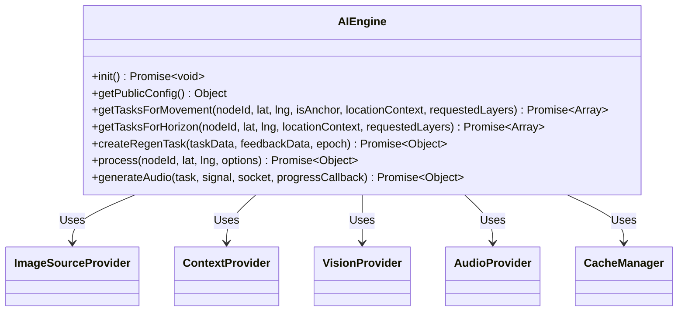


</dd>
<dt><a href="#BaseAudioProvider">BaseAudioProvider</a></dt>
<dd><p>Base Class Interface.<br>Interface for audio synthesis providers.</p>
<ul>
<li><h3 id="architecture">Architecture</h3>
</li>
</ul>


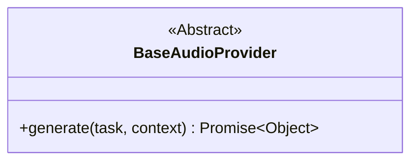


</dd>
<dt><a href="#PythonAudioProvider">PythonAudioProvider</a></dt>
<dd><p>EXAMPLE STRATEGY IMPLEMENTATION<br>Delegate strategy for producing audio by invoking an external Python generation script (e.g., custom PyTorch inferencing).</p>
<ul>
<li><h3 id="architecture">Architecture</h3>
</li>
</ul>


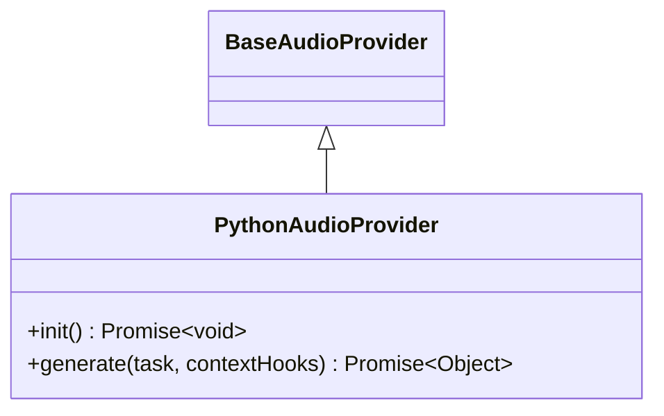


</dd>
<dt><a href="#StableAudioGradioProvider">StableAudioGradioProvider</a></dt>
<dd><p>EXAMPLE STRATEGY IMPLEMENTATION<br>Handles generation and transcodes of audio via Gradio API connections to a Stable Audio Open instance.</p>
<ul>
<li><h3 id="architecture">Architecture</h3>
</li>
</ul>


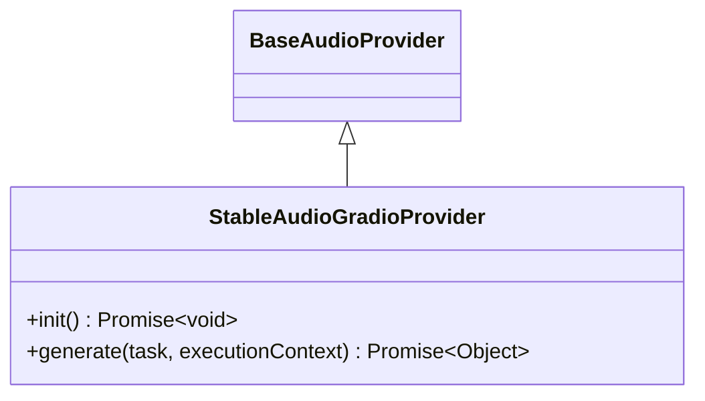


</dd>
<dt><a href="#BaseContextProvider">BaseContextProvider</a></dt>
<dd><p>Base Class Interface.<br>Interface for location resolution and client-side configuration delivery. Enforces provider-agnosticism on the backend.</p>
<ul>
<li><h3 id="architecture">Architecture</h3>
</li>
</ul>


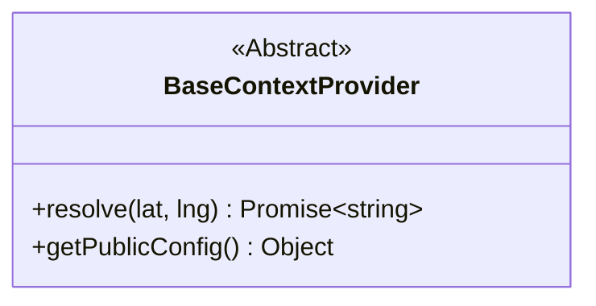


</dd>
<dt><a href="#GeoapifyContextProvider">GeoapifyContextProvider</a></dt>
<dd><p>EXAMPLE STRATEGY IMPLEMENTATION<br>Resolves geographical coordinates into location context strings using the Geoapify Reverse Geocoding API.</p>
<ul>
<li><h3 id="architecture">Architecture</h3>
</li>
</ul>


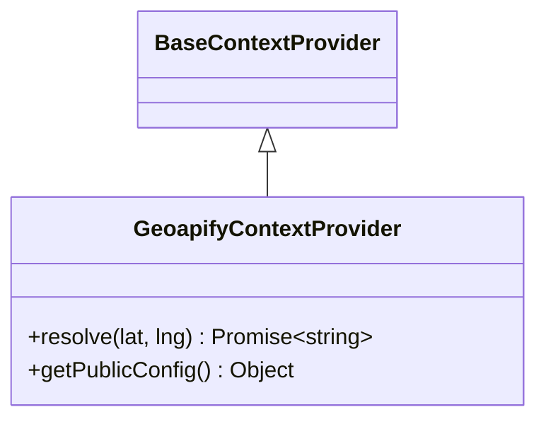


</dd>
<dt><a href="#MarzipanoContextProvider">MarzipanoContextProvider</a></dt>
<dd><p>EXAMPLE STRATEGY IMPLEMENTATION<br>Serves locational and contextual metadata logic for local Marzipano environments.</p>
<ul>
<li><h3 id="architecture">Architecture</h3>
</li>
</ul>


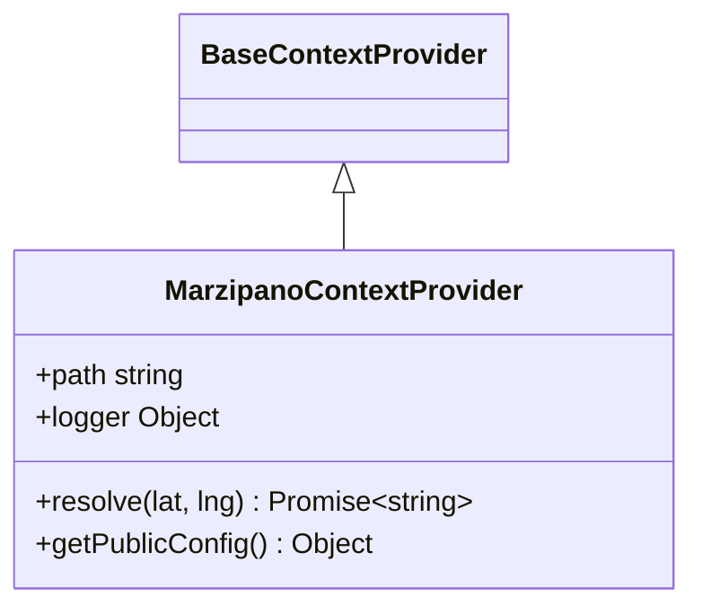


</dd>
<dt><a href="#BaseImageSourceProvider">BaseImageSourceProvider</a></dt>
<dd><p>Base Class Interface.<br>Interface for 360-degree image acquisition strategies.</p>
<ul>
<li><h3 id="architecture">Architecture</h3>
</li>
</ul>


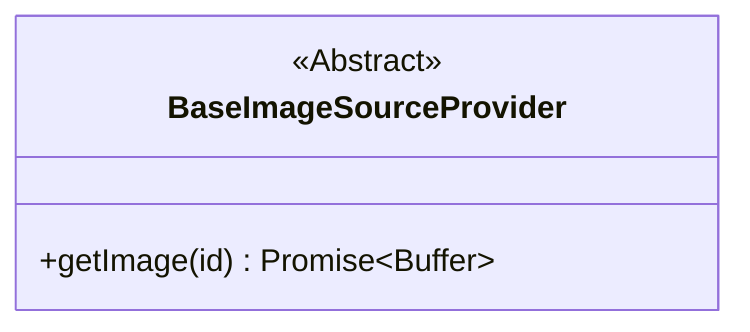


</dd>
<dt><a href="#MapillarySource">MapillarySource</a></dt>
<dd><p>EXAMPLE STRATEGY IMPLEMENTATION<br>Provider strategy for fetching raw equirectangular image buffers from the Mapillary API.<br>Enforces strict filtering to reject non-360 panoramic images.</p>
<ul>
<li><h3 id="architecture">Architecture</h3>
</li>
</ul>


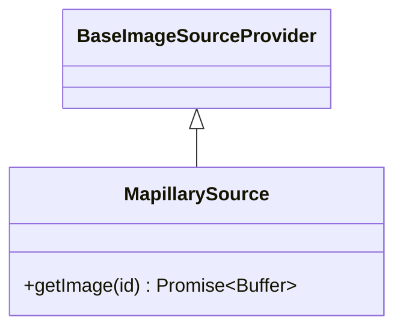


</dd>
<dt><a href="#MarzipanoImageSource">MarzipanoImageSource</a></dt>
<dd><p>Provides server-side processing to stitch Marzipano tiles back into equirectangular formats for AI engine ingestion.</p>
<ul>
<li><h3 id="architecture">Architecture</h3>
</li>
</ul>


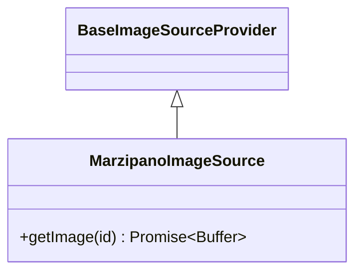


</dd>
<dt><a href="#BaseVisionProvider">BaseVisionProvider</a></dt>
<dd><p>Base class interface.<br>Interface for multimodal analysis providers.<br>CONTRACT: Implementing classes must return an object containing an &#39;intents&#39; array.</p>
<ul>
<li><h3 id="architecture">Architecture</h3>
</li>
</ul>


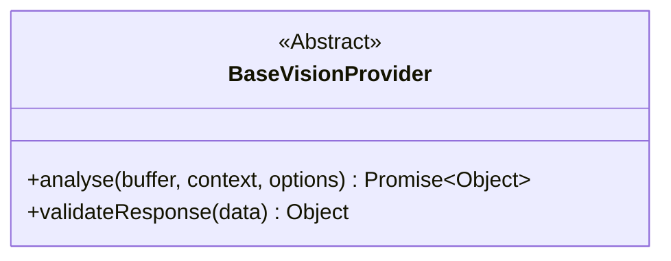


</dd>
<dt><a href="#LMStudioVisionProvider">LMStudioVisionProvider</a></dt>
<dd><p>EXAMPLE STRATEGY IMPLEMENTATION<br>Strategy authority for prompt engineering and intent mapping using a local LM Studio Vision-Language Model.</p>
<ul>
<li><h3 id="architecture">Architecture</h3>
</li>
</ul>


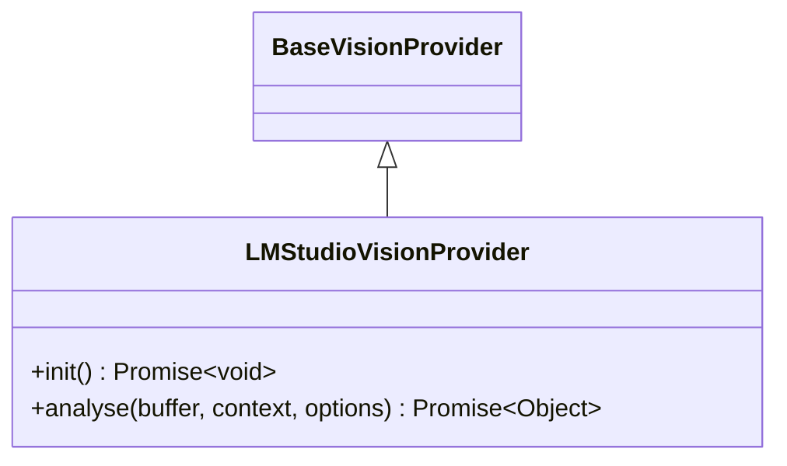


</dd>
<dt><a href="#PythonVisionProvider">PythonVisionProvider</a></dt>
<dd><p>EXAMPLE STRATEGY IMPLEMENTATION<br>Interacts with external Python scripts (e.g., custom models or OpenCV pipelines) to generate sonic intents from visual buffers.</p>
<ul>
<li><h3 id="architecture">Architecture</h3>
</li>
</ul>


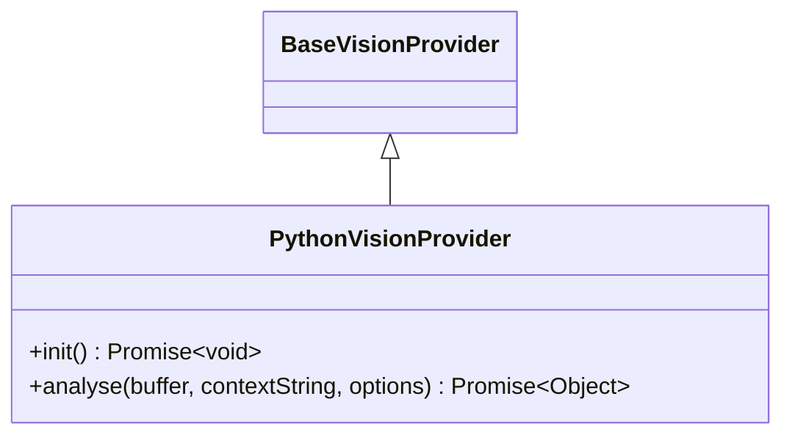


</dd>
<dt><a href="#PipelineService">PipelineService</a></dt>
<dd><p>Domain-agnostic task runner.<br>It treats tasks as black boxes and moves data without editing it.</p>
<ul>
<li><h3 id="architecture">Architecture</h3>
</li>
</ul>


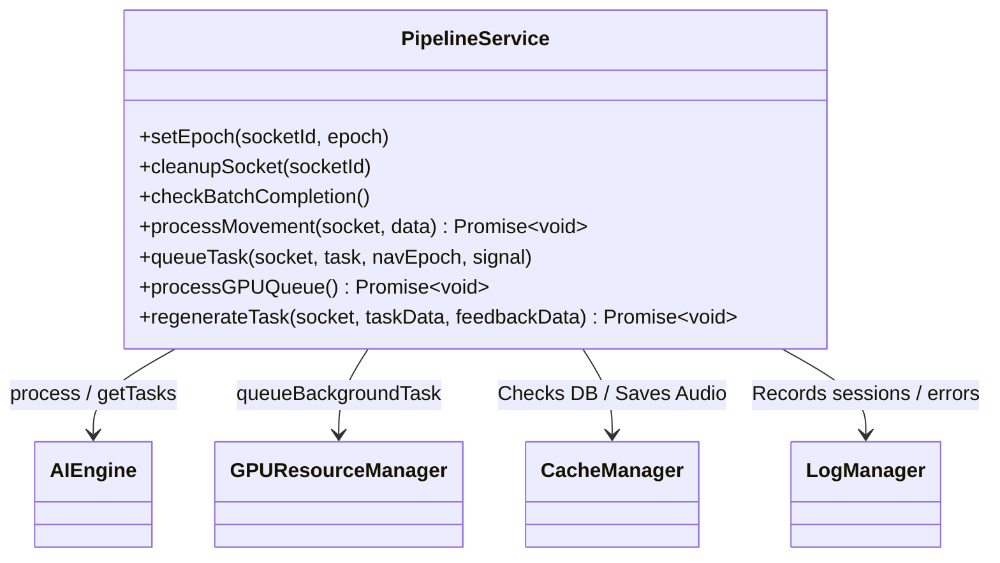


</dd>
<dt><a href="#CacheManager">CacheManager</a></dt>
<dd><p>Implements a hybrid storage strategy:  </p>
<ul>
<li>SQLite: Database of pointers and lightweight metadata.  </li>
<li>Filesystem: Standalone storage for JSON (VLM Ouputs) and Audio outputs.</li>
</ul>
<ul>
<li><h3 id="architecture">Architecture</h3>
</li>
</ul>


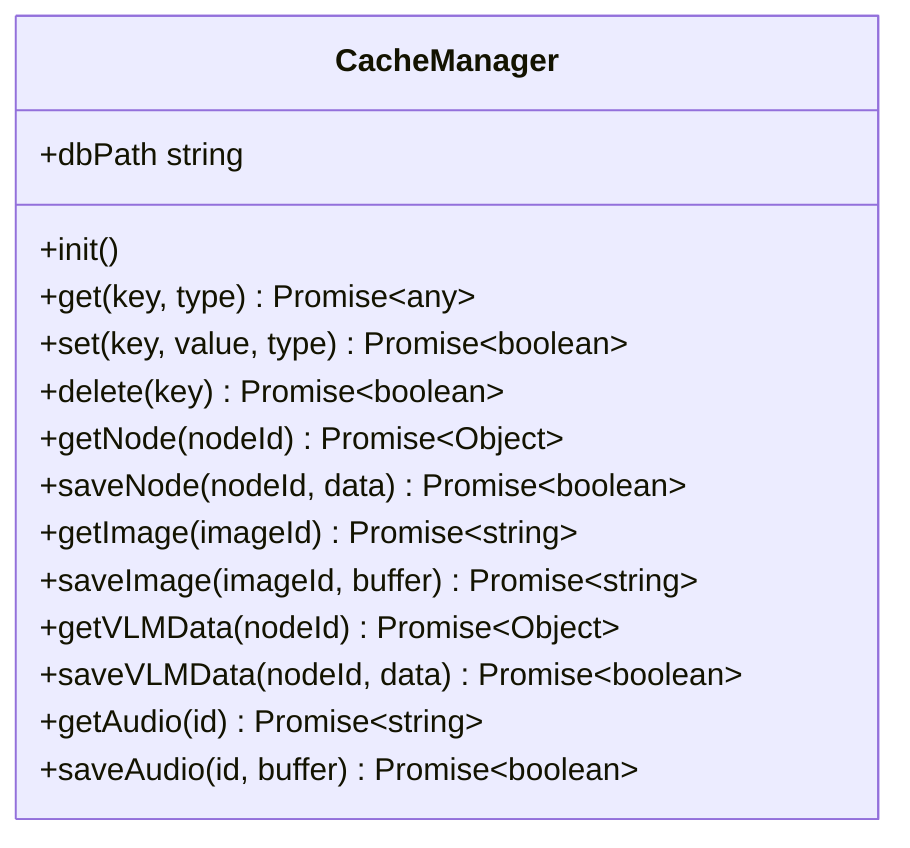


</dd>
<dt><a href="#GPUResourceManager">GPUResourceManager</a></dt>
<dd><p>Handles queuing and concurrency for hardware-intensive tasks.</p>
<ul>
<li><h3 id="architecture">Architecture</h3>
</li>
</ul>


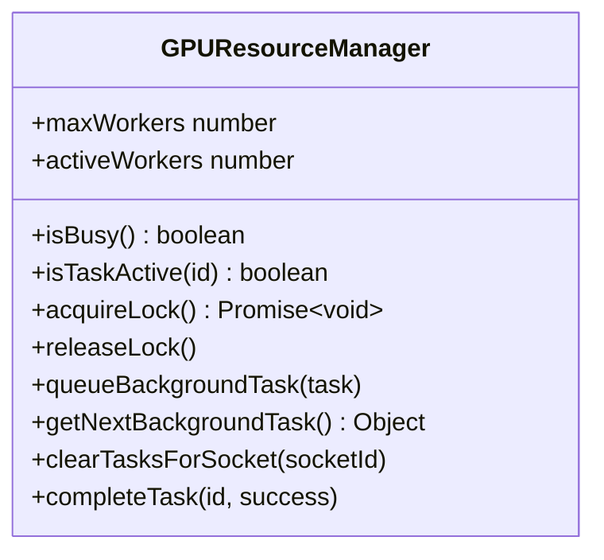


</dd>
<dt><a href="#LogManager">LogManager</a></dt>
<dd><p>Handles session-based file logging.<br>It creates a new log file for the system boot and individual files for each socket connection.</p>
<ul>
<li><h3 id="architecture">Architecture</h3>
</li>
</ul>


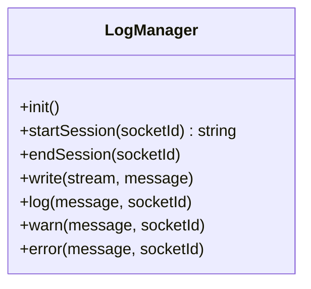


</dd>
<dt><a href="#SocketController">SocketController</a></dt>
<dd><p>Acts as the primary research interface for WebSocket clients.<br>It coordinates real-time data flow between the frontend, the GPU queue, and the pluggable AI strategies. </p>
<ul>
<li><h3 id="architecture">Architecture</h3>
</li>
</ul>


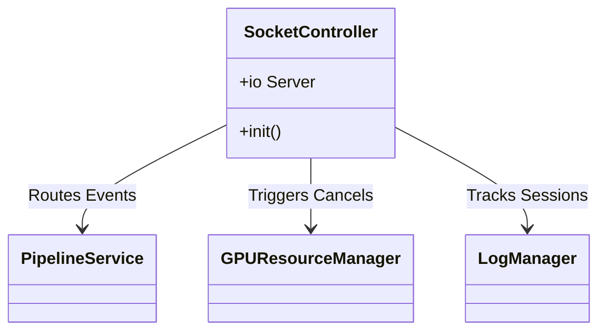


</dd>
<dt><a href="#Utils">Utils</a></dt>
<dd><p>Server-side utility class for file handling and audio manipulation.</p>
<ul>
<li><h3 id="architecture">Architecture</h3>
</li>
</ul>


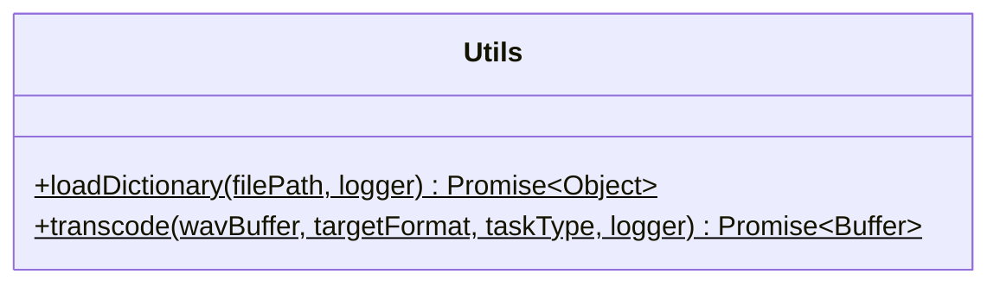


</dd>
</dl>

## Members

<dl>
<dt><a href="#envItems">envItems</a> : <code>Array.&lt;Object&gt;</code></dt>
<dd><p>Stores the ordered sequence of document blocks (sections and variables) fetched from the server.</p>
</dd>
<dt><a href="#currentMoveIndex">currentMoveIndex</a> : <code>number</code></dt>
<dd><p>Tracks the array index of the variable currently selected to move sections via the move modal. A value of -1 indicates no variable is currently queued to move.</p>
</dd>
</dl>

## Functions

<dl>
<dt><a href="#loadEnv">loadEnv()</a> ⇒ <code>Promise.&lt;void&gt;</code></dt>
<dd><p>Fetches the array of environment blocks from the backend API via localhost.</p>
</dd>
<dt><a href="#escapeHTML">escapeHTML(str)</a> ⇒ <code>string</code></dt>
<dd><p>Sanitizes raw strings for safe injection into HTML attributes to prevent layout breakage and XSS.</p>
</dd>
<dt><a href="#getSectionTitle">getSectionTitle(content)</a> ⇒ <code>string</code></dt>
<dd><p>Parses a raw section header block and extracts a clean, readable title for dropdown menus.</p>
</dd>
<dt><a href="#autoExpand">autoExpand(field)</a> ⇒ <code>void</code></dt>
<dd><p>Dynamically resizes a textarea height to fit its content exactly, removing internal scrollbars.</p>
</dd>
<dt><a href="#syncStateFromDOM">syncStateFromDOM()</a> ⇒ <code>void</code></dt>
<dd><p>Scrapes all current input values from the screen and updates the internal <code>envItems</code> array state. Prevents unsaved text edits from disappearing when the UI is forced to re-render.</p>
</dd>
<dt><a href="#render">render()</a> ⇒ <code>void</code></dt>
<dd><p>Flushes the container and iterates over the <code>envItems</code> array to draw the UI. Respects the &#39;collapsed&#39; state of sections to hide/show their child variables.</p>
</dd>
<dt><a href="#toggleCollapse">toggleCollapse(index)</a> ⇒ <code>void</code></dt>
<dd><p>Flips the visibility state for the variables nested under a specific section header.</p>
</dd>
<dt><a href="#moveBlock">moveBlock(index, dir)</a> ⇒ <code>void</code></dt>
<dd><p>Mathematically moves a single variable OR an entire section block (header + children) up or down the array.</p>
</dd>
<dt><a href="#openAddModal">openAddModal()</a> ⇒ <code>void</code></dt>
<dd><p>Syncs the DOM state, populates the target section dropdown, and opens the &#39;Add Variable&#39; modal.</p>
</dd>
<dt><a href="#closeAddModal">closeAddModal()</a> ⇒ <code>void</code></dt>
<dd><p>Hides the &#39;Add Variable&#39; modal overlay without saving changes.</p>
</dd>
<dt><a href="#confirmAddVariable">confirmAddVariable()</a> ⇒ <code>void</code></dt>
<dd><p>Validates modal input, formats comments safely, calculates insertion index, and appends the new variable.</p>
</dd>
<dt><a href="#openMoveModal">openMoveModal(index)</a> ⇒ <code>void</code></dt>
<dd><p>Syncs the DOM state, prepares the target section dropdown, and opens the Move overlay.</p>
</dd>
<dt><a href="#closeMoveModal">closeMoveModal()</a> ⇒ <code>void</code></dt>
<dd><p>Hides the move modal overlay and resets the active move index.</p>
</dd>
<dt><a href="#confirmMoveVariable">confirmMoveVariable()</a> ⇒ <code>void</code></dt>
<dd><p>Calculates array offsets to extract the selected variable and inject it at the bottom of the target section.</p>
</dd>
<dt><a href="#addNewSection">addNewSection()</a> ⇒ <code>void</code></dt>
<dd><p>Syncs the DOM state, then appends a new Section Header template to the bottom of the state flow.</p>
</dd>
<dt><a href="#removeItem">removeItem(index)</a> ⇒ <code>void</code></dt>
<dd><p>Syncs the DOM state, destroys a specific block, and re-renders the UI. Warns if removing a parent section.</p>
</dd>
<dt><a href="#saveChanges">saveChanges()</a> ⇒ <code>Promise.&lt;void&gt;</code></dt>
<dd><p>Syncs the DOM state, then executes a POST request to the backend to write the updated <code>.env</code> array to disk.</p>
</dd>
<dt><a href="#startServer">startServer()</a> ⇒ <code>Promise.&lt;void&gt;</code></dt>
<dd><p>Standardized Agnostic Bootloader for the Express/WebSocket backend. Assembles the infrastructure (Cache, GPU, Logging) and bootstraps the AI Engine.</p>
</dd>
<dt><a href="#requireLocalhost">requireLocalhost(req, res, next)</a></dt>
<dd><p>Express middleware to restrict route access strictly to the local machine. Blocks external IP addresses from accessing the admin dashboard.</p>
</dd>
<dt><a href="#getEnvData">getEnvData()</a> ⇒ <code>Array.&lt;Object&gt;</code></dt>
<dd><p>Parses the .env file into an ordered array of blocks. Separates standalone section headers from variable-specific comments.</p>
</dd>
<dt><a href="#updateEnvFile">updateEnvFile(items)</a></dt>
<dd><p>Reconstructs and writes the .env file sequentially from an array of blocks, maintaining exact order and updating the live <code>process.env</code>.</p>
</dd>
</dl>

<a name="AIEngine"></a>

## AIEngine
Handles logic, prompt construction, and provider selection.  
Standardized: Encapsulates all strategy instantiation and dictionary.

* ### Architecture
```mermaid
classDiagram
AIEngine --> ImageSourceProvider : Uses
AIEngine --> ContextProvider : Uses
AIEngine --> VisionProvider : Uses
AIEngine --> AudioProvider : Uses
AIEngine --> CacheManager : Uses
class AIEngine{
+init() Promise~void~
+getPublicConfig() Object
+getTasksForMovement(nodeId, lat, lng, isAnchor, locationContext, requestedLayers) Promise~Array~
+getTasksForHorizon(nodeId, lat, lng, locationContext, requestedLayers) Promise~Array~
+createRegenTask(taskData, feedbackData, epoch) Promise~Object~
+process(nodeId, lat, lng, options) Promise~Object~
+generateAudio(task, signal, socket, progressCallback) Promise~Object~
}
```

**Kind**: global class  

* [AIEngine](#AIEngine)
    * [new AIEngine(options)](#new_AIEngine_new)
    * [.init()](#AIEngine.init) ⇒ <code>Promise.&lt;void&gt;</code>
    * [.getPublicConfig()](#AIEngine.getPublicConfig) ⇒ <code>Object</code>
    * [.getTasksForMovement(nodeId, lat, lng, isAnchor, locationContext, requestedLayers)](#AIEngine.getTasksForMovement) ⇒ <code>Promise.&lt;Array.&lt;Object&gt;&gt;</code>
    * [.getTasksForHorizon(nodeId, lat, lng, locationContext, requestedLayers)](#AIEngine.getTasksForHorizon) ⇒ <code>Promise.&lt;Array.&lt;Object&gt;&gt;</code>
    * [.createRegenTask(taskData, feedbackData, epoch)](#AIEngine.createRegenTask) ⇒ <code>Promise.&lt;Object&gt;</code>
    * [.process(nodeId, lat, lng, [options])](#AIEngine.process) ⇒ <code>Promise.&lt;Object&gt;</code>
    * [.generateAudio(task, signal, socket, progressCallback)](#AIEngine.generateAudio) ⇒ <code>Promise.&lt;Object&gt;</code>

<a name="new_AIEngine_new"></a>

### new AIEngine(options)

| Param | Type | Description |
| --- | --- | --- |
| options | <code>Object</code> | Initialization options including config, cacheManager, and logger. |

<a name="AIEngine.init"></a>

### AIEngine.init() ⇒ <code>Promise.&lt;void&gt;</code>
Instantiates the configured strategy providers via dynamic imports based on the environment variables.

**Kind**: static method of [<code>AIEngine</code>](#AIEngine)  
<a name="AIEngine.getPublicConfig"></a>

### AIEngine.getPublicConfig() ⇒ <code>Object</code>
Exposes public configuration parameters required by the frontend client strategies.

**Kind**: static method of [<code>AIEngine</code>](#AIEngine)  
**Returns**: <code>Object</code> - Configuration bundle.  
<a name="AIEngine.getTasksForMovement"></a>

### AIEngine.getTasksForMovement(nodeId, lat, lng, isAnchor, locationContext, requestedLayers) ⇒ <code>Promise.&lt;Array.&lt;Object&gt;&gt;</code>
Evaluates VLM data for a primary node to generate a queue of foreground Audio tasks.

**Kind**: static method of [<code>AIEngine</code>](#AIEngine)  
**Returns**: <code>Promise.&lt;Array.&lt;Object&gt;&gt;</code> - Array of configured synthesis tasks.  

| Param | Type | Description |
| --- | --- | --- |
| nodeId | <code>string</code> | Target panorama ID. |
| lat | <code>number</code> | Latitude. |
| lng | <code>number</code> | Longitude. |
| isAnchor | <code>boolean</code> | Whether the node is a topological/acoustic anchor. |
| locationContext | <code>string</code> | Geocoded contextual string. |
| requestedLayers | <code>Array.&lt;string&gt;</code> | Target semantic layers (e.g., 'ambient', 'spatial'). |

<a name="AIEngine.getTasksForHorizon"></a>

### AIEngine.getTasksForHorizon(nodeId, lat, lng, locationContext, requestedLayers) ⇒ <code>Promise.&lt;Array.&lt;Object&gt;&gt;</code>
Evaluates VLM data for background/neighboring nodes to support the acoustic treadmill.

**Kind**: static method of [<code>AIEngine</code>](#AIEngine)  
**Returns**: <code>Promise.&lt;Array.&lt;Object&gt;&gt;</code> - Array of configured background tasks.  

| Param | Type | Description |
| --- | --- | --- |
| nodeId | <code>string</code> | Target panorama ID. |
| lat | <code>number</code> | Latitude. |
| lng | <code>number</code> | Longitude. |
| locationContext | <code>string</code> | Geocoded contextual string. |
| requestedLayers | <code>Array.&lt;string&gt;</code> | Target semantic layers. |

<a name="AIEngine.createRegenTask"></a>

### AIEngine.createRegenTask(taskData, feedbackData, epoch) ⇒ <code>Promise.&lt;Object&gt;</code>
Reconfigures an existing task for forced generation based on user feedback.

**Kind**: static method of [<code>AIEngine</code>](#AIEngine)  
**Returns**: <code>Promise.&lt;Object&gt;</code> - Regenerated task payload.  

| Param | Type | Description |
| --- | --- | --- |
| taskData | <code>Object</code> | Existing task state. |
| feedbackData | <code>Object</code> | Explicit user modification requests. |
| epoch | <code>number</code> | Current navigation epoch. |

<a name="AIEngine.process"></a>

### AIEngine.process(nodeId, lat, lng, [options]) ⇒ <code>Promise.&lt;Object&gt;</code>
Wraps the image acquisition and Vision Language Model evaluation phases.

**Kind**: static method of [<code>AIEngine</code>](#AIEngine)  
**Returns**: <code>Promise.&lt;Object&gt;</code> - Object containing generated { sceneData, locationString }.  

| Param | Type | Default | Description |
| --- | --- | --- | --- |
| nodeId | <code>string</code> |  | Target node identifier. |
| lat | <code>number</code> |  | Latitude. |
| lng | <code>number</code> |  | Longitude. |
| [options] | <code>Object</code> | <code>{}</code> | Extra contextual options. |

<a name="AIEngine.generateAudio"></a>

### AIEngine.generateAudio(task, signal, socket, progressCallback) ⇒ <code>Promise.&lt;Object&gt;</code>
Executes the audio diffusion strategy and performs post-processing transcodes.

**Kind**: static method of [<code>AIEngine</code>](#AIEngine)  
**Returns**: <code>Promise.&lt;Object&gt;</code> - Object containing the raw { buffer }.  

| Param | Type | Description |
| --- | --- | --- |
| task | <code>Object</code> | The synthesis configuration payload. |
| signal | <code>AbortSignal</code> | Cancellation controller. |
| socket | <code>Socket</code> | Target client socket for localized progress events. |
| progressCallback | <code>function</code> | Hook to emit step-by-step progress. |

<a name="BaseAudioProvider"></a>

## BaseAudioProvider
Base Class Interface.  
Interface for audio synthesis providers.

* ### Architecture
```mermaid
classDiagram
class BaseAudioProvider{
<<Abstract>>
+generate(task, context) Promise~Object~
}
```

**Kind**: global class  
<a name="BaseAudioProvider.generate"></a>

### BaseAudioProvider.generate(task, context) ⇒ <code>Promise.&lt;{buffer: Buffer, duration: string}&gt;</code>
Executes the audio generation pipeline for a given semantic task.

**Kind**: static method of [<code>BaseAudioProvider</code>](#BaseAudioProvider)  
**Returns**: <code>Promise.&lt;{buffer: Buffer, duration: string}&gt;</code> - The generated audio data.  
**Throws**:

- <code>Error</code> If not implemented by the specific provider.


| Param | Type | Description |
| --- | --- | --- |
| task | <code>Object</code> | The complete task metadata (prompt, type, steps). |
| context | <code>Object</code> | Execution hooks including { signal, socket, progressCallback }. |

<a name="PythonAudioProvider"></a>

## PythonAudioProvider
EXAMPLE STRATEGY IMPLEMENTATION  
Delegate strategy for producing audio by invoking an external Python generation script (e.g., custom PyTorch inferencing).

* ### Architecture
```mermaid
classDiagram
BaseAudioProvider <|-- PythonAudioProvider
class PythonAudioProvider{
+init() Promise~void~
+generate(task, contextHooks) Promise~Object~
}
```

**Kind**: global class  

* [PythonAudioProvider](#PythonAudioProvider)
    * [new PythonAudioProvider(config, logger)](#new_PythonAudioProvider_new)
    * [.init()](#PythonAudioProvider.init) ⇒ <code>Promise.&lt;void&gt;</code>
    * [.generate(task, [contextHooks])](#PythonAudioProvider.generate) ⇒ <code>Promise.&lt;{buffer: (Buffer\|null), duration: (number\|string)}&gt;</code>

<a name="new_PythonAudioProvider_new"></a>

### new PythonAudioProvider(config, logger)

| Param | Type | Description |
| --- | --- | --- |
| config | <code>Object</code> | System configuration containing PYTHON_EXEC and PYTHON_AUDIO_SCRIPT. |
| logger | <code>Object</code> | System Logger. |

<a name="PythonAudioProvider.init"></a>

### PythonAudioProvider.init() ⇒ <code>Promise.&lt;void&gt;</code>
Validates configuration variables upon system start.

**Kind**: static method of [<code>PythonAudioProvider</code>](#PythonAudioProvider)  
<a name="PythonAudioProvider.generate"></a>

### PythonAudioProvider.generate(task, [contextHooks]) ⇒ <code>Promise.&lt;{buffer: (Buffer\|null), duration: (number\|string)}&gt;</code>
Offloads the audio task to a Python subprocess, handling the retrieval of the generated wav file.

**Kind**: static method of [<code>PythonAudioProvider</code>](#PythonAudioProvider)  
**Returns**: <code>Promise.&lt;{buffer: (Buffer\|null), duration: (number\|string)}&gt;</code> - Generated audio data buffer and performance timing.  

| Param | Type | Default | Description |
| --- | --- | --- | --- |
| task | <code>Object</code> |  | Execution instructions/intent. |
| [contextHooks] | <code>Object</code> | <code>{}</code> | Optional object containing abort signals, sockets, and progress callbacks. |

<a name="StableAudioGradioProvider"></a>

## StableAudioGradioProvider
EXAMPLE STRATEGY IMPLEMENTATION  
Handles generation and transcodes of audio via Gradio API connections to a Stable Audio Open instance.

* ### Architecture
```mermaid
classDiagram
BaseAudioProvider <|-- StableAudioGradioProvider
class StableAudioGradioProvider{
+init() Promise~void~
+generate(task, executionContext) Promise~Object~
}
```

**Kind**: global class  

* [StableAudioGradioProvider](#StableAudioGradioProvider)
    * [new StableAudioGradioProvider(config, logger)](#new_StableAudioGradioProvider_new)
    * [.init()](#StableAudioGradioProvider.init) ⇒ <code>Promise.&lt;void&gt;</code>
    * [.generate(task, executionContext)](#StableAudioGradioProvider.generate) ⇒ <code>Promise.&lt;{buffer: (Buffer\|null), duration: (number\|string)}&gt;</code>

<a name="new_StableAudioGradioProvider_new"></a>

### new StableAudioGradioProvider(config, logger)

| Param | Type | Description |
| --- | --- | --- |
| config | <code>Object</code> | System configuration containing STABLE_AUDIO_API URL. |
| logger | <code>Object</code> | System Logger. |

<a name="StableAudioGradioProvider.init"></a>

### StableAudioGradioProvider.init() ⇒ <code>Promise.&lt;void&gt;</code>
Pre-loads the prompt tuning dictionary and pre-warms the Gradio API connection.

**Kind**: static method of [<code>StableAudioGradioProvider</code>](#StableAudioGradioProvider)  
<a name="StableAudioGradioProvider.generate"></a>

### StableAudioGradioProvider.generate(task, executionContext) ⇒ <code>Promise.&lt;{buffer: (Buffer\|null), duration: (number\|string)}&gt;</code>
Executes the generation cycle via Gradio API, handling prompt formulation, audio-to-audio feedback transcodes, and socket progress callbacks.

**Kind**: static method of [<code>StableAudioGradioProvider</code>](#StableAudioGradioProvider)  
**Returns**: <code>Promise.&lt;{buffer: (Buffer\|null), duration: (number\|string)}&gt;</code> - The generated audio buffer and tracking duration.  

| Param | Type | Description |
| --- | --- | --- |
| task | <code>Object</code> | Audio generation intent parameters. |
| executionContext | <code>Object</code> | Context containing abort signals, sockets, and callbacks. |

<a name="BaseContextProvider"></a>

## BaseContextProvider
Base Class Interface.  
Interface for location resolution and client-side configuration delivery. Enforces provider-agnosticism on the backend.

* ### Architecture
```mermaid
classDiagram
class BaseContextProvider{
<<Abstract>>
+resolve(lat, lng) Promise~string~
+getPublicConfig() Object
}
```

**Kind**: global class  
**Calss**:   

* [BaseContextProvider](#BaseContextProvider)
    * [.resolve(lat, lng)](#BaseContextProvider.resolve) ⇒ <code>Promise.&lt;string&gt;</code>
    * [.getPublicConfig()](#BaseContextProvider.getPublicConfig) ⇒ <code>Object</code>

<a name="BaseContextProvider.resolve"></a>

### BaseContextProvider.resolve(lat, lng) ⇒ <code>Promise.&lt;string&gt;</code>
Resolves raw latitude and longitude into a human-readable location context.

**Kind**: static method of [<code>BaseContextProvider</code>](#BaseContextProvider)  
**Returns**: <code>Promise.&lt;string&gt;</code> - Contextual string (e.g., "Urban City Center, London").  
**Throws**:

- <code>Error</code> If not implemented by the specific provider.


| Param | Type | Description |
| --- | --- | --- |
| lat | <code>number</code> | Latitude. |
| lng | <code>number</code> | Longitude. |

<a name="BaseContextProvider.getPublicConfig"></a>

### BaseContextProvider.getPublicConfig() ⇒ <code>Object</code>
Exposes public configuration/credentials safely to the frontend client.

**Kind**: static method of [<code>BaseContextProvider</code>](#BaseContextProvider)  
**Returns**: <code>Object</code> - Public config dictionary (e.g., { apiKey: "..." }).  
**Throws**:

- <code>Error</code> If not implemented by the specific provider.

<a name="GeoapifyContextProvider"></a>

## GeoapifyContextProvider
EXAMPLE STRATEGY IMPLEMENTATION  
Resolves geographical coordinates into location context strings using the Geoapify Reverse Geocoding API.

* ### Architecture
```mermaid
classDiagram
BaseContextProvider <|-- GeoapifyContextProvider
class GeoapifyContextProvider{
+resolve(lat, lng) Promise~string~
+getPublicConfig() Object
}
```

**Kind**: global class  

* [GeoapifyContextProvider](#GeoapifyContextProvider)
    * [new GeoapifyContextProvider(key, logger)](#new_GeoapifyContextProvider_new)
    * [.resolve(lat, lng)](#GeoapifyContextProvider.resolve) ⇒ <code>Promise.&lt;string&gt;</code>
    * [.getPublicConfig()](#GeoapifyContextProvider.getPublicConfig) ⇒ <code>Object</code>

<a name="new_GeoapifyContextProvider_new"></a>

### new GeoapifyContextProvider(key, logger)

| Param | Type | Description |
| --- | --- | --- |
| key | <code>Object</code> | Server configuration object containing API tokens. |
| logger | <code>Object</code> | System Logger instance. |

<a name="GeoapifyContextProvider.resolve"></a>

### GeoapifyContextProvider.resolve(lat, lng) ⇒ <code>Promise.&lt;string&gt;</code>
Resolves raw coordinates into contextual language data for prompts.

**Kind**: static method of [<code>GeoapifyContextProvider</code>](#GeoapifyContextProvider)  
**Returns**: <code>Promise.&lt;string&gt;</code> - Formatted location string (e.g., "City, State, Country").  

| Param | Type | Description |
| --- | --- | --- |
| lat | <code>number</code> | Latitude. |
| lng | <code>number</code> | Longitude. |

<a name="GeoapifyContextProvider.getPublicConfig"></a>

### GeoapifyContextProvider.getPublicConfig() ⇒ <code>Object</code>
Exposes required public keys to the frontend without leaking server secrets.

**Kind**: static method of [<code>GeoapifyContextProvider</code>](#GeoapifyContextProvider)  
**Returns**: <code>Object</code> - Public configuration object.  
<a name="BaseImageSourceProvider"></a>

## BaseImageSourceProvider
Base Class Interface.  
Interface for 360-degree image acquisition strategies.

* ### Architecture
```mermaid
classDiagram
class BaseImageSourceProvider{
<<Abstract>>
+getImage(id) Promise~Buffer~
}
```

**Kind**: global class  
<a name="BaseImageSourceProvider.getImage"></a>

### BaseImageSourceProvider.getImage(id) ⇒ <code>Promise.&lt;Buffer&gt;</code>
Fetches an equirectangular image buffer for a specific node ID.

**Kind**: static method of [<code>BaseImageSourceProvider</code>](#BaseImageSourceProvider)  
**Returns**: <code>Promise.&lt;Buffer&gt;</code> - The binary image data.  
**Throws**:

- <code>Error</code> If not implemented by the specific provider.


| Param | Type | Description |
| --- | --- | --- |
| id | <code>string</code> | The agnostic node identifier. |

<a name="MapillarySource"></a>

## MapillarySource
EXAMPLE STRATEGY IMPLEMENTATION  
Provider strategy for fetching raw equirectangular image buffers from the Mapillary API.  
Enforces strict filtering to reject non-360 panoramic images.

* ### Architecture
```mermaid
classDiagram
BaseImageSourceProvider <|-- MapillarySource
class MapillarySource{
+getImage(id) Promise~Buffer~
}
```

**Kind**: global class  

* [MapillarySource](#MapillarySource)
    * [new MapillarySource(options, logger, [cacheManager])](#new_MapillarySource_new)
    * [.getImage(id)](#MapillarySource.getImage) ⇒ <code>Promise.&lt;Buffer&gt;</code>

<a name="new_MapillarySource_new"></a>

### new MapillarySource(options, logger, [cacheManager])

| Param | Type | Default | Description |
| --- | --- | --- | --- |
| options | <code>Object</code> |  | Configuration containing the MAPILLARY_TOKEN. |
| logger | <code>Object</code> |  | System Logger. |
| [cacheManager] | <code>Object</code> | <code></code> | Optional disk caching manager. |

<a name="MapillarySource.getImage"></a>

### MapillarySource.getImage(id) ⇒ <code>Promise.&lt;Buffer&gt;</code>
Fetches the image buffer for a given Mapillary Node ID, utilizing the cache if available.

**Kind**: static method of [<code>MapillarySource</code>](#MapillarySource)  
**Returns**: <code>Promise.&lt;Buffer&gt;</code> - The image data buffer.  
**Throws**:

- <code>Error</code> If the image is not a 360 panorama or the fetch fails.


| Param | Type | Description |
| --- | --- | --- |
| id | <code>string</code> | Mapillary Image ID. |

<a name="BaseVisionProvider"></a>

## BaseVisionProvider
Base class interface.  
Interface for multimodal analysis providers.  
CONTRACT: Implementing classes must return an object containing an 'intents' array.
 
* ### Architecture
```mermaid
classDiagram
class BaseVisionProvider{
<<Abstract>>
+analyse(buffer, context, options) Promise~Object~
+validateResponse(data) Object
}
```

**Kind**: global class  

* [BaseVisionProvider](#BaseVisionProvider)
    * [.analyse(buffer, context, options)](#BaseVisionProvider.analyse) ⇒ <code>Promise.&lt;Object&gt;</code>
    * [.validateResponse(data)](#BaseVisionProvider.validateResponse) ⇒ <code>Object</code>

<a name="BaseVisionProvider.analyse"></a>

### BaseVisionProvider.analyse(buffer, context, options) ⇒ <code>Promise.&lt;Object&gt;</code>
Executes multimodal analysis to extract sonic layers from visuals.

**Kind**: static method of [<code>BaseVisionProvider</code>](#BaseVisionProvider)  
**Returns**: <code>Promise.&lt;Object&gt;</code> - Must resolve with { intents: [...] }  
**Throws**:

- <code>Error</code> If not implemented by the specific provider.


| Param | Type | Description |
| --- | --- | --- |
| buffer | <code>Buffer</code> | Raw image data. |
| context | <code>string</code> | Geocoded location string. |
| options | <code>Object</code> | Strategy configuration parameters. |

<a name="BaseVisionProvider.validateResponse"></a>

### BaseVisionProvider.validateResponse(data) ⇒ <code>Object</code>
Validation guard ensuring the provider adheres to the system pipeline schema.

**Kind**: static method of [<code>BaseVisionProvider</code>](#BaseVisionProvider)  
**Returns**: <code>Object</code> - Validated payload.  
**Throws**:

- <code>Error</code> If fields are missing.


| Param | Type | Description |
| --- | --- | --- |
| data | <code>Object</code> | Data payload to validate. |

<a name="LMStudioVisionProvider"></a>

## LMStudioVisionProvider
EXAMPLE STRATEGY IMPLEMENTATION  
Strategy authority for prompt engineering and intent mapping using a local LM Studio Vision-Language Model.

* ### Architecture
```mermaid
classDiagram
BaseVisionProvider <|-- LMStudioVisionProvider
class LMStudioVisionProvider{
+init() Promise~void~
+analyse(buffer, context, options) Promise~Object~
}
```

**Kind**: global class  

* [LMStudioVisionProvider](#LMStudioVisionProvider)
    * [new LMStudioVisionProvider(config, logger)](#new_LMStudioVisionProvider_new)
    * [.layerProcessors()](#LMStudioVisionProvider.layerProcessors) ⇒ <code>Object</code>
    * [.init()](#LMStudioVisionProvider.init) ⇒ <code>Promise.&lt;void&gt;</code>
    * [.analyse(buffer, context, options)](#LMStudioVisionProvider.analyse) ⇒ <code>Promise.&lt;Object&gt;</code>
    * [._processAmbientLayer(buffer, locationContext, layerName, config)](#LMStudioVisionProvider._processAmbientLayer) ⇒ <code>Promise.&lt;Array&gt;</code>

<a name="new_LMStudioVisionProvider_new"></a>

### new LMStudioVisionProvider(config, logger)

| Param | Type | Description |
| --- | --- | --- |
| config | <code>Object</code> | Configuration object containing {LM_STUDIO_API, VLM_MODEL_ID, VLM_PROMPT_AMBIENT, VLM_PROMPT_SPATIAL} |
| logger | [<code>LogManager</code>](#LogManager) | The system logger |

<a name="LMStudioVisionProvider.layerProcessors"></a>

### LMStudioVisionProvider.layerProcessors() ⇒ <code>Object</code>
Maps requested layer names to their corresponding processing functions.

**Kind**: static method of [<code>LMStudioVisionProvider</code>](#LMStudioVisionProvider)  
<a name="LMStudioVisionProvider.init"></a>

### LMStudioVisionProvider.init() ⇒ <code>Promise.&lt;void&gt;</code>
Initializes the Vision Provider and logs connection details.

**Kind**: static method of [<code>LMStudioVisionProvider</code>](#LMStudioVisionProvider)  
<a name="LMStudioVisionProvider.analyse"></a>

### LMStudioVisionProvider.analyse(buffer, context, options) ⇒ <code>Promise.&lt;Object&gt;</code>
Executes multimodal analysis to extract sonic layers from an image buffer.

**Kind**: static method of [<code>LMStudioVisionProvider</code>](#LMStudioVisionProvider)  
**Returns**: <code>Promise.&lt;Object&gt;</code> - An object containing an array of audio generation 'intents'.  

| Param | Type | Description |
| --- | --- | --- |
| buffer | <code>Buffer</code> | Raw equirectangular image data. |
| context | <code>string</code> | Geocoded location string. |
| options | <code>Object</code> | Strategy configuration parameters containing requested layers and topology info. |

<a name="LMStudioVisionProvider._processAmbientLayer"></a>

### LMStudioVisionProvider.\_processAmbientLayer(buffer, locationContext, layerName, config) ⇒ <code>Promise.&lt;Array&gt;</code>
Processes the ambient layer for audio generation.

**Kind**: static method of [<code>LMStudioVisionProvider</code>](#LMStudioVisionProvider)  
**Returns**: <code>Promise.&lt;Array&gt;</code> - An array of processed ambient audio intents.  

| Param | Type | Description |
| --- | --- | --- |
| buffer | <code>Buffer</code> | Raw equirectangular image data. |
| locationContext | <code>string</code> | Geocoded location string. |
| layerName | <code>string</code> | Name of the layer being processed. |
| config | <code>Object</code> | Configuration options for the processing function. |

<a name="PythonVisionProvider"></a>

## PythonVisionProvider
EXAMPLE STRATEGY IMPLEMENTATION  
Interacts with external Python scripts (e.g., custom models or OpenCV pipelines) to generate sonic intents from visual buffers.

* ### Architecture
```mermaid
classDiagram
BaseVisionProvider <|-- PythonVisionProvider
class PythonVisionProvider{
+init() Promise~void~
+analyse(buffer, contextString, options) Promise~Object~
}
```

**Kind**: global class  

* [PythonVisionProvider](#PythonVisionProvider)
    * [new PythonVisionProvider(config, logger)](#new_PythonVisionProvider_new)
    * [.init()](#PythonVisionProvider.init) ⇒ <code>Promise.&lt;void&gt;</code>
    * [.analyse(buffer, contextString, [options])](#PythonVisionProvider.analyse) ⇒ <code>Promise.&lt;Object&gt;</code>

<a name="new_PythonVisionProvider_new"></a>

### new PythonVisionProvider(config, logger)

| Param | Type | Description |
| --- | --- | --- |
| config | <code>Object</code> | System configuration containing PYTHON_EXEC and PYTHON_VISION_SCRIPT paths. |
| logger | <code>Object</code> | System Logger. |

<a name="PythonVisionProvider.init"></a>

### PythonVisionProvider.init() ⇒ <code>Promise.&lt;void&gt;</code>
Validates configuration and verifies script targets.

**Kind**: static method of [<code>PythonVisionProvider</code>](#PythonVisionProvider)  
<a name="PythonVisionProvider.analyse"></a>

### PythonVisionProvider.analyse(buffer, contextString, [options]) ⇒ <code>Promise.&lt;Object&gt;</code>
Writes the image buffer to disk, spawns a Python child process for analysis, and parses the returned JSON intents.

**Kind**: static method of [<code>PythonVisionProvider</code>](#PythonVisionProvider)  
**Returns**: <code>Promise.&lt;Object&gt;</code> - Formatted intents payload matching the VisionProvider contract.  

| Param | Type | Default | Description |
| --- | --- | --- | --- |
| buffer | <code>Buffer</code> |  | Image data buffer. |
| contextString | <code>string</code> |  | Physical location string to pass to the model. |
| [options] | <code>Object</code> | <code>{}</code> | Additional execution flags. |

<a name="PipelineService"></a>

## PipelineService
Domain-agnostic task runner.  
It treats tasks as black boxes and moves data without editing it.

* ### Architecture
```mermaid
classDiagram
PipelineService --> AIEngine : process / getTasks
PipelineService --> GPUResourceManager : queueBackgroundTask
PipelineService --> CacheManager : Checks DB / Saves Audio
PipelineService --> LogManager : Records sessions / errors
class PipelineService{
+setEpoch(socketId, epoch)
+cleanupSocket(socketId)
+checkBatchCompletion()
+processMovement(socket, data) Promise~void~
+queueTask(socket, task, navEpoch, signal)
+processGPUQueue() Promise~void~
+regenerateTask(socket, taskData, feedbackData) Promise~void~
}
```

**Kind**: global class  

* [PipelineService](#PipelineService)
    * [new PipelineService(aiEngine, gpuManager, cacheManager, logger)](#new_PipelineService_new)
    * [.setEpoch(socketId, epoch)](#PipelineService.setEpoch)
    * [.cleanupSocket(socketId)](#PipelineService.cleanupSocket)
    * [.checkBatchCompletion()](#PipelineService.checkBatchCompletion)
    * [.processMovement(socket, data)](#PipelineService.processMovement) ⇒ <code>Promise.&lt;void&gt;</code>
    * [.queueTask(socket, task, navEpoch, signal)](#PipelineService.queueTask)
    * [.processGPUQueue()](#PipelineService.processGPUQueue) ⇒ <code>Promise.&lt;void&gt;</code>
    * [.regenerateTask(socket, taskData, feedbackData)](#PipelineService.regenerateTask) ⇒ <code>Promise.&lt;void&gt;</code>

<a name="new_PipelineService_new"></a>

### new PipelineService(aiEngine, gpuManager, cacheManager, logger)

| Param | Type | Description |
| --- | --- | --- |
| aiEngine | [<code>AIEngine</code>](#AIEngine) | The central AI processing engine. |
| gpuManager | [<code>GPUResourceManager</code>](#GPUResourceManager) | The queue/concurrency manager. |
| cacheManager | [<code>CacheManager</code>](#CacheManager) | The hybrid caching system. |
| logger | [<code>LogManager</code>](#LogManager) | The system logger. |

<a name="PipelineService.setEpoch"></a>

### PipelineService.setEpoch(socketId, epoch)
Registers the current navigation epoch for a specific client socket.

**Kind**: static method of [<code>PipelineService</code>](#PipelineService)  

| Param | Type | Description |
| --- | --- | --- |
| socketId | <code>string</code> | The client's socket identifier. |
| epoch | <code>number</code> | The current navigation tick. |

<a name="PipelineService.cleanupSocket"></a>

### PipelineService.cleanupSocket(socketId)
Aborts active tasks and removes epoch tracking for a disconnected client.

**Kind**: static method of [<code>PipelineService</code>](#PipelineService)  

| Param | Type | Description |
| --- | --- | --- |
| socketId | <code>string</code> | The client's socket identifier. |

<a name="PipelineService.checkBatchCompletion"></a>

### PipelineService.checkBatchCompletion()
Evaluates if all queued tasks for the active batch have concluded to log completion times.

**Kind**: static method of [<code>PipelineService</code>](#PipelineService)  
<a name="PipelineService.processMovement"></a>

### PipelineService.processMovement(socket, data) ⇒ <code>Promise.&lt;void&gt;</code>
Primary entry point for syncing audio generation when a user navigates to a new node. Coordinates VLM analysis, foreground layer generation, and background horizon fetching.

**Kind**: static method of [<code>PipelineService</code>](#PipelineService)  

| Param | Type | Description |
| --- | --- | --- |
| socket | <code>Socket</code> | The client's socket. |
| data | <code>Object</code> | Navigation payload including coordinates, anchors, and requested layers. |

<a name="PipelineService.queueTask"></a>

### PipelineService.queueTask(socket, task, navEpoch, signal)
Routes a single synthesized task to either the active Cache or the GPU queue.

**Kind**: static method of [<code>PipelineService</code>](#PipelineService)  

| Param | Type | Description |
| --- | --- | --- |
| socket | <code>Socket</code> | The client's socket. |
| task | <code>Object</code> | The task configuration. |
| navEpoch | <code>number</code> | The navigation tick tracking task relevance. |
| signal | <code>AbortSignal</code> | The controller signal for cancellation. |

<a name="PipelineService.processGPUQueue"></a>

### PipelineService.processGPUQueue() ⇒ <code>Promise.&lt;void&gt;</code>
Continuously pulls tasks from the GPU queue until saturation is reached.

**Kind**: static method of [<code>PipelineService</code>](#PipelineService)  
<a name="PipelineService.regenerateTask"></a>

### PipelineService.regenerateTask(socket, taskData, feedbackData) ⇒ <code>Promise.&lt;void&gt;</code>
Stateless entry for audio regeneration (human-in-the-loop). Creates a new forced-bypass task using user feedback.

**Kind**: static method of [<code>PipelineService</code>](#PipelineService)  

| Param | Type | Description |
| --- | --- | --- |
| socket | <code>Socket</code> | The client's socket. |
| taskData | <code>Object</code> | The original task metadata. |
| feedbackData | <code>Object</code> | The user's feedback payload (text, ratings). |

<a name="CacheManager"></a>

## CacheManager
Implements a hybrid storage strategy:  
 - SQLite: Database of pointers and lightweight metadata.  
 - Filesystem: Standalone storage for JSON (VLM Ouputs) and Audio outputs.

* ### Architecture
```mermaid
classDiagram
class CacheManager{
+dbPath string
+init()
+get(key, type) Promise~any~
+set(key, value, type) Promise~boolean~
+delete(key) Promise~boolean~
+getNode(nodeId) Promise~Object~
+saveNode(nodeId, data) Promise~boolean~
+getImage(imageId) Promise~string~
+saveImage(imageId, buffer) Promise~string~
+getVLMData(nodeId) Promise~Object~
+saveVLMData(nodeId, data) Promise~boolean~
+getAudio(id) Promise~string~
+saveAudio(id, buffer) Promise~boolean~
}
```

**Kind**: global class  

* [CacheManager](#CacheManager)
    * [new CacheManager(config, [logger])](#new_CacheManager_new)
    * [.init()](#CacheManager.init)
    * [.get(key, [type])](#CacheManager.get) ⇒ <code>Promise.&lt;(any\|null)&gt;</code>
    * [.set(key, value, [type])](#CacheManager.set) ⇒ <code>Promise.&lt;boolean&gt;</code>
    * [.delete(key)](#CacheManager.delete) ⇒ <code>Promise.&lt;boolean&gt;</code>
    * [.close()](#CacheManager.close)
    * [.getSafeFileName(id)](#CacheManager.getSafeFileName) ⇒ <code>string</code>
    * [.getNode(nodeId)](#CacheManager.getNode) ⇒ <code>Promise.&lt;(Object\|null)&gt;</code>
    * [.saveNode(nodeId, data)](#CacheManager.saveNode) ⇒ <code>Promise.&lt;boolean&gt;</code>
    * [.getImage(imageId)](#CacheManager.getImage) ⇒ <code>Promise.&lt;(string\|null)&gt;</code>
    * [.saveImage(imageId, buffer)](#CacheManager.saveImage) ⇒ <code>Promise.&lt;(string\|null)&gt;</code>
    * [.getVLMData(nodeId)](#CacheManager.getVLMData) ⇒ <code>Promise.&lt;(Object\|null)&gt;</code>
    * [.saveVLMData(nodeId, data)](#CacheManager.saveVLMData) ⇒ <code>Promise.&lt;boolean&gt;</code>
    * [.saveAudio(id, buffer)](#CacheManager.saveAudio) ⇒ <code>Promise.&lt;boolean&gt;</code>
    * [.getAudio(id)](#CacheManager.getAudio) ⇒ <code>Promise.&lt;(string\|null)&gt;</code>
    * [.getAudioPath(id)](#CacheManager.getAudioPath) ⇒ <code>Promise.&lt;(string\|null)&gt;</code>
    * [.deleteAudio(id)](#CacheManager.deleteAudio) ⇒ <code>Promise.&lt;boolean&gt;</code>

<a name="new_CacheManager_new"></a>

### new CacheManager(config, [logger])

| Param | Type | Default | Description |
| --- | --- | --- | --- |
| config | <code>Object</code> |  | Configuration object containing { dbPath, audioFormat }. |
| [logger] | <code>Object</code> | <code>console</code> | Optional logger instance. |

<a name="CacheManager.init"></a>

### CacheManager.init()
Initializes the SQLite database and creates the necessary tables. Operates synchronously via better-sqlite3.

**Kind**: static method of [<code>CacheManager</code>](#CacheManager)  
**Throws**:

- <code>Error</code> If database initialization fails.

<a name="CacheManager.get"></a>

### CacheManager.get(key, [type]) ⇒ <code>Promise.&lt;(any\|null)&gt;</code>
Retrieves a value from the SQLite cache.

**Kind**: static method of [<code>CacheManager</code>](#CacheManager)  
**Returns**: <code>Promise.&lt;(any\|null)&gt;</code> - The parsed JSON or string value, or null if not found.  

| Param | Type | Default | Description |
| --- | --- | --- | --- |
| key | <code>string</code> |  | The unique identifier for the cache entry. |
| [type] | <code>string</code> | <code>&quot;&#x27;json&#x27;&quot;</code> | The data format ('json' or 'string'). |

<a name="CacheManager.set"></a>

### CacheManager.set(key, value, [type]) ⇒ <code>Promise.&lt;boolean&gt;</code>
Stores a value in the SQLite cache using an UPSERT strategy.

**Kind**: static method of [<code>CacheManager</code>](#CacheManager)  
**Returns**: <code>Promise.&lt;boolean&gt;</code> - True if successful, false otherwise.  

| Param | Type | Default | Description |
| --- | --- | --- | --- |
| key | <code>string</code> |  | The unique identifier for the cache entry. |
| value | <code>any</code> |  | The data to store. |
| [type] | <code>string</code> | <code>&quot;&#x27;json&#x27;&quot;</code> | The data format ('json' or 'string'). |

<a name="CacheManager.delete"></a>

### CacheManager.delete(key) ⇒ <code>Promise.&lt;boolean&gt;</code>
Deletes a specific entry from the SQLite cache.

**Kind**: static method of [<code>CacheManager</code>](#CacheManager)  
**Returns**: <code>Promise.&lt;boolean&gt;</code> - True if successful, false otherwise.  

| Param | Type | Description |
| --- | --- | --- |
| key | <code>string</code> | The unique identifier for the cache entry. |

<a name="CacheManager.close"></a>

### CacheManager.close()
Closes the database connection safely.

**Kind**: static method of [<code>CacheManager</code>](#CacheManager)  
<a name="CacheManager.getSafeFileName"></a>

### CacheManager.getSafeFileName(id) ⇒ <code>string</code>
Sanitizes an identifier for safe use as a file name.

**Kind**: static method of [<code>CacheManager</code>](#CacheManager)  
**Returns**: <code>string</code> - The sanitized file name.  

| Param | Type | Description |
| --- | --- | --- |
| id | <code>string</code> \| <code>number</code> | The raw identifier. |

<a name="CacheManager.getNode"></a>

### CacheManager.getNode(nodeId) ⇒ <code>Promise.&lt;(Object\|null)&gt;</code>
Retrieves cached metadata for a specific geographic node.

**Kind**: static method of [<code>CacheManager</code>](#CacheManager)  
**Returns**: <code>Promise.&lt;(Object\|null)&gt;</code> - The node data.  

| Param | Type | Description |
| --- | --- | --- |
| nodeId | <code>string</code> | The unique node identifier. |

<a name="CacheManager.saveNode"></a>

### CacheManager.saveNode(nodeId, data) ⇒ <code>Promise.&lt;boolean&gt;</code>
Saves geographic node metadata to the cache.

**Kind**: static method of [<code>CacheManager</code>](#CacheManager)  

| Param | Type | Description |
| --- | --- | --- |
| nodeId | <code>string</code> | The unique node identifier. |
| data | <code>Object</code> | The node data to save. |

<a name="CacheManager.getImage"></a>

### CacheManager.getImage(imageId) ⇒ <code>Promise.&lt;(string\|null)&gt;</code>
Retrieves the physical path of a cached image.

**Kind**: static method of [<code>CacheManager</code>](#CacheManager)  
**Returns**: <code>Promise.&lt;(string\|null)&gt;</code> - The file path, or null if not found.  

| Param | Type | Description |
| --- | --- | --- |
| imageId | <code>string</code> | The unique image identifier. |

<a name="CacheManager.saveImage"></a>

### CacheManager.saveImage(imageId, buffer) ⇒ <code>Promise.&lt;(string\|null)&gt;</code>
Saves an image buffer to the physical filesystem.

**Kind**: static method of [<code>CacheManager</code>](#CacheManager)  
**Returns**: <code>Promise.&lt;(string\|null)&gt;</code> - The file path if successful, null otherwise.  

| Param | Type | Description |
| --- | --- | --- |
| imageId | <code>string</code> | The unique image identifier. |
| buffer | <code>Buffer</code> | The image data. |

<a name="CacheManager.getVLMData"></a>

### CacheManager.getVLMData(nodeId) ⇒ <code>Promise.&lt;(Object\|null)&gt;</code>
Retrieves VLM (Vision-Language Model) data for a given node. Resolves the database pointer to read the physical JSON file from disk.

**Kind**: static method of [<code>CacheManager</code>](#CacheManager)  
**Returns**: <code>Promise.&lt;(Object\|null)&gt;</code> - The parsed VLM JSON data.  

| Param | Type | Description |
| --- | --- | --- |
| nodeId | <code>string</code> | The unique node identifier. |

<a name="CacheManager.saveVLMData"></a>

### CacheManager.saveVLMData(nodeId, data) ⇒ <code>Promise.&lt;boolean&gt;</code>
Saves VLM data as an individual physical JSON file and stores its pointer in the database.

**Kind**: static method of [<code>CacheManager</code>](#CacheManager)  
**Returns**: <code>Promise.&lt;boolean&gt;</code> - True if successful.  

| Param | Type | Description |
| --- | --- | --- |
| nodeId | <code>string</code> | The unique node identifier. |
| data | <code>Object</code> | The VLM data to serialize and save. |

<a name="CacheManager.saveAudio"></a>

### CacheManager.saveAudio(id, buffer) ⇒ <code>Promise.&lt;boolean&gt;</code>
Saves a physical audio buffer to disk and stores its path in SQLite.

**Kind**: static method of [<code>CacheManager</code>](#CacheManager)  
**Returns**: <code>Promise.&lt;boolean&gt;</code> - True if successful.  

| Param | Type | Description |
| --- | --- | --- |
| id | <code>string</code> | The unique audio identifier. |
| buffer | <code>Buffer</code> | The raw audio data. |

<a name="CacheManager.getAudio"></a>

### CacheManager.getAudio(id) ⇒ <code>Promise.&lt;(string\|null)&gt;</code>
Retrieves the database reference path for an audio file.

**Kind**: static method of [<code>CacheManager</code>](#CacheManager)  
**Returns**: <code>Promise.&lt;(string\|null)&gt;</code> - The file path.  

| Param | Type | Description |
| --- | --- | --- |
| id | <code>string</code> | The unique audio identifier. |

<a name="CacheManager.getAudioPath"></a>

### CacheManager.getAudioPath(id) ⇒ <code>Promise.&lt;(string\|null)&gt;</code>
Retrieves the physical path to serve via Express.

**Kind**: static method of [<code>CacheManager</code>](#CacheManager)  
**Returns**: <code>Promise.&lt;(string\|null)&gt;</code> - The file path.  

| Param | Type | Description |
| --- | --- | --- |
| id | <code>string</code> | The unique audio identifier. |

<a name="CacheManager.deleteAudio"></a>

### CacheManager.deleteAudio(id) ⇒ <code>Promise.&lt;boolean&gt;</code>
Deletes an audio file and its database reference.

**Kind**: static method of [<code>CacheManager</code>](#CacheManager)  
**Returns**: <code>Promise.&lt;boolean&gt;</code> - True if successful.  

| Param | Type | Description |
| --- | --- | --- |
| id | <code>string</code> | The unique audio identifier. |

<a name="GPUResourceManager"></a>

## GPUResourceManager
Handles queuing and concurrency for hardware-intensive tasks.

* ### Architecture
```mermaid
classDiagram
class GPUResourceManager{
+maxWorkers number
+activeWorkers number
+isBusy() boolean
+isTaskActive(id) boolean
+acquireLock() Promise~void~
+releaseLock()
+queueBackgroundTask(task)
+getNextBackgroundTask() Object
+clearTasksForSocket(socketId)
+completeTask(id, success)
}
```

**Kind**: global class  

* [GPUResourceManager](#GPUResourceManager)
    * [new GPUResourceManager([maxWorkers])](#new_GPUResourceManager_new)
    * [.isBusy()](#GPUResourceManager.isBusy) ⇒ <code>boolean</code>
    * [.isTaskActive(id)](#GPUResourceManager.isTaskActive) ⇒ <code>boolean</code>
    * [.acquireLock()](#GPUResourceManager.acquireLock) ⇒ <code>Promise.&lt;void&gt;</code>
    * [.releaseLock()](#GPUResourceManager.releaseLock)
    * [.queueBackgroundTask(task)](#GPUResourceManager.queueBackgroundTask)
    * [.getNextBackgroundTask()](#GPUResourceManager.getNextBackgroundTask) ⇒ <code>Object</code> \| <code>undefined</code>
    * [.clearTasksForSocket(socketId)](#GPUResourceManager.clearTasksForSocket)
    * [.completeTask(id, [success])](#GPUResourceManager.completeTask)

<a name="new_GPUResourceManager_new"></a>

### new GPUResourceManager([maxWorkers])

| Param | Type | Default | Description |
| --- | --- | --- | --- |
| [maxWorkers] | <code>number</code> | <code>2</code> | The maximum number of concurrent GPU tasks allowed. |

<a name="GPUResourceManager.isBusy"></a>

### GPUResourceManager.isBusy() ⇒ <code>boolean</code>
Checks if the GPU worker pool is currently full.

**Kind**: static method of [<code>GPUResourceManager</code>](#GPUResourceManager)  
<a name="GPUResourceManager.isTaskActive"></a>

### GPUResourceManager.isTaskActive(id) ⇒ <code>boolean</code>
Checks if a specific task ID is currently being processed by the GPU.

**Kind**: static method of [<code>GPUResourceManager</code>](#GPUResourceManager)  

| Param | Type | Description |
| --- | --- | --- |
| id | <code>string</code> | The task identifier. |

<a name="GPUResourceManager.acquireLock"></a>

### GPUResourceManager.acquireLock() ⇒ <code>Promise.&lt;void&gt;</code>
Asynchronously waits until a GPU worker slot is available.

**Kind**: static method of [<code>GPUResourceManager</code>](#GPUResourceManager)  
<a name="GPUResourceManager.releaseLock"></a>

### GPUResourceManager.releaseLock()
Releases a GPU worker slot and resolves the next task in the lock queue.

**Kind**: static method of [<code>GPUResourceManager</code>](#GPUResourceManager)  
<a name="GPUResourceManager.queueBackgroundTask"></a>

### GPUResourceManager.queueBackgroundTask(task)
Adds a task to the background processing queue. Handles regeneration bypasses and metadata updates for existing tasks.

**Kind**: static method of [<code>GPUResourceManager</code>](#GPUResourceManager)  

| Param | Type | Description |
| --- | --- | --- |
| task | <code>Object</code> | The task configuration object. |

<a name="GPUResourceManager.getNextBackgroundTask"></a>

### GPUResourceManager.getNextBackgroundTask() ⇒ <code>Object</code> \| <code>undefined</code>
Shifts the next task off the background queue and marks it active.

**Kind**: static method of [<code>GPUResourceManager</code>](#GPUResourceManager)  
**Returns**: <code>Object</code> \| <code>undefined</code> - The next task, or undefined if the queue is empty.  
<a name="GPUResourceManager.clearTasksForSocket"></a>

### GPUResourceManager.clearTasksForSocket(socketId)
Flushes the task queue for a specific user upon disconnection/cancellation, preserving tasks marked as 'persistent' by the AI Engine.

**Kind**: static method of [<code>GPUResourceManager</code>](#GPUResourceManager)  

| Param | Type | Description |
| --- | --- | --- |
| socketId | <code>string</code> | The client's socket identifier. |

<a name="GPUResourceManager.completeTask"></a>

### GPUResourceManager.completeTask(id, [success])
Marks an active task as completed and tracks it in the recent completions set.

**Kind**: static method of [<code>GPUResourceManager</code>](#GPUResourceManager)  

| Param | Type | Default | Description |
| --- | --- | --- | --- |
| id | <code>string</code> |  | The task identifier. |
| [success] | <code>boolean</code> | <code>true</code> | Whether the task finished successfully. |

<a name="LogManager"></a>

## LogManager
Handles session-based file logging.  
It creates a new log file for the system boot and individual files for each socket connection.

* ### Architecture
```mermaid
classDiagram
class LogManager{
+init()
+startSession(socketId) string
+endSession(socketId)
+write(stream, message)
+log(message, socketId)
+warn(message, socketId)
+error(message, socketId)
}
```

**Kind**: global class  

* [LogManager](#LogManager)
    * [.init()](#LogManager.init)
    * [.startSession(socketId)](#LogManager.startSession) ⇒ <code>string</code>
    * [.endSession(socketId)](#LogManager.endSession)
    * [.write(stream, message)](#LogManager.write)
    * [.log(message, [socketId])](#LogManager.log)
    * [.warn(message, [socketId])](#LogManager.warn)
    * [.error(message, [socketId])](#LogManager.error)

<a name="LogManager.init"></a>

### LogManager.init()
Initializes the logging directory and system-level boot log.

**Kind**: static method of [<code>LogManager</code>](#LogManager)  
<a name="LogManager.startSession"></a>

### LogManager.startSession(socketId) ⇒ <code>string</code>
Starts a new log file for a specific socket session.

**Kind**: static method of [<code>LogManager</code>](#LogManager)  
**Returns**: <code>string</code> - The generated filename for the session log.  

| Param | Type | Description |
| --- | --- | --- |
| socketId | <code>string</code> | The client's socket identifier. |

<a name="LogManager.endSession"></a>

### LogManager.endSession(socketId)
Closes the write stream for a disconnected session.

**Kind**: static method of [<code>LogManager</code>](#LogManager)  

| Param | Type | Description |
| --- | --- | --- |
| socketId | <code>string</code> | The client's socket identifier. |

<a name="LogManager.write"></a>

### LogManager.write(stream, message)
Internal write helper that strips ANSI colors before writing to disk.

**Kind**: static method of [<code>LogManager</code>](#LogManager)  

| Param | Type | Description |
| --- | --- | --- |
| stream | <code>fs.WriteStream</code> | The target file stream. |
| message | <code>string</code> | The raw string message. |

<a name="LogManager.log"></a>

### LogManager.log(message, [socketId])
Central logging method that mirrors to console, system log, and active session log.

**Kind**: static method of [<code>LogManager</code>](#LogManager)  

| Param | Type | Default | Description |
| --- | --- | --- | --- |
| message | <code>string</code> |  | The message to log. |
| [socketId] | <code>string</code> \| <code>null</code> | <code>null</code> | Optional socket ID to route to a specific session log. |

<a name="LogManager.warn"></a>

### LogManager.warn(message, [socketId])
Warning logging method for non-fatal alerts.

**Kind**: static method of [<code>LogManager</code>](#LogManager)  

| Param | Type | Default | Description |
| --- | --- | --- | --- |
| message | <code>string</code> |  | The warning message. |
| [socketId] | <code>string</code> \| <code>null</code> | <code>null</code> | Optional socket ID. |

<a name="LogManager.error"></a>

### LogManager.error(message, [socketId])
Error logging method for critical failures.

**Kind**: static method of [<code>LogManager</code>](#LogManager)  

| Param | Type | Default | Description |
| --- | --- | --- | --- |
| message | <code>string</code> |  | The error message. |
| [socketId] | <code>string</code> \| <code>null</code> | <code>null</code> | Optional socket ID. |

<a name="SocketController"></a>

## SocketController
Acts as the primary research interface for WebSocket clients.  
It coordinates real-time data flow between the frontend, the GPU queue, and the pluggable AI strategies. 

* ### Architecture
```mermaid
classDiagram
SocketController --> PipelineService : Routes Events
SocketController --> GPUResourceManager : Triggers Cancels
SocketController --> LogManager : Tracks Sessions
class SocketController{
+io Server
+init()
}
```

**Kind**: global class  

* [SocketController](#SocketController)
    * [new SocketController(io, pipelineService, gpuManager, logger)](#new_SocketController_new)
    * [.init()](#SocketController.init)

<a name="new_SocketController_new"></a>

### new SocketController(io, pipelineService, gpuManager, logger)

| Param | Type | Description |
| --- | --- | --- |
| io | <code>Server</code> | Socket.io Server instance. |
| pipelineService | [<code>PipelineService</code>](#PipelineService) | The active generation pipeline. |
| gpuManager | [<code>GPUResourceManager</code>](#GPUResourceManager) | The queue manager. |
| logger | [<code>LogManager</code>](#LogManager) | The system logger. |

<a name="SocketController.init"></a>

### SocketController.init()
Binds event listeners to incoming connections (spatial_sync, cancel_tasks, regenerate).

**Kind**: static method of [<code>SocketController</code>](#SocketController)  
<a name="Utils"></a>

## Utils
Server-side utility class for file handling and audio manipulation.

* ### Architecture
```mermaid
classDiagram
class Utils{
+loadDictionary(filePath, logger)$ Promise~Object~
+transcode(wavBuffer, targetFormat, taskType, logger)$ Promise~Buffer~
}
```

**Kind**: global class  

* [Utils](#Utils)
    * [.loadDictionary(filePath, [logger])](#Utils.loadDictionary) ⇒ <code>Promise.&lt;Object&gt;</code>
    * [.transcode(wavBuffer, targetFormat, taskType, [logger])](#Utils.transcode) ⇒ <code>Promise.&lt;Buffer&gt;</code>

<a name="Utils.loadDictionary"></a>

### Utils.loadDictionary(filePath, [logger]) ⇒ <code>Promise.&lt;Object&gt;</code>
Loads a JSON research dictionary and maps it for fast backend lookup.

**Kind**: static method of [<code>Utils</code>](#Utils)  
**Returns**: <code>Promise.&lt;Object&gt;</code> - The mapped dictionary.  

| Param | Type | Default | Description |
| --- | --- | --- | --- |
| filePath | <code>string</code> |  | Absolute path to the JSON file. |
| [logger] | <code>Object</code> | <code>console</code> | System logger for error reporting. |

<a name="Utils.transcode"></a>

### Utils.transcode(wavBuffer, targetFormat, taskType, [logger]) ⇒ <code>Promise.&lt;Buffer&gt;</code>
Transcodes a raw WAV buffer into the target framework format (webm, mp3, ogg) using FFmpeg. Also handles stereo-to-mono downmixing based on semantic task type.

**Kind**: static method of [<code>Utils</code>](#Utils)  
**Returns**: <code>Promise.&lt;Buffer&gt;</code> - The transcoded audio buffer.  

| Param | Type | Default | Description |
| --- | --- | --- | --- |
| wavBuffer | <code>Buffer</code> |  | The source audio buffer. |
| targetFormat | <code>string</code> |  | Target extension (e.g., 'webm'). |
| taskType | <code>string</code> |  | Semantic task type (used to determine channel count). |
| [logger] | <code>Object</code> | <code>console</code> | System logger. |

<a name="envItems"></a>

## envItems : <code>Array.&lt;Object&gt;</code>
Stores the ordered sequence of document blocks (sections and variables) fetched from the server.

**Kind**: global variable  
<a name="currentMoveIndex"></a>

## currentMoveIndex : <code>number</code>
Tracks the array index of the variable currently selected to move sections via the move modal. A value of -1 indicates no variable is currently queued to move.

**Kind**: global variable  
<a name="loadEnv"></a>

## loadEnv() ⇒ <code>Promise.&lt;void&gt;</code>
Fetches the array of environment blocks from the backend API via localhost.

**Kind**: global function  
<a name="escapeHTML"></a>

## escapeHTML(str) ⇒ <code>string</code>
Sanitizes raw strings for safe injection into HTML attributes to prevent layout breakage and XSS.

**Kind**: global function  
**Returns**: <code>string</code> - The escaped HTML string.  

| Param | Type | Description |
| --- | --- | --- |
| str | <code>string</code> | The raw string to sanitize. |

<a name="getSectionTitle"></a>

## getSectionTitle(content) ⇒ <code>string</code>
Parses a raw section header block and extracts a clean, readable title for dropdown menus.

**Kind**: global function  
**Returns**: <code>string</code> - A cleaned string representing the title.  

| Param | Type | Description |
| --- | --- | --- |
| content | <code>string</code> | The raw, multi-line string of the section header. |

<a name="autoExpand"></a>

## autoExpand(field) ⇒ <code>void</code>
Dynamically resizes a textarea height to fit its content exactly, removing internal scrollbars.

**Kind**: global function  

| Param | Type | Description |
| --- | --- | --- |
| field | <code>HTMLElement</code> | The textarea element triggering the input event. |

<a name="syncStateFromDOM"></a>

## syncStateFromDOM() ⇒ <code>void</code>
Scrapes all current input values from the screen and updates the internal `envItems` array state. Prevents unsaved text edits from disappearing when the UI is forced to re-render.

**Kind**: global function  
<a name="render"></a>

## render() ⇒ <code>void</code>
Flushes the container and iterates over the `envItems` array to draw the UI. Respects the 'collapsed' state of sections to hide/show their child variables.

**Kind**: global function  
<a name="toggleCollapse"></a>

## toggleCollapse(index) ⇒ <code>void</code>
Flips the visibility state for the variables nested under a specific section header.

**Kind**: global function  

| Param | Type | Description |
| --- | --- | --- |
| index | <code>number</code> | The array index of the section header to toggle. |

<a name="moveBlock"></a>

## moveBlock(index, dir) ⇒ <code>void</code>
Mathematically moves a single variable OR an entire section block (header + children) up or down the array.

**Kind**: global function  

| Param | Type | Description |
| --- | --- | --- |
| index | <code>number</code> | The starting array index of the item. |
| dir | <code>number</code> | The direction of movement (-1 for Up, 1 for Down). |

<a name="openAddModal"></a>

## openAddModal() ⇒ <code>void</code>
Syncs the DOM state, populates the target section dropdown, and opens the 'Add Variable' modal.

**Kind**: global function  
<a name="closeAddModal"></a>

## closeAddModal() ⇒ <code>void</code>
Hides the 'Add Variable' modal overlay without saving changes.

**Kind**: global function  
<a name="confirmAddVariable"></a>

## confirmAddVariable() ⇒ <code>void</code>
Validates modal input, formats comments safely, calculates insertion index, and appends the new variable.

**Kind**: global function  
<a name="openMoveModal"></a>

## openMoveModal(index) ⇒ <code>void</code>
Syncs the DOM state, prepares the target section dropdown, and opens the Move overlay.

**Kind**: global function  

| Param | Type | Description |
| --- | --- | --- |
| index | <code>number</code> | The array index of the variable being moved. |

<a name="closeMoveModal"></a>

## closeMoveModal() ⇒ <code>void</code>
Hides the move modal overlay and resets the active move index.

**Kind**: global function  
<a name="confirmMoveVariable"></a>

## confirmMoveVariable() ⇒ <code>void</code>
Calculates array offsets to extract the selected variable and inject it at the bottom of the target section.

**Kind**: global function  
<a name="addNewSection"></a>

## addNewSection() ⇒ <code>void</code>
Syncs the DOM state, then appends a new Section Header template to the bottom of the state flow.

**Kind**: global function  
<a name="removeItem"></a>

## removeItem(index) ⇒ <code>void</code>
Syncs the DOM state, destroys a specific block, and re-renders the UI. Warns if removing a parent section.

**Kind**: global function  

| Param | Type | Description |
| --- | --- | --- |
| index | <code>number</code> | The array index of the item to remove. |

<a name="saveChanges"></a>

## saveChanges() ⇒ <code>Promise.&lt;void&gt;</code>
Syncs the DOM state, then executes a POST request to the backend to write the updated `.env` array to disk.

**Kind**: global function  
<a name="startServer"></a>

## startServer() ⇒ <code>Promise.&lt;void&gt;</code>
Standardized Agnostic Bootloader for the Express/WebSocket backend. Assembles the infrastructure (Cache, GPU, Logging) and bootstraps the AI Engine.

**Kind**: global function  
<a name="requireLocalhost"></a>

## requireLocalhost(req, res, next)
Express middleware to restrict route access strictly to the local machine. Blocks external IP addresses from accessing the admin dashboard.

**Kind**: global function  

| Param | Type | Description |
| --- | --- | --- |
| req | <code>express.Request</code> | The Express request object. |
| res | <code>express.Response</code> | The Express response object. |
| next | <code>express.NextFunction</code> | The next middleware function. |

<a name="getEnvData"></a>

## getEnvData() ⇒ <code>Array.&lt;Object&gt;</code>
Parses the .env file into an ordered array of blocks. Separates standalone section headers from variable-specific comments.

**Kind**: global function  
**Returns**: <code>Array.&lt;Object&gt;</code> - An array of objects representing the document flow. [{ type: 'section', content: '...' }, { type: 'variable', key: '...', value: '...', comment: '...' }]  
<a name="updateEnvFile"></a>

## updateEnvFile(items)
Reconstructs and writes the .env file sequentially from an array of blocks, maintaining exact order and updating the live `process.env`.

**Kind**: global function  

| Param | Type | Description |
| --- | --- | --- |
| items | <code>Array.&lt;Object&gt;</code> | The ordered array of section and variable blocks from the UI. |

